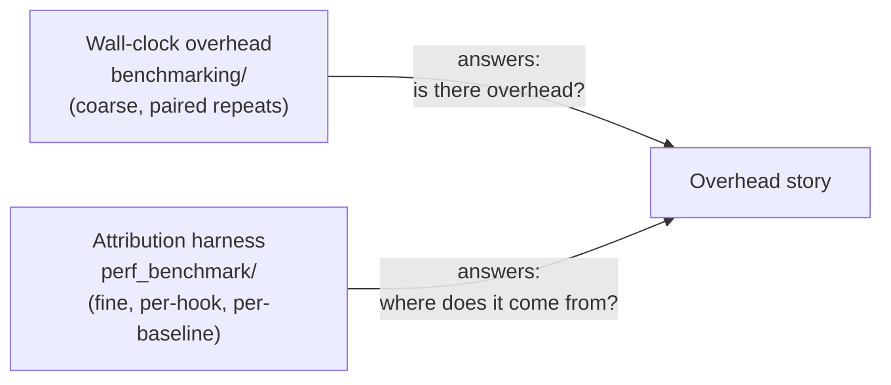
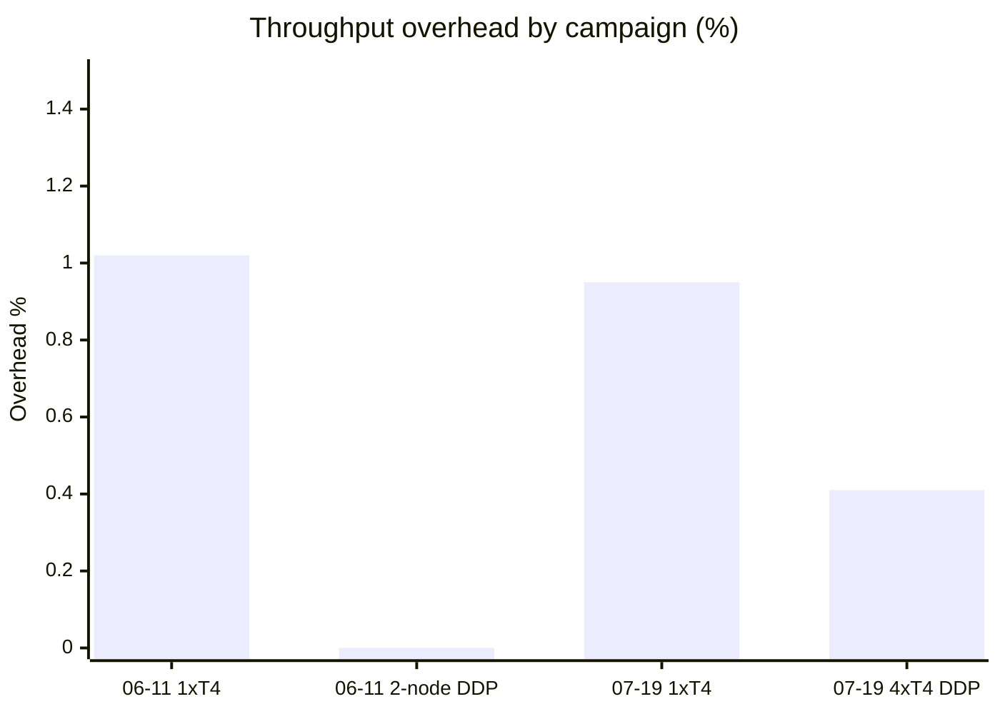

# TraceML overhead benchmarking

TraceML measures its own runtime cost through two independent tracks. Both
live in this branch; neither has moved or been renamed to make this doc —
follow the links below for the actual instructions.

## Wall-clock overhead — `benchmarking/`

**What it measures:** end-to-end training-time cost of the full multi-node
telemetry/aggregation layer, as a single number per topology.

**Granularity:** coarse. One wall-clock and one throughput percentage per
topology; no breakdown of which internal component contributes the cost.

**Method:** paired repeats — `time torchrun ...` (native) vs
`time traceml run ...` (TraceML), alternated order to cancel thermal/
environment bias, identical args each time. Requires no TraceML-specific
tooling to reproduce; anyone can run the same two `time` commands themselves.

**Campaigns so far:**

| Date | TraceML version | Hardware | 1-GPU throughput overhead | Multi-GPU/DDP throughput overhead |
|---|---|---|---|---|
| 2026-06-11 | v0.3.1 | 2× AWS g4dn.xlarge (T4) | +1.02% | ≈0% (network-bound floor) |
| 2026-07-19 | v0.3.5 | AWS g4dn.12xlarge (T4) | +0.95% ± 0.09 | +0.41% ± 0.07 |

Full write-ups: [`benchmarking/README.md`](benchmarking/README.md),
[`benchmarking/analysis/2026-06-11_pr153_ddp_mlp_g4dn/report.md`](benchmarking/analysis/2026-06-11_pr153_ddp_mlp_g4dn/report.md),
[`benchmarking/analysis/2026-07-19_v035_ddp_mlp_g4dn/report.md`](benchmarking/analysis/2026-07-19_v035_ddp_mlp_g4dn/report.md).

## Attribution / automated harness — `perf_benchmark/`

**What it measures:** where overhead comes from — which instrumentation
hook (dataloader, forward, backward, H2D, optimizer, background sampler
thread) contributes, and whether that hook runs on the training-critical
path or off-thread.

**Granularity:** fine. Three baselines (`never_init` / `trace_manual` /
`trace_auto`) × two timing modes (`step` headline / `phase` attribution),
plus a static source audit tagging every hook `critical_path: true/false`.

**Method:** JSON-config-driven automated runner + aggregator; see
[`perf_benchmark/README.md`](perf_benchmark/README.md) for the full
methodology and every reproduction command.

**Status:** harness and methodology landed 2026-07-20; no campaign has been
run yet. This section will gain a results row once one has.

## Reading this as an outside visitor

If you only need one number: the wall-clock track's latest campaign
(2026-07-19 row above) is the current headline overhead figure. The
attribution track exists to explain *why* that number is what it is, not
to replace it.

## TODO

Point the main repository README at this doc once `benchmarking` lands on
`main` (tracked separately — this branch has not merged yet).
