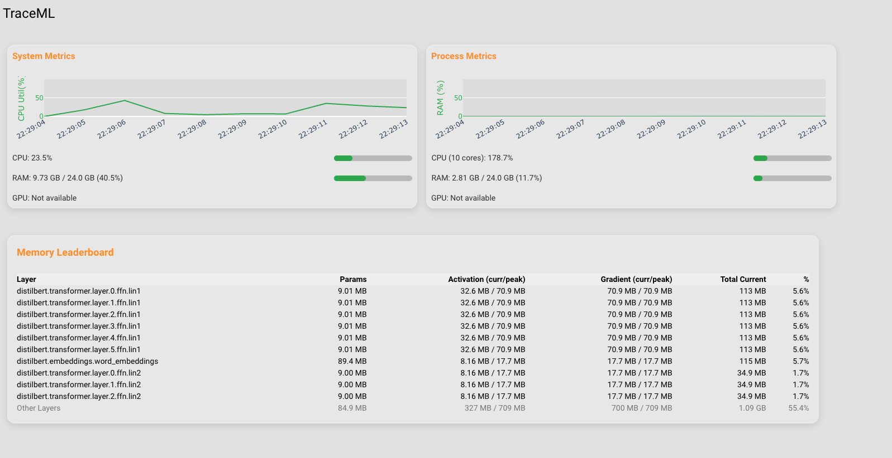

# TraceML
<sub><em>If you find it useful, consider giving it a ⭐ on GitHub — it helps others discover the project!</em></sub>

[](https://opensource.org/licenses/MIT) 
[](https://github.com/traceopt-ai/traceml/stargazers) [](https://colab.research.google.com/github/traceopt-ai/traceml/blob/main/src/examples/tracing_bert_notebook.ipynb) 
[](https://www.python.org/) 
[-success?logo=apple)](https://www.apple.com/mac/) 
[](https://ubuntu.com/) 
[](https://pypi.org/project/traceml-ai/)

---


A lightweight, always-on profiler for PyTorch that makes **memory**, **timing**, and **system usage** visible in real time via:

- Terminal dashboards  
- Jupyter notebooks  
- A **lightweight local web dashboard/server**  
- JSON logging for offline analysis  

Minimal configuration. Minimal overhead. Plug-and-trace.

### Note: TraceML currently supports single-GPU training. DDP multi-GPU support is coming soon.

---

## 📊 Quick User Survey (2 min)
Using TraceML? Help shape the roadmap: https://forms.gle/vaDQao8L81oAoAkv9


## 🚨 The Problem

Training deep learning models often feels like debugging a black box:

- CUDA OOM errors appear without warning  
- Step times are slow with no visibility  
- Existing profilers are heavy, complicated, or lack activation/gradient memory details  

TraceML provides **continuous, lightweight observability** without slowing down training.

---

## 💡 Why TraceML?

TraceML is designed to stay **lightweight, always-on, and practical**:

- Module-level memory tracking (params, activations, gradients)  
- Step timing (forward, backward, optimizer, dataloader)  
- Terminal + Notebook + Local Web Dashboard (port 8765)  
- Minimal overhead (sampling-based — NOT full graph tracing)  

A tool you can safely keep on in every training loop.

---

# ⭐ Quick Start

## 1. Installation

```bash
pip install .
```

Developer mode:

```bash
pip install '.[dev]'
```

---

# 🔧 2. Model Registration (Required)

TraceML needs to attach hooks to your model. Two ways:

### **A. Decorator (recommended)**

```python
from traceml.decorators import trace_model
import torch.nn as nn

@trace_model()
class TinyNet(nn.Module):
    def __init__(self):
        super().__init__()
        self.fc = nn.Linear(100, 10)

    def forward(self, x):
        return self.fc(x)
```

### **B. Register a model instance**

```python
from traceml.decorators import trace_model_instance
import torch.nn as nn

model = nn.Sequential(
    nn.Linear(100, 50),
    nn.ReLU(),
    nn.Linear(50, 10)
)

trace_model_instance(model)
```

This is all you need to enable memory + timing tracing across all workflows.

---

# 🚀 3. Running TraceML

You can run TraceML in **three modes**:

---

## ✅ **A. CLI Mode (Terminal Dashboard — default)**

```
traceml run your_script.py
```

This launches a live terminal dashboard showing:

- System metrics (CPU, RAM, GPU)  
- Layer memory  
- Activation + gradient memory  
- Step timings  


---

## ✅ **B. Dashboard Mode (Local Web UI)**

Run your training script with:

```bash
traceml run your_script.py --mode=dashboard
```

Opens a live dashboard at:

```
http://localhost:8765
```

Includes:

- Real-time charts  
- Per-layer memory
- Peaks and summaries  



---

## ✅ **C. Notebook Mode**

```python
from traceml.decorators import trace_model_instance
from traceml.manager.tracker_manager import TrackerManager

trace_model_instance(model)

tracker = TrackerManager(interval_sec=1.0, mode="notebook")
tracker.start()

train(model)

tracker.stop()
tracker.log_summaries()
```

Notebook UI updates automatically.

---

# ⏱ Step Timing Example

```python
from traceml.decorators import trace_timestep

@trace_timestep("forward", use_gpu=True)
def forward_pass(model, batch):
    return model(**batch)

@trace_timestep("backward", use_gpu=True)
def backward_pass(loss, scaler):
    scaler.scale(loss).backward()
```

Timings automatically appear in CLI, dashboard, and notebook summaries.

---

# 📤 Exporting Logs as JSON

Enable JSON logging:

```bash
traceml run your_script.py --enable-logging
```

Logs are stored in:

```
./logs/
```

Useful for plotting, analytics, or offline dashboards.

---

# 📊 How TraceML Works (Lightweight Samplers)

TraceML uses asynchronous samplers (NOT full tracing):

- **SystemSampler** — CPU, RAM, GPU  
- **LayerMemorySampler** — Params  
- **ActivationMemorySampler** — Forward activations  
- **GradientMemorySampler** — Backward gradients  
- **StepTimeSampler** — Forward/backward/optimizer timings  

This keeps overhead extremely low.

---

# 📦 Current Features

- Live system usage (CPU, RAM, GPU)  
- Per-layer memory tracking  
- Activation & gradient memory  
- Step timing  
- Terminal UI  
- Notebook display  
- Local web dashboard  
- JSON logging  

---

# 🛠 Coming Soon

- Multi-node distributed tracing  
- PyTorch Lightning / Accelerate integration  

---

# 🤝 Contribute

- ⭐ the repo to support development  
- Open issues for improvements or bugs  
- Contributions welcome  

📧 Contact: **abhinavsriva@gmail.com**

---

# 🧾 License

TraceML uses **MIT License + Commons Clause**:

- Free for personal, research, academic, and internal use  
- Not allowed for resale, SaaS, or commercial redistribution  

For commercial licensing, contact **abhinavsriva@gmail.com**.

---

*TraceML — Lightweight, real-time visibility for PyTorch training.*
