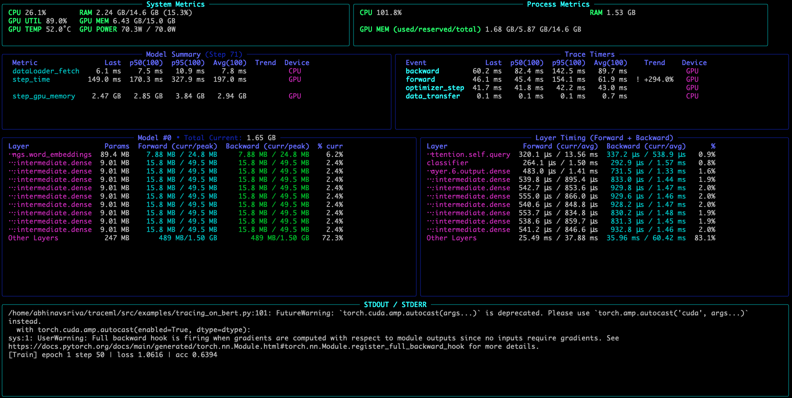
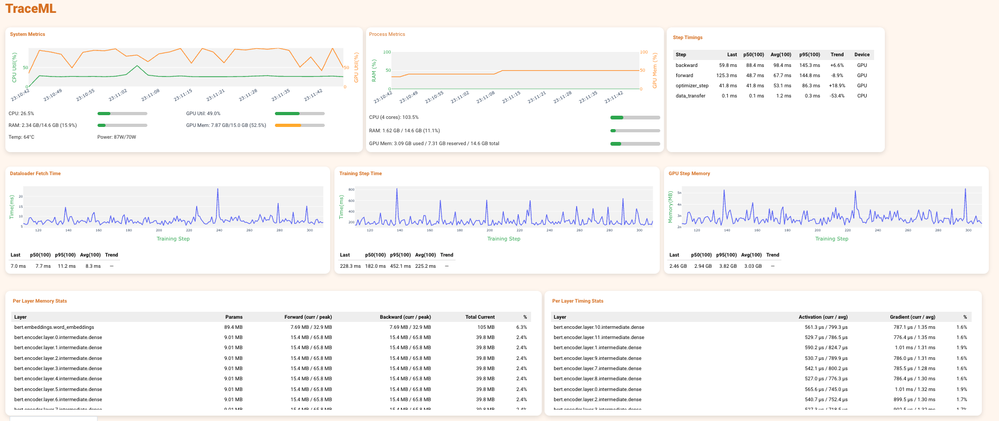

# TraceML

**Real-time profiling for PyTorch training — lightweight, always-on, and actionable.**

[](https://opensource.org/licenses/MIT) 
[](https://pypi.org/project/traceml-ai/)
[](https://www.python.org/) 
[](https://colab.research.google.com/github/traceopt-ai/traceml/blob/main/src/examples/tracing_bert_notebook.ipynb)

---

## The Problem TraceML Solves

Training deep learning models shouldn't feel like debugging a black box. Yet we constantly face:

- **💥 CUDA OOM errors** with no insight into which layer caused the memory spike
- **🐌 Slow training** without knowing if the bottleneck is data loading, forward pass, backward pass, or optimizer
- **🔍 Layer-level mysteries** — which layers consume the most memory? Which are slowest?
- **📊 Heavy profilers** that are impractical to keep running during actual training

**TraceML changes this.** It provides continuous, low-overhead visibility into your training process while it's running — no restarts, no heavy tooling, no guesswork.

---

## What TraceML Does

TraceML answers the questions you actually need answered:

| Question | TraceML Answer |
|----------|----------------|
| Which layer is eating my GPU memory? | Per-layer memory breakdown (params + activations + gradients) |
| Where did that memory spike happen? | Real-time memory tracking during forward/backward passes |
| Which layer is slow? | Per-layer compute time (forward + backward) |
| What's slowing down my training step? | Step-level timing: dataloader → forward → backward → optimizer |

**Three ways to view your data:**
- 🖥️ **Terminal dashboard** — live updates in your console
- 📓 **Jupyter notebooks** — inline visualizations
- 🌐 **Web dashboard** — local browser UI at `localhost:8765`

---

## Installation

```bash
pip install traceml-ai
```

For development:

```bash
git clone https://github.com/traceopt-ai/traceml.git
cd traceml
pip install -e '.[dev]'
```

**Requirements:** Python 3.9-3.13, PyTorch 1.12+

**Platform support:** macOS (Intel/ARM), Linux. Single-GPU training (DDP support coming soon).

---

## Quick Start

### Step 1: Add One Decorator to Your Model

TraceML works by attaching lightweight hooks to your PyTorch model. Choose your preferred method:

**Option A: Class decorator** (recommended)

```python
from traceml.decorators import trace_model
import torch.nn as nn

@trace_model()
class MyModel(nn.Module):
    def __init__(self):
        super().__init__()
        self.encoder = nn.TransformerEncoder(...)
        self.decoder = nn.Linear(512, 1000)
    
    def forward(self, x):
        x = self.encoder(x)
        return self.decoder(x)
```

**Option B: Instance registration**

```python
from traceml.decorators import trace_model_instance

model = torchvision.models.resnet50()
trace_model_instance(model)
```

That's it. No other code changes needed.

### Step 2: Run Your Training Script

```bash
traceml run train.py
```

You'll immediately see a live terminal dashboard tracking:
- System resources (CPU, RAM, GPU)
- Per-layer memory usage and compute time
- Training step breakdowns



---

Best for: Training on remote servers, quick debugging, CI/CD environments.

### 🌐 Web Dashboard

```bash
traceml run train.py --mode=dashboard
```

Opens `http://localhost:8765` with interactive charts and real-time updates.



Best for: Local development, detailed analysis, sharing results with teammates.

### 📓 Jupyter Notebooks

```python
from traceml.decorators import trace_model_instance
from traceml.manager.tracker_manager import TrackerManager

# Register your model
trace_model_instance(model)

# Start tracking
tracker = TrackerManager(interval_sec=1.0, mode="notebook")
tracker.start()

# Run your training
for epoch in range(num_epochs):
    train_one_epoch(model, dataloader)

# Stop and view results
tracker.stop()
tracker.log_summaries()
```

Best for: Experimentation, teaching, sharing results in notebooks.

---

## Advanced: Step Timing

Track specific operations in your training loop:

```python
from traceml.decorators import trace_timestep

@trace_timestep("dataloader", use_gpu=True)
def load_batch(dataloader):
    return next(iter(dataloader))

@trace_timestep("forward", use_gpu=True)
def forward_pass(model, batch):
    return model(batch)

@trace_timestep("backward", use_gpu=True)
def backward_pass(loss, optimizer):
    loss.backward()
    optimizer.step()
```

Timings automatically appear in all dashboards and logs, helping you identify bottlenecks at a glance.

---

## Exporting Data

Enable JSON logging for offline analysis:

```bash
traceml run train.py --enable-logging
```

Logs are saved to `./logs/` with timestamps, ready for plotting or integration with your own monitoring tools.

---

## Current Features

✅ Real-time system monitoring (CPU, RAM, GPU)  
✅ Per-layer memory tracking (parameters, activations, gradients)  
✅ Per-layer compute time (forward + backward)  
✅ Training step timing (dataloader, forward, backward, optimizer)  
✅ Terminal UI with live updates  
✅ Jupyter notebook integration  
✅ Local web dashboard  
✅ JSON export for offline analysis  
✅ Minimal overhead 
✅ Zero code changes (beyond registration)  

---

## Roadmap

🔜 Multi-GPU distributed training (DDP, FSDP)  
🔜 PyTorch Lightning integration  
🔜 Hugging Face Accelerate support  
🔜 Memory leak detection  
🔜 Automatic optimization suggestions  
🔜 Cloud dashboard (optional)  

---

## Examples

Explore complete examples in the repository:

- [BERT fine-tuning with TraceML](https://colab.research.google.com/github/traceopt-ai/traceml/blob/main/src/examples/tracing_bert_notebook.ipynb)


## Contributing

We welcome contributions! Here's how to help:

1. ⭐ **Star the repo** to show support
2. 🐛 **Report bugs** via [GitHub Issues](https://github.com/traceopt-ai/traceml/issues)
3. 💡 **Request features** we should prioritize
4. 🔧 **Submit PRs** for improvements

**Development setup:**

```bash
git clone https://github.com/traceopt-ai/traceml.git
cd traceml
pip install -e '.[dev]'
pytest tests/
```

---

## Community & Support

- 📧 Email: abhinav@traceopt.ai
- 🐙 GitHub: [traceopt-ai/traceml](https://github.com/traceopt-ai/traceml)
- 📋 User Survey: [Help shape the roadmap](https://forms.gle/vaDQao8L81oAoAkv9) (2 minutes)

---

## License

TraceML is released under the **MIT License with Commons Clause**.

**What this means:**
- ✅ Free for personal use
- ✅ Free for research and academic use
- ✅ Free for internal company use
- ❌ Not allowed for resale or SaaS products

For commercial licensing inquiries, contact abhinav@traceopt.ai.

See [LICENSE](./LICENSE) for full details.

---

## Citation

If TraceML helps your research, please cite:

```bibtex
@software{traceml2024,
  author = {TraceOpt AI},
  title = {TraceML: Real-time Profiling for PyTorch Training},
  year = {2024},
  url = {https://github.com/traceopt-ai/traceml}
}
```

---

<div align="center">

**TraceML — Stop guessing. Start profiling.**

Made with ❤️ by [TraceOpt AI](https://traceopt.ai)

</div>
