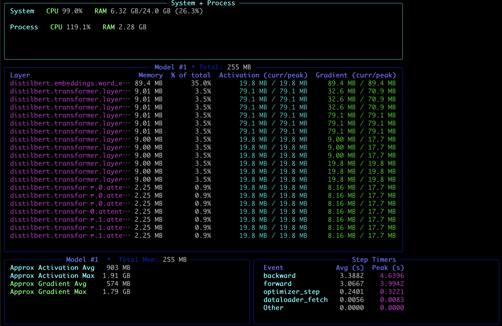

# TraceML
<sub><em> If you find useful, consider giving it a ⭐ on GitHub — it helps others discover the project!</em></sub>

[](https://opensource.org/licenses/MIT)  
[](https://github.com/traceml-ai/traceml/stargazers)


 A lightweight library + CLI to make PyTorch training memory visible in real time.

## The Problem

Training large machine learning models often feels like a black box. One minute everything's running and the next, you're staring at a cryptic **"CUDA out of memory"** error.

Pinpointing which part of the model is consuming too much memory or slowing things down is frustrating and time-consuming. Traditional profiling tools can be overly complex or lack the granularity deep learning developers need.

## 💡 Why TraceML?

`traceml` is a lightweight CLI tool to instrument your PyTorch training scripts and get real-time, granular insights into:

✅ System + process-level usage (CPU, RAM, GPU)

✅ PyTorch layer-level memory allocation (via decorator/instance tracing)

✅ Live activation & gradient memory

All shown live in your terminal — no config, no setup, just plug-and-trace.

## 📦 Installation

```bash
pip install .
```

For developer mode:
```bash
pip install '.[dev]'
```


## 🚀 Usage

TraceML wraps your training script and prints memory insights to the terminal as your model trains:

```bash
traceml run <your_training_script.py>
```

### Registering your model for tracing

To capture **memory usage**, you need to register your model with TraceML. There are two simple ways:

#### 1. With a class decorator (recommended)

```python
import torch.nn as nn
from traceml.decorator import trace_model

@trace_model()
class TinyNet(nn.Module):
    def __init__(self):
        super().__init__()
        self.fc = nn.Linear(100, 10)

    def forward(self, x):
        return self.fc(x)
```

✅ Any instance of `TinyNet` will now be automatically traced.

#### 2. With an explicit model instance

```python
import torch.nn as nn
from traceml.decorator import trace_model_instance

model = nn.Sequential(
    nn.Linear(100, 50),
    nn.ReLU(),
    nn.Linear(50, 10)
).to("cuda")

# Attach hooks so TraceML can see memory events
trace_model_instance(model)
```

✅ Best when you build models dynamically or don't want to decorate the class.

## Examples

```bash
# Trace an explicitly defined model instance
traceml run src/examples/tracing_with_model_instance

# Trace a model using a class decorator (recommended)
traceml run src/examples/tracing_with_class_decorator
```



## 🔎 How the Samplers Work

TraceML introduces samplers that collect memory usage at intervals, not layer-by-layer traces only:

- SystemSampler → CPU, RAM, GPU usage sampled at a fixed frequency.

- LayerMemorySampler → Parameter allocation (per module, not per parameter).

- ActivationMemorySampler → Tracks per-layer forward activations. Maintains current and global peak values, and estimates total activation memory for a forward pass.

- GradientMemorySampler → Tracks per-layer backward gradients. Maintains current and global peak values, and estimates total gradient memory during backpropagation.

This means what you see in your terminal is a rolling snapshot of memory over time, giving you:

- Live per-layer breakdowns

- Current vs global peaks

- Running totals of activation + gradient memory

This design makes TraceML lightweight compared to full profilers — you get practical insights without slowing training to a crawl.

## 📊 Current Features

- Live CPU, RAM, and GPU usage (System + Current Process)
- PyTorch module-level memory tracking
- Live activation memory tracking (per layer, plus totals)
- Live gradient memory tracking (per layer, plus totals)
- Real-time terminal dashboards via Rich

## Coming Soon

- Step & operation timers (forward, backward, optimizer)
- Notebook support
- Export logs as JSON / CSV
- More visual dashboards

## 🙌 Contribute & Feedback

TraceML is early-stage and evolving quickly. Contributions, feedback, and ideas are welcome!

- Found it useful? Please ⭐ the repo to support development.

- Issues / feature requests → open a GitHub issue.

- Want to contribute? See CONTRIBUTING.md (coming soon).

📧 Contact: traceml.ai@gmail.com

---

*TraceML - Making PyTorch memory usage visible, one trace at a time.*
