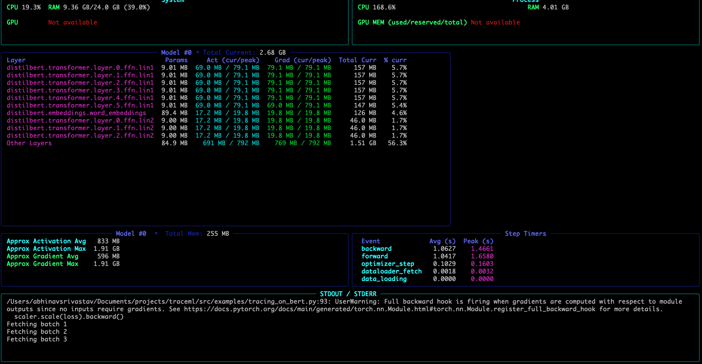

# TraceML

**Always-on, live observability for Multi-GPU PyTorch training (DDP)**

📋 **User Survey (2 min):** https://forms.gle/KwPSLaPmJnJjoVXSA

[](https://pypi.org/project/traceml-ai/)
[](https://pepy.tech/project/traceml-ai)
[](https://github.com/traceopt-ai/traceml)
[](https://www.python.org/)
[](./LICENSE)

TraceML is a lightweight **runtime observability** tool for **PyTorch DDP training** (currently on **single-node Multi-GPU)**.
It surfaces **step-level, rank-aware** signals *while your job runs*, without turning on heavy profilers. It answers 

> “What’s happening inside my training step right now — and is a particular rank behaving worse than the rest?”

If your run is healthy, TraceML should say so.

---

### Terminal dashboard (default)




The terminal view updates **continuously during training** and shows:
- Step time, dataloader fetch time, and GPU memory
- Median vs worst rank (to spot imbalance / stragglers)
- System signals (CPU, RAM, GPU) alongside training signals

This is the primary interface, designed to stay open next to your training logs.

### Web dashboard (optional)


The web dashboard mirrors the same signals in a browser:
- Interactive charts over recent steps
- Rank-aware comparisons
- Useful for exploration and longer-running jobs

The web UI is **read-only** and reflects exactly what TraceML computes during training.

*Both views are driven by the same runtime signals and update live, step by step.*
 
---

## Why TraceML

Training deep learning becomes a black box as we scale from single GPU

Typical pain:
- Steps get **slow / unstable** and it’s unclear if the cause is input, compute, sync/comm, or optimizer work
- “It’s slower on 8 GPUs than 1 GPU” and you don’t know **which rank** or **which part** is lagging
- **OOMs and crashes** with little context for “where did it happen?”
- Full profilers are powerful, but often too intrusive to keep enabled in real training

TraceML is designed to be **live**: show the *minimum useful* truth during real runs.

---

## What TraceML Shows (Core Signals)

### Step-level signals (rank-aware)
When you wrap your iteration with `trace_step()`, TraceML tracks step-scoped signals and summarizes them across ranks:
- **Dataloader fetch time**
- **Step time** (GPU-aware via CUDA events without sync)
- **GPU memory** (allocated + peak)

Across ranks, TraceML reports:
- **Median** (typical behavior)
- **Worst** (the slowest / highest-memory rank)

This helps you spot **rank imbalance / straggler-like behavior** early.

### Lightweight failure attribution (Deep-Dive)
In Deep-Dive mode, TraceML installs **model hooks** to give more context around failures:
- Show per-layer memory and timing usage (worst across all ranks) 
- Helps identify **where** an OOM/crash happened (forward/backward region and the most suspicious layer signals)
- Experimental and evolving — meant to be a practical debugging aid, not a formal profiler

---

## What TraceML is Not

TraceML is **not** a profiler replacement or an auto-tuner.

- It does not replace Nsight / PyTorch Profiler
- It does not automatically fix batch size or optimizer settings
- It will not always “find a problem”

---

## Views

TraceML currently supports:

- 🖥️ **Terminal dashboard** — live updates in your console (Rich UI)
- 🌐 **Web dashboard** — local browser UI at `http://localhost:8765`

> Notebook view is temporarily disabled.

---

## Tracking Profiles

TraceML provides two profiles so you can choose insight vs overhead.

### ESSENTIAL (basic)
Designed for continuous usage during real training.

Tracks:
- Dataloader fetch time
- Step time (GPU-aware)
- Step GPU memory (allocated + peak)
- System metrics (CPU/RAM/GPU)

### DEEP-DIVE (diagnostic)
Designed for investigating slowdowns and failures.

Includes everything in ESSENTIAL, plus:
- Per-layer memory signals
- Per-layer forward/backward timing signals
- Lightweight failure attribution via hooks (experimental)

---

## Installation

```bash
pip install traceml-ai
```

For development:

```bash
git clone https://github.com/traceopt-ai/traceml.git
cd traceml
pip install -e '.[dev]'
pre-commit install
```

**Requirements:** Python 3.9–3.13, PyTorch 1.12+  
**Platform:** macOS (Intel/ARM), Linux  
**Training support:** Single GPU + **single-node DDP **

---

## Quick Start

### 1) Step-level tracking (required)

TraceML’s core signals are computed inside `trace_step()`.

```python
from traceml.decorators import trace_step

for batch in dataloader:
    with trace_step(model):
        outputs = model(batch["x"])
        loss = criterion(outputs, batch["y"])
        loss.backward()
        optimizer.step()
        optimizer.zero_grad(set_to_none=True)
```

Without `trace_step()`:
- Step timing is not computed
- Step memory is not recorded
- Live dashboards won’t update meaningfully

---

### 2) Deep-Dive: model registration (optional, only for Deep-Dive)

```python
from traceml.decorators import trace_model_instance

trace_model_instance(model)
```

Use this **together with** `trace_step(model)` to enable hook-based deep signals:
- layer-level memory/timing
- experimental failure attribution

> `@trace_time` / region user timers is removed for now.  
> TraceML is focusing on step-level semantics + optional Deep-Dive hooks.

---

## Running TraceML

```bash
traceml run train.py --nproc-per-node=2
```

You’ll see a live terminal dashboard showing:
- System resources (CPU/RAM/GPU)
- Dataloader fetch time, step time, step GPU memory
- (Deep-Dive) per-layer signals + failure attribution hints

---

## Web Dashboard

```bash
traceml run train.py --nproc-per-node=2 --mode=dashboard
```

Opens `http://localhost:8765` with interactive charts and live updates.

---

## Roadmap

Near-term:
- **Single-node DDP hardening**: reduce overhead, improve step alignment accuracy, improve collector/UI performance
- **Run logging to disk**: per-run artifacts + compact run summaries
- **Compatibility & failure modes**: validate behavior for common training patterns:
  - gradient accumulation
  - `torch.compile`
  - cases that bypass typical hooks / patch points
- **Documentation**: clearer docs, examples, and “known limitations” page
- Accelerate / Lightning wrappers

Next:
- **Multi-node DDP**
- **FSDP**: shard-aware aggregation + imbalance signals (initial support)

Later:
- **TP / PP**: multi-process-group + mesh/stage-aware attribution


---

## Contributing

Contributions are welcome.

1. ⭐ Star the repo
2. 🐛 Report bugs via GitHub Issues
3. 💡 Request features / workloads you want supported
4. 🔧 Submit PRs (small focused PRs are ideal)

When opening an issue, please include:
- minimal repro script
- hardware + CUDA + PyTorch versions
- ESSENTIAL vs DEEP-DIVE
- single GPU vs DDP

---

## Community & Support

- 📧 Email: abhinav@traceopt.ai
- 🐙 LinkedIn: [Abhinav Srivastav](https://www.linkedin.com/in/abhinavsriva/)
- 📋 User Survey (2 min): https://forms.gle/KwPSLaPmJnJjoVXSA

Stars help more teams find the project. 🌟

<a href="https://www.star-history.com/#traceopt-ai/traceml&type=date&legend=top-left">
  
</a>

---

## License

TraceML is released under the **Apache 2.0**.

See [LICENSE](./LICENSE) for details.

---

## Citation

If TraceML helps your research, please cite:

```bibtex
@software{traceml2024,
  author = {TraceOpt AI},
  title = {TraceML: Real-time Training Observability for PyTorch},
  year = {2024},
  url = {https://github.com/traceopt-ai/traceml}
}
```

---

<div align="center">

Made with ❤️ by TraceOpt AI

</div>
