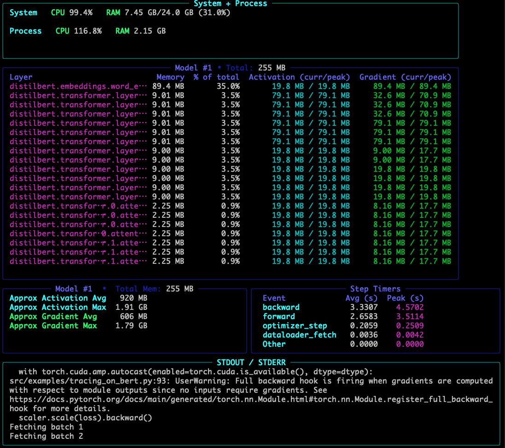

 # TraceML
<sub><em> If you find useful, consider giving it a ⭐ on GitHub — it helps others discover the project!</em></sub>

[](https://opensource.org/licenses/MIT) 
[](https://github.com/traceopt-ai/traceml/stargazers) 
[](https://colab.research.google.com/github/traceopt-ai/traceml/blob/main/src/examples/tracing_bert_notebook.ipynb)
[](https://www.python.org/)
[-success?logo=apple)](https://www.apple.com/mac/)
[](https://ubuntu.com/)
[](https://pypi.org/project/traceml-ai/)


 A lightweight library to make PyTorch training **memory and timing** visible in real time (in CLI and Notebook).

## The Problem

Training large machine learning models often feels like a black box. One minute everything's running and the next, you're staring at a cryptic **"CUDA out of memory"** error or wondering *why a single step is so slow*.

Pinpointing which part of the model is consuming too much memory or slowing things down is frustrating and time-consuming. Traditional profiling tools can be overly complex or lack the granularity deep learning developers need.

## 💡 Why TraceML?

`traceml` is designed to give you **real-time, granular observability** for both **memory usage** and **timing** without heavy overhead. It works both in the **terminal (CLI) and inside Jupyter notebooks**, so you can pick the workflow that fits you best:

 - System + process-level usage (CPU, RAM, GPU)

 - PyTorch layer-level memory allocation (parameters, activations, gradients)

 - Step-level timing (forward, backward, optimizer, etc.)  

 - Lightweight — minimal overhead  

No config, no setup, just plug-and-trace.


## 📦 Installation

```bash
pip install .
```

For developer mode:
```bash
pip install '.[dev]'
```


## 🚀 Usage

### Registering your model for tracing

To capture **memory usage**, you first need to register your model with TraceML. There are two simple ways:

#### 1. With a class decorator (recommended)

```python
import torch.nn as nn
from traceml.traceml_decorator import trace_model


@trace_model()
class TinyNet(nn.Module):
    def __init__(self):
        super().__init__()
        self.fc = nn.Linear(100, 10)

    def forward(self, x):
        return self.fc(x)
```

-  Any instance of `TinyNet` will now be automatically traced.

#### 2. With an explicit model instance

```python
import torch.nn as nn
from traceml.traceml_decorator import trace_model_instance

model = nn.Sequential(
    nn.Linear(100, 50),
    nn.ReLU(),
    nn.Linear(50, 10)
).to("cuda")

# Attach hooks so TraceML can see memory events
trace_model_instance(model)
```

Best when you build models dynamically or don't want to decorate the class.


Then, choose whichever fits your workflow.

### 📓 Notebook

Run TraceML directly in Jupyter/Colab:

```shell
from traceml.decorator import trace_model_instance
from traceml.manager.tracker_manager import TrackerManager

# Attach TraceML hooks
trace_model_instance(model)

# Start live tracker
tracker = TrackerManager(interval_sec=1.0, mode="notebook")
tracker.start()

# 🔄 Train as usual
train_model(model, train_loader, val_loader, optimizer, scheduler, scaler, device, dtype)

# Stop and show summaries
tracker.stop()
tracker.log_summaries()

```

### Step Timing and Performance Tracing

TraceML now supports fine-grained step timing, letting you measure CPU/GPU latency for every major operation including data loading, device transfer, forward pass, backward pass, and optimizer steps.
Simply decorate any function with `@trace_timestep`:

```python 
from traceml.traceml_decorator import trace_timestep


@trace_timestep("forward", use_gpu=True)
def forward_pass(model, batch, dtype):
    with torch.cuda.amp.autocast():
        return model(**batch)


@trace_timestep("backward", use_gpu=True)
def backward_pass(loss, scaler):
    scaler.scale(loss).backward()


@trace_timestep("optimizer_step", use_gpu=True)
def optimizer_step(scaler, optimizer, scheduler):
    scaler.step(optimizer)
    scaler.update()
    scheduler.step()
```
Top timing data appears automatically in your live dashboard and notebook summary.
Works seamlessly with your activation + gradient dashboards — all visible together in real-time.


### Terminal/CLI

Wrap your training script to see live dashboards in your terminal:
```bash
traceml run <your_training_script.py>
```


## Examples

```bash
# Trace an explicitly defined model instance
traceml run src/examples/tracing_with_model_instance

# Trace a model using a class decorator (recommended)
traceml run src/examples/tracing_with_class_decorator
```




### 📓 Notebook Example

You can also run TraceML inside Jupyter/Colab.
See the full [example notebook](src/examples/tracing_bert_notebook.ipynb) for a working demo.

 Notebook output will refresh live per interval, similar to the terminal dashboard.


## 🔎 How the Samplers Work

TraceML introduces samplers that collect memory usage at intervals, not layer-by-layer traces only:

- SystemSampler → CPU, RAM, GPU usage sampled at a fixed frequency.

- LayerMemorySampler → Parameter allocation (per module, not per parameter).

- ActivationMemorySampler → Tracks per-layer forward activations. Maintains current and global peak values, and estimates total activation memory for a forward pass.

- GradientMemorySampler → Tracks per-layer backward gradients. Maintains current and global peak values, and estimates total gradient memory during backpropagation.

- StepTimeSampler -> CPU/GPU event durations (forward, backward, optimizer, etc.)

Because TraceML samples asynchronously, it stays lightweight while providing practical observability.

## 📊 Current Features

- Live CPU, RAM, and GPU usage (System + Current Process)
- PyTorch module-level memory tracking
- Live activation & gradient memory tracking (per layer, plus totals)
- Step & operation timers (forward, backward, optimizer)
- Real-time terminal dashboards via Rich
- Notebook support
- Export logs as JSON / CSV

## Coming Soon
- Streamlit dashboard
- Multi-node distributed support

## 🙌 Contribute & Feedback

TraceML is early-stage and evolving quickly. Contributions, feedback, and ideas are welcome!

- Found it useful? Please ⭐ the repo to support development.

- Issues / feature requests → open a GitHub issue.

- Want to contribute? See CONTRIBUTING.md (coming soon).

📧 Contact: abhinavsriva@gmail.com

## 🧾 License

TraceML is distributed under an **MIT License with Commons Clause restriction**.

- ✅ Free for personal, academic, and internal business use  
- 🚫 Not for resale, SaaS hosting, or commercial redistribution  

For commercial licensing, contact abhinavsriva@gmail.com.  

---

*TraceML - Making PyTorch memory usage visible, one trace at a time.*
