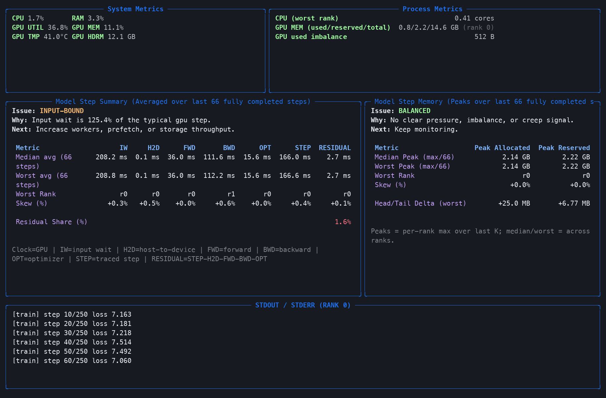

<div align="center">

# TraceML

**Find out why your PyTorch training is slow—before it wastes GPU hours.**

Low-overhead, full-run performance diagnostics for PyTorch training.

[](https://pypi.org/project/traceml-ai/)
[](https://github.com/traceopt-ai/traceml/actions/workflows/ci.yml)
[](https://www.python.org/)
[](./LICENSE)
[](https://github.com/traceopt-ai/traceml/stargazers)
[](https://discord.gg/rY3EQguZAN)

[**Quickstart**](#quickstart) •
[**Integrations**](docs/user_guide/integrations.md) •
[**Distributed Training**](docs/user_guide/distributed-training.md) •
[**Compare Runs**](docs/user_guide/compare.md) •
[**Documentation**](docs/user_guide/quickstart.md) •
[**Discord**](https://discord.gg/rY3EQguZAN)

</div>

<div align="center">


<sub>Live performance diagnostics for single-node PyTorch training. Multi-node jobs are supported through summary mode.</sub>

</div>

TraceML runs alongside your training loop and identifies where training time is
going across the full job—not just a small window of profiled steps.

It helps you answer:

- Is the GPU computing or waiting for the input pipeline?
- Which phase is making each training step slower?
- Is one distributed rank holding back the others?
- Is memory usage silently growing?
- Did a code, data, or infrastructure change make the run slower?

TraceML produces actionable diagnostics with under 2% overhead in current
single-GPU benchmarks and under 1% in current single-node multi-GPU benchmarks.

---

## Quickstart

### 1. Install TraceML

For the live browser dashboard:

```bash
pip install "traceml-ai[dashboard]"
```

For summary-only, CLI, CI, or multi-node use:

```bash
pip install traceml-ai
```

Using Hugging Face Trainer, PyTorch Lightning, Ray Train, W&B, or MLflow?
Start with the native integration path in
[Use With Your Stack](docs/user_guide/integrations.md).

### 2. Instrument the training step

Add TraceML around the core training step. You do not need to change your model,
optimizer, loss function, or dataloader.

```python
import traceml_ai as traceml

traceml.init(mode="auto")

for batch in dataloader:
    with traceml.trace_step(model):
        optimizer.zero_grad(set_to_none=True)
        outputs = model(batch["x"])
        loss = criterion(outputs, batch["y"])
        loss.backward()
        optimizer.step()
```

### 3. Run your training

Launch the live browser dashboard:

```bash
traceml run train.py --mode=dashboard
```

Use summary mode for headless, CI, DDP, FSDP, or multi-node runs:

```bash
traceml run train.py --mode=summary
```

Or try the self-contained example first:

```bash
traceml run examples/quickstart.py --mode=summary
```

For DDP, FSDP, Slurm, and multi-node runs, see
[Distributed Training](docs/user_guide/distributed-training.md).

---

## Example Diagnosis

Instead of showing only utilization charts, TraceML explains what is slowing
the job, presents the supporting evidence, and tells you where to investigate.

> **INPUT STRAGGLER / CRITICAL**
>
> Rank 0 spent 254.5 ms waiting for input versus 3.8 ms on the median rank.
>
> **Next:** inspect the dataloader, preprocessing, `collate_fn`, storage, and
> worker configuration on rank 0.

<details>
<summary>View the complete terminal report</summary>

```text
+----------------------------------------------------------------------------+
|  TraceML Run Summary | duration 40.1s                                      |
+----------------------------------------------------------------------------+
|                                                                            |
|  TraceML Verdict: INPUT STRAGGLER / CRITICAL                               |
|  Why: Rank r0 input wait was 254.5ms vs median rank r1 at 3.8ms.           |
|  Next: Inspect dataloader, collate_fn, preprocessing, and storage on the   |
|  slow rank.                                                                |
|                                                                            |
|  Section Status                                                            |
|  Section       Status                  Severity                            |
|  ------------------------------------------------                          |
|  Step Time     INPUT STRAGGLER         CRITICAL                            |
|  System        LOW GPU UTIL            INFO                                |
|  Process       NORMAL                  INFO                                |
|  Step Memory   BALANCED                INFO                                |
|                                                                            |
|  System Evidence                                                           |
|  Metric          Median        Worst         Skew        Scope             |
|  --------------------------------------------------------------------------|
|  CPU Util        18.4%         71.2%         52.8pp      node=n1           |
|  GPU Util        14.0%         0.0%          14.0pp      node=n0           |
|  GPU Memory      6.20GB        8.90GB        43.5%       node=n1           |
|  GPU Temp        42C           58C           16C         node=n1           |
|                                                                            |
|  Step Time Evidence                                                        |
|  Phase           Median        Worst         Skew        Scope             |
|  --------------------------------------------------------------------------|
|  Total           303.7ms       304.1ms       0.1%        rank=r0 node=n0   |
|  Input Wait      3.8ms         254.5ms       6597.4%     rank=r0 node=n0   |
|  Compute         259.5ms       261.0ms       0.6%        rank=r2 node=n1   |
+----------------------------------------------------------------------------+
```

</details>

In this example, rank 0 is the slow input rank and can hold back the aligned
distributed step.

Want to reproduce a specific bottleneck? See [examples/](examples/) for
self-contained demos covering dataloader bottlenecks, H2D timing, DDP rank
stragglers, Lightning, Hugging Face, Ray, and tracker-friendly summary logging.

---

## What TraceML Helps You Triage

Use TraceML as the first check before opening a heavier profiler. It surfaces
the likely bottleneck category so you know where to look next.

| Area | What TraceML surfaces | What to inspect next |
|---|---|---|
| Input pipeline | High input time or a slow input rank | `num_workers`, `pin_memory`, transforms, tokenization, `collate_fn`, dataset and storage latency |
| GPU utilization | Step time split across input, compute, and residual time | input pipeline, CPU/GPU handoff, synchronization, distributed coordination |
| Distributed skew | One DDP or FSDP rank slower than the others | rank-local dataloading, data imbalance, node variance, storage, and network differences |
| Memory creep | Memory usage growing during the run | retained tensors, logging references, loss accumulation, cached activations |
| Run regression | Changed metrics versus a known-good run | code, data, batch size, container, driver, hardware, and infrastructure changes |
| Compute-heavy runs | Most time is spent in compute | `torch.profiler`, Kineto, or Nsight for operator- and kernel-level detail |

---

## Display Modes

Choose the interface that fits the environment without changing the saved
end-of-run artifacts.

| Mode | Experience during training | Supported topology |
|---|---|---|
| `--mode=dashboard` | Live browser dashboard | Single-node; requires `pip install "traceml-ai[dashboard]"` |
| `--mode=cli` | Live terminal diagnostics | Single-node, including multi-GPU |
| `--mode=summary` | Silent execution with end-of-run report | Single-node and multi-node multi-GPU |
| `mode="auto"` | Selects an appropriate runtime display | Use when embedding TraceML in training code |

> **Headless, CI, or capturing stdout?** Use `--mode=summary`. TraceML still
> writes the same `.json` and `.txt` artifacts at the end of the run.

<div align="center">



<sub>`--mode=cli` — live terminal diagnostics for local and SSH workflows.</sub>

</div>

---

## Saved Run Artifacts

TraceML writes two end-of-run artifacts:

```text
logs/<run_name>/final_summary.json
logs/<run_name>/final_summary.txt
```

Reprint a saved summary without rerunning training:

```bash
traceml view logs/<run_name>/final_summary.json
```

Create a self-contained HTML report during the run:

```bash
traceml run train.py --html-report
```

Or render one later from a saved summary:

```bash
traceml view logs/<run_name>/final_summary.json --html
```

For experiment trackers, call `traceml.summary()` near the end of your script
to get a flat dictionary of diagnosis statuses and average metrics. Keep
`final_summary.json` when you want the complete run artifact or an input for
`traceml compare`.

---

## Compare Runs and Catch Regressions

Compare a slow run against a known-good baseline:

```bash
traceml compare input_slow/final_summary.json input_fixed/final_summary.json
```

```text
+--------------------------------------------------------------------------------------+
|  TraceML Compare                                                                     |
+--------------------------------------------------------------------------------------+
|  Verdict: IMPROVEMENT                                                                |
|  Why: Step time decreased by 95.6%.                                                  |
|                                                                                      |
|  Metric                         A                B                Delta              |
|  Total step                     294.0 ms         13.0 ms          -280.9 ms (-95.6%) |
|  Input                          66.4 ms          2.7 ms           -63.7 ms (-95.9%)  |
+--------------------------------------------------------------------------------------+
```

See [Compare Runs](docs/user_guide/compare.md) for the full report format.

---

## Use With Your Stack

TraceML supports:

- Custom PyTorch training loops
- Hugging Face Trainer
- PyTorch Lightning
- Ray Train
- W&B and MLflow summary logging
- DDP and FSDP
- Slurm and multi-node summary reports

See [Use With Your Stack](docs/user_guide/integrations.md) for integration
examples.

---

## Where TraceML Fits

| Tool | Use it for | Not for |
|---|---|---|
| TraceML | Full-run bottlenecks, runtime diagnostics, rank skew, and run regressions | Kernel- or operator-level timelines |
| `torch.profiler` / Kineto | Operator and CUDA traces for selected steps | Always-on full-run summaries |
| Nsight Systems | Deep GPU and kernel timeline debugging | Everyday training triage |
| Holistic Trace Analysis | Analyzing collected profiler traces | Live or full-run collection |
| W&B / MLflow | Experiment tracking, metrics, and run history | Runtime bottleneck diagnosis |

Start with TraceML to identify the bottleneck category. Open a deeper profiler
when you need operator- or kernel-level detail.

---

## Current Support

**Works today:**

- Single-GPU training
- Single-node multi-GPU DDP and FSDP
- Multi-node DDP summary reports
- Multi-node runs on Slurm
- Run-to-run comparison from `final_summary.json`
- Custom PyTorch loops, Hugging Face, PyTorch Lightning, and Ray Train

**On the roadmap:**

- Multi-node live CLI and browser dashboard
- Explicit collective and NCCL timing

---

## Overhead

In current benchmark runs, TraceML adds:

- Under 2% overhead on single GPU at default settings
- Under 1% overhead on single-node multi-GPU at default settings

TraceML is designed to remain enabled across the full job, rather than only
during a small sampled profiling window.

---

## Troubleshooting Guides

- [Find why PyTorch training is slow](docs/guides/slow-pytorch-training.md)
- [Find input pipeline bottlenecks](docs/guides/pytorch-input-pipeline-bottleneck.md)
- [Debug low GPU utilization](docs/guides/low-gpu-utilization-pytorch.md)
- [Debug DDP rank stragglers](docs/guides/ddp-slow-training-rank-straggler.md)
- [Find PyTorch memory creep](docs/guides/pytorch-memory-creep.md)
- [Distributed training](docs/user_guide/distributed-training.md)
- [Running on Slurm](docs/user_guide/slurm.md)
- [Use With Your Stack](docs/user_guide/integrations.md)
- [Compare Runs](docs/user_guide/compare.md)
- [How to Read Output](docs/user_guide/reading-output.md)
- [FAQ](docs/user_guide/faq.md)

---

## Feedback

For bugs, unexpected results, or feature requests, open a GitHub issue using
the matching issue template.

The templates ask for the information needed to reproduce
training-environment problems, including hardware, topology, launch command,
TraceML version, PyTorch and CUDA versions, and redacted summary output.

- [Open a GitHub issue](https://github.com/traceopt-ai/traceml/issues)
- [Security policy](SECURITY.md)
- [support@traceopt.ai](mailto:support@traceopt.ai)

If TraceML helped you find a real bottleneck, use the **I found a bottleneck**
issue template. These reports help other training teams recognize similar
problems.

---

## Contributing

Contributions are welcome, especially:

- Real slowdown examples and reproductions
- Distributed training edge cases
- Documentation improvements
- Framework integrations

See [CONTRIBUTING.md](CONTRIBUTING.md) for development setup and contribution
guidelines.

---

## License

Apache 2.0. See [LICENSE](LICENSE).

TraceOpt is a trademark of OptAI UG (haftungsbeschränkt).
