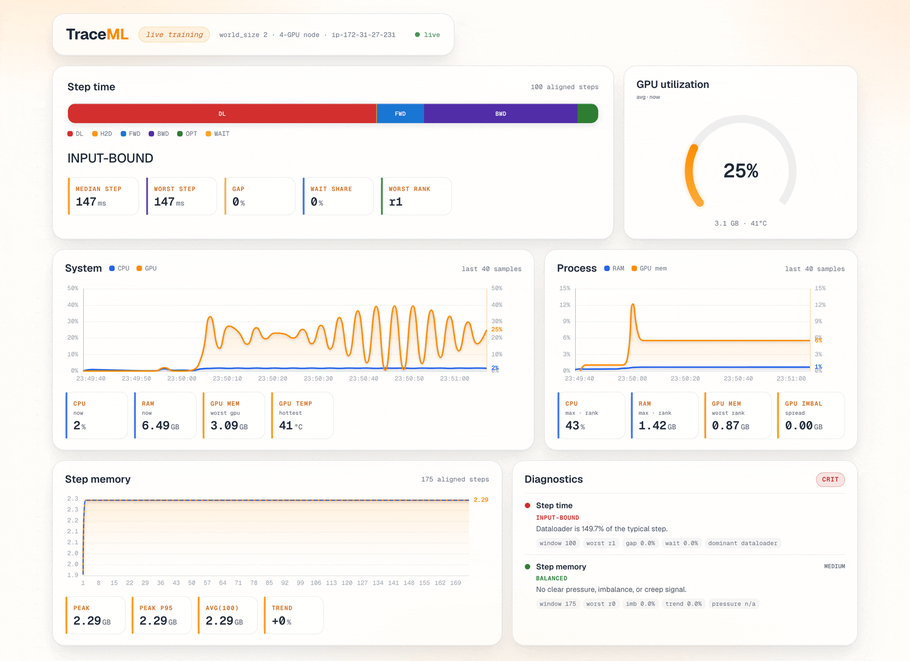

<div align="center">

# TraceML

**Find hidden PyTorch training bottlenecks before they waste GPU hours.**

[](https://pypi.org/project/traceml-ai/)
[](https://github.com/traceopt-ai/traceml/actions/workflows/ci.yml)
[](https://github.com/traceopt-ai/traceml/actions/workflows/codeql.yml)
[](https://www.python.org/)
[](./LICENSE)
[](https://github.com/traceopt-ai/traceml/stargazers)
[](https://discord.gg/rY3EQguZAN)

[**Quickstart**](docs/user_guide/quickstart.md) •
[**Compare Runs**](docs/user_guide/compare.md) •
[**Read Output**](docs/user_guide/reading-output.md) •
[**Use With Your Stack**](docs/user_guide/integrations.md) •
[**FAQ**](docs/user_guide/faq.md)

</div>

</div>

<div align="center">


<sub>Live terminal view</sub>

</div>


TraceML is open-source performance observability for PyTorch training.
It runs alongside your training loop and writes a compact performance summary at the end of every run — so teams can diagnose bottlenecks, compare runs, and catch regressions before reaching for a heavyweight profiler. Under 2% overhead in current benchmarks, across the full job, not just sampled steps.

TraceML helps answer:

- Is the GPU doing work, or waiting on input?
- Is one distributed rank consistently slower than the others?
- Is memory silently creeping upward during the run?
- Did a code, data, or infrastructure change slow training down?

---

## Where TraceML Fits

| Tool | Use it for | Not for |
|---|---|---|
| TraceML | Full-run bottlenecks and rank skew | Kernel/operator timelines |
| `torch.profiler` / Kineto | Op/CUDA traces for selected steps | Always-on summaries |
| Nsight Systems | GPU/kernel timeline debugging | Everyday training triage |
| Holistic Trace Analysis | Analyzing profiler traces | Live/full-run collection |
| W&B / MLflow | Experiment tracking and run history | Runtime bottleneck diagnosis |

Start with TraceML to find the bottleneck category; open deeper profilers when
you need operator- or kernel-level detail.

---


## 3-Minute Quickstart

### 1. Install the package

```bash
pip install traceml-ai
```

Using Hugging Face Trainer, PyTorch Lightning, Ray Train, W&B, or MLflow?
Start with the native integration path in
[Use With Your Stack](docs/user_guide/integrations.md).

### 2. Wrap your training step

Add TraceML around the core training step. You do not need to change your model,
optimizer, loss function, or dataloader.

```python
import traceml_ai as traceml

traceml.init(mode="auto")

for batch in dataloader:
    with traceml.trace_step(model):
        optimizer.zero_grad(set_to_none=True)
        outputs = model(batch["x"])
        loss = criterion(outputs, batch["y"])
        loss.backward()
        optimizer.step()
```

### 3. Run your script

```bash
traceml run train.py
```

Or try the self-contained example first:

```bash
traceml run examples/quickstart.py --mode=summary
```

For DDP, FSDP, and multi-node runs, see
[Distributed Training](docs/user_guide/distributed-training.md).

### Or launch your script directly

Prefer to launch training yourself with `python` or `torchrun`? Start the
TraceML aggregator once with `traceml serve`, then run your script directly.
`traceml.init(...)` connects to the aggregator over TCP:

```bash
# terminal 1: start the TraceML aggregator
traceml serve --aggregator-host 127.0.0.1 --aggregator-port 29765

# terminal 2: run your script directly
python train.py
```

For torchrun and multi-node, bind the aggregator so workers on other nodes can
reach it:

```bash
# on the aggregator node
traceml serve --aggregator-bind-host 0.0.0.0 --aggregator-host <node0-ip> --aggregator-port 29765

# on each training node
torchrun ... train.py
```

`traceml.init(...)` takes runtime settings as arguments (for example
`traceml.init(mode="auto", logs_dir="logs", aggregator_port=29765)`), and falls
back to `TRACEML_*` environment variables and `traceml.yaml`. The aggregator
endpoint is configured with `traceml serve` flags. See
[Public API](docs/user_guide/public-api.md#direct-launch-with-traceml-serve).

---

## What You Get

TraceML writes two end-of-run artifacts:

```text
logs/<run_name>/final_summary.json
logs/<run_name>/final_summary.txt
```

You can re-print a saved summary later without rerunning training:

```bash
traceml view logs/<run_name>/final_summary.json
```

Want a shareable report? Add `--html-report` to also write a self-contained
`final_summary.html`, or
render one from a saved run after the fact:

```bash
traceml run train.py --html-report
traceml view logs/<run_name>/final_summary.json --html   # writes <...>.html
```

For very large or slow multi-node jobs, TraceML waits at shutdown for late
telemetry, SQLite checkpointing, and final summary writing. Tune that single
end-of-run budget with `--finalize-timeout-sec` or
`TRACEML_FINALIZE_TIMEOUT_SEC` when running on slow filesystems or congested
networks.

Instead of guessing where training time went, you get an end-of-run verdict:
what slowed the run down, which rank or phase is suspicious, and where to look
next.

Example TraceML output:

```text
+----------------------------------------------------------------------------+
|  TraceML Run Summary | duration 40.1s                                      |
+----------------------------------------------------------------------------+
|                                                                            |
|  TraceML Verdict: INPUT STRAGGLER / CRITICAL                               |
|  Why: Rank r0 dataloader was 254.5ms vs median rank r1 at 3.8ms.           |
|  Next: Inspect dataloader, collate_fn, preprocessing, and storage on the   |
|  slow rank.                                                                |
|                                                                            |
|  Section Status                                                            |
|  Section       Status                  Severity                            |
|  ------------------------------------------------                          |
|  Step Time     INPUT STRAGGLER         CRITICAL                            |
|  System        LOW GPU UTIL            INFO                                |
|  Process       NORMAL                  INFO                                |
|  Step Memory   BALANCED                INFO                                |
|                                                                            |
|  System Evidence                                                           |
|  Metric          Median        Worst         Skew        Scope             |
|  --------------------------------------------------------------------------|
|  CPU Util        18.4%         71.2%         52.8pp      node=n1           |
|  GPU Util        14.0%         0.0%          14.0pp      node=n0           |
|  GPU Memory      6.20GB        8.90GB        43.5%       node=n1           |
|  GPU Temp        42C           58C           16C         node=n1           |
|                                                                            |
|  Step Time Evidence                                                        |
|  Phase           Median        Worst         Skew        Scope             |
|  --------------------------------------------------------------------------|
|  Total           303.7ms       304.1ms       0.1%        rank=r0 node=n0   |
|  Dataloader      3.8ms         254.5ms       6597.4%     rank=r0 node=n0   |
|  Compute         259.5ms       261.0ms       0.6%        rank=r2 node=n1   |
+----------------------------------------------------------------------------+
```

In this example, rank 0 is the slow input rank, which can hold back the aligned
distributed step.

Want to try a specific bottleneck? See [examples/](examples/) for
self-contained demos covering dataloader bottlenecks, H2D timing, DDP rank
stragglers, Lightning, Hugging Face, Ray, and tracker-friendly summary logging.

For experiment trackers, call `traceml.summary()` near the end of your script
to get a flat dict of diagnosis statuses and average metrics. Keep
`final_summary.json` when you want the full run artifact or an input for
`traceml compare`.

---

## What TraceML Helps You Triage

Use TraceML as the first check before opening a heavier profiler — it surfaces
the likely bottleneck area so you know where to look next.

| Area | What TraceML surfaces | What to inspect next |
|---|---|---|
| Input pipeline | High input time or slow input rank | `num_workers`, `pin_memory`, transforms, tokenization, `collate_fn`, dataset/storage latency |
| GPU utilization / residual | Step time split across input, compute, and residual | input pipeline, CPU/GPU handoff, synchronization, distributed coordination |
| Distributed skew | One DDP/FSDP rank slower than the others | rank-local dataloading, data imbalance, node variance, storage/network differences |
| Memory creep | Memory usage growing during the run | retained tensors, logging references, loss accumulation, cached activations |
| Run regression | Changed metrics versus a known-good run | code changes, data changes, batch size, container, driver, hardware, infrastructure |
| Compute-heavy runs | Most time is spent in compute | open `torch.profiler` or Nsight for operator/kernel-level detail |

---

## Catching Regressions with Compare Mode

Compare a slow run against a known good baseline to identify which metrics
changed:

```bash
traceml compare input_slow/final_summary.json input_fixed/final_summary.json
```

```text
+--------------------------------------------------------------------------------------+
|  TraceML Compare                                                                     |
+--------------------------------------------------------------------------------------+
|  Verdict: IMPROVEMENT                                                                |
|  Why: Step time decreased by 95.6%.                                                  |
|                                                                                      |
|  Metric                         A                B                Delta              |
|  Total step                     294.0 ms         13.0 ms          -280.9 ms (-95.6%) |
|  Input                          66.4 ms          2.7 ms           -63.7 ms (-95.9%)  |
+--------------------------------------------------------------------------------------+
```

See [Compare Runs](docs/user_guide/compare.md) for the full report format.

---

## Display Modes

TraceML controls what you see during training with the `--mode` flag, without
changing the final saved artifacts.

| Mode flag | Experience during training | Supported topology |
|---|---|---|
| no `--mode` | Live CLI on single-node; summary-only on multi-node | Single-node and multi-node multi-GPU |
| `--mode=summary` | Silent execution | Single-node and multi-node multi-GPU |
| `--mode=cli` | Live terminal display | Single-node, including multi-GPU |
| `--mode=dashboard` | Live browser display | Single-node; requires `pip install "traceml-ai[dashboard]"` |

> **Headless / CI / capturing stdout?** Use `--mode=summary` to
> suppress the live terminal display. The `final_summary.json` and `.txt` artifacts are still written.

<div align="center">



<sub>`--mode=dashboard` — optional local browser view for single-node runs.</sub>

</div>

---

## Current Support

**Works today:**

- Single GPU training
- Single-node multi-GPU DDP / FSDP
- Multi-node DDP summary reports
- Multi-node runs on Slurm (sbatch template + guide)
- Run-to-run comparison from `final_summary.json`
- Custom PyTorch loops, Hugging Face, PyTorch Lightning, and Ray Train

**On the roadmap:**

- Multi-node live CLI / browser dashboard
- Explicit collective / NCCL timing

---

## Overhead

In our benchmark runs, TraceML adds:

- <2% overhead on single GPU at default settings
- <1% overhead on single-node multi-GPU at default settings

---

## Troubleshooting Guides

These guides cover the common bottlenecks TraceML is designed to identify:

- [Find why PyTorch training is slow](docs/guides/slow-pytorch-training.md)
- [Find DataLoader Bottlenecks](docs/guides/pytorch-dataloader-bottleneck.md)
- [Debug Low GPU Utilization](docs/guides/low-gpu-utilization-pytorch.md)
- [Debug DDP Rank Stragglers](docs/guides/ddp-slow-training-rank-straggler.md)
- [Find PyTorch Memory Creep](docs/guides/pytorch-memory-creep.md)
- [Distributed Training](docs/user_guide/distributed-training.md)
- [Running on Slurm](docs/user_guide/slurm.md)
- [Use With Your Stack](docs/user_guide/integrations.md)
- [Compare Runs](docs/user_guide/compare.md)
- [How to Read Output](docs/user_guide/reading-output.md)
- [FAQ](docs/user_guide/faq.md)

---

## Feedback

For bugs, unexpected results, or feature requests, open a GitHub issue and use
the matching issue template. The templates ask for the details we need to
reproduce training-environment problems, including hardware, topology, launch
command, TraceML version, PyTorch/CUDA versions, and redacted summary output.

GitHub issues: [open an issue](https://github.com/traceopt-ai/traceml/issues)

If TraceML helped you find a real bottleneck, use the "I found a bottleneck"
issue template. These reports help other training teams recognize similar
problems.

Security reports: see [SECURITY.md](SECURITY.md)

Email: [support@traceopt.ai](mailto:support@traceopt.ai)

---

## Contributing

Contributions are welcome, especially:

- real slowdown examples and repros
- distributed training edge cases
- docs improvements
- framework integrations

See [CONTRIBUTING.md](CONTRIBUTING.md) for development setup and contribution guidelines.

---

## License

Apache 2.0. See [LICENSE](LICENSE).

TraceOpt is a trademark of OptAI UG (haftungsbeschränkt).
