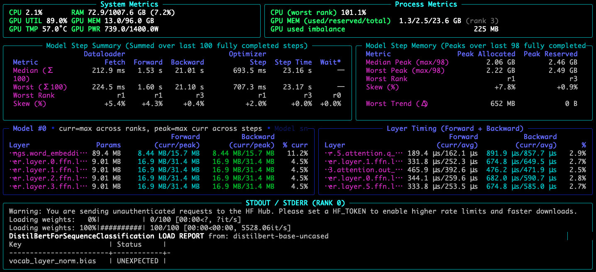

# TraceML

**Catch wasted GPU time during live PyTorch training**

[](https://pypi.org/project/traceml-ai/)
[](https://www.python.org/)
[](./LICENSE)
[](https://github.com/traceopt-ai/traceml)

TraceML is a lightweight bottleneck finder for PyTorch training.
It helps you catch input stalls, DDP rank imbalance, unstable step times, and memory drift while the run is still in progress.

**Works today:** Single GPU, single-node DDP, Hugging Face Trainer, PyTorch Lightning

**Not yet:** Multi-node DDP, FSDP / TP / PP

---


## Why TraceML

When training feels slow, a wall-clock timer tells you **that** it is slow.
TraceML helps show **where the time is going** and **what looks wrong while the job is still running**.

Use it to answer:

- Is the input pipeline starving the GPU?
- Are step times drifting or jittering?
- Is one DDP rank lagging behind the others?
- Is memory creeping up over time?
- How much time is going into forward, backward, optimizer, and overhead?

TraceML is designed for **real runs**, not only postmortem profiling.

---

## What TraceML gives you

### Live during training

- step-time breakdown
- dataloader / input wait visibility
- forward / backward / optimizer / overhead timing
- step jitter and drift
- GPU memory trend
- CPU / RAM / GPU signals

### At the end of the run

- a compact summary you can review quickly
- something easy to paste into an issue or share with a teammate
- a clearer starting point before using heavier profilers


---


## Quick Start

Install:

```bash
pip install traceml-ai
```

Wrap your training step:

```python
from traceml.decorators import trace_step

for batch in dataloader:
    with trace_step(model):
        outputs = model(batch["x"])
        loss = criterion(outputs, batch["y"])
        loss.backward()
        optimizer.step()
        optimizer.zero_grad(set_to_none=True)
```

Run your script through TraceML:

```bash
traceml run train.py
```

During training, TraceML opens a live terminal view alongside your logs.



At run end, it prints a compact summary.


If you want a richer view, TraceML also includes a local UI for reviewing runs and comparing them locally.


See [docs/quickstart.md](docs/quickstart.md) for more setup details.


---


## Why not just use timers?

Simple timers are useful, but they usually do not show:

- which part of the training step is growing
- whether the slowdown is coming from input, compute, optimizer, or overhead
- whether one DDP rank is slower than the others
- whether memory is drifting over time
- what the run looked like before it fully finished

TraceML is built to make those patterns visible with minimal code changes.

---


## Works with your training stack

### Plain PyTorch

Use `trace_step(model)` around your training step.

### Hugging Face Trainer

Replace `Trainer` with `TraceMLTrainer`:

```python
from traceml.hf_decorators import TraceMLTrainer

trainer = TraceMLTrainer(
    model=model,
    args=training_args,
    train_dataset=train_ds,
    eval_dataset=eval_ds,
    traceml_enabled=True,
)
```

See [docs/huggingface.md](docs/huggingface.md).

### PyTorch Lightning

Add `TraceMLCallback()` to your trainer:

```python
import lightning as L
from traceml.utils.lightning import TraceMLCallback

trainer = L.Trainer(callbacks=[TraceMLCallback()])
```

See the Lightning docs for the full setup.

---


## What TraceML surfaces

### Step-level breakdown

TraceML tracks:

- `dataloader -> forward -> backward -> optimizer -> overhead`
- step time
- GPU memory (allocated + peak)
- CPU / RAM / GPU signals

### DDP imbalance

In single-node DDP, TraceML surfaces:

- median rank
- worst rank
- skew (%)

This makes stragglers easier to spot without extra instrumentation.

### Optional model-level hooks

If you want extra model-level context, enable lightweight hooks:

```python
from traceml.decorators import trace_model_instance

trace_model_instance(model)
```

Use this together with `trace_step(model)` to add optional per-layer timing and memory signals.
The core step-level view works without it.

---

## Scope

TraceML focuses on lightweight diagnosis during real PyTorch training runs.

It is **not**:

- a kernel-level tracer
- an auto-tuner
- a replacement for deep profiling tools
- a full observability platform

---

## Safe to try on real runs

TraceML is built for practical training workflows:

- lightweight enough to use during real runs
- compact terminal output during training
- end-of-run summary for quick review and sharing
- fail-open behavior so instrumentation does not become the center of your training script

---

## Start with examples

If you want to see what TraceML is good at, start with example cases such as:

- input / dataloader stall
- DDP straggler / rank skew
- memory drift over time

See the examples folder for runnable cases and expected output.

---

## Feedback

If TraceML caught a slowdown for you, please open an issue and include:

- hardware / CUDA / PyTorch versions
- single GPU or DDP
- whether you used core step tracing only or model hooks
- the TraceML end-of-run summary
- a minimal repro if possible

Useful bug reports, slowdown cases, and integration feedback are especially valuable right now.

- 📧 Email: abhinav@traceopt.ai
- 📋 User Survey: https://forms.gle/KwPSLaPmJnJjoVXSA

---

## Contributing

Contributions are welcome.

Examples, reproducible slowdown cases, integration feedback, and bug reports are especially helpful.

---

## License

TraceML is released under the **Apache 2.0**.
See [LICENSE](./LICENSE) for details.
