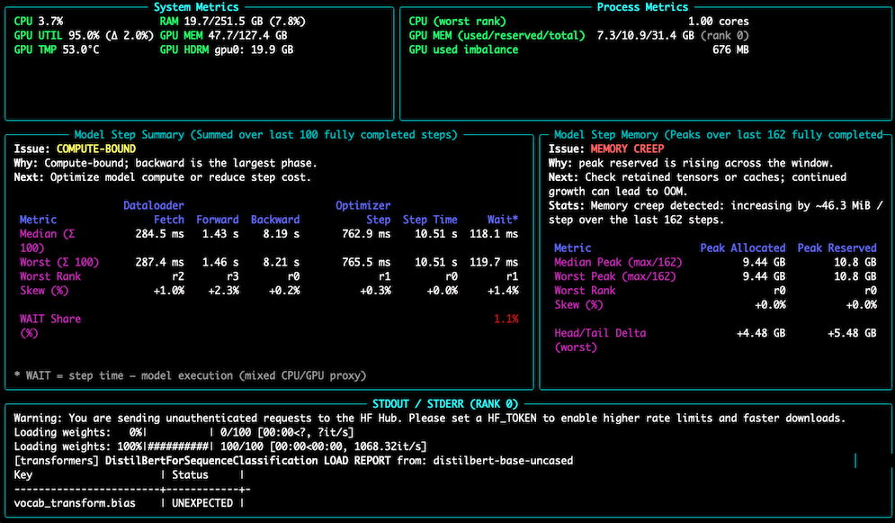
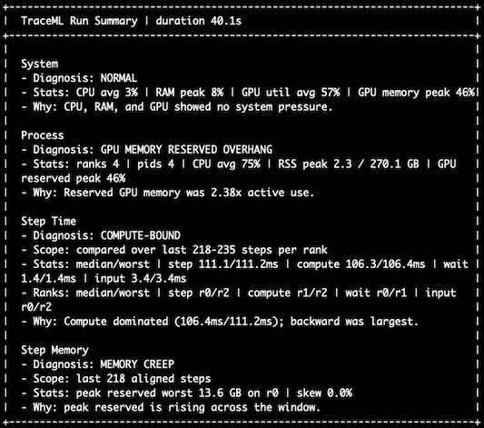

<div align="center">

# TraceML

**Find why PyTorch training is slow while the job is still running.**

[](https://pypi.org/project/traceml-ai/)
[](https://www.python.org/)
[](./LICENSE)
[](https://github.com/traceopt-ai/traceml)

[**Quickstart**](docs/quickstart.md) • [**How to Read Output**](docs/how-to-read-output.md) • [**FAQ**](docs/faq.md) • [**Use with W&B / MLflow**](docs/use-with-wandb-mlflow.md) • [**Issues**](https://github.com/traceopt-ai/traceml/issues)


</div>

TraceML helps you find training bottlenecks in PyTorch while the job is still running.
It helps you catch:

- input bottlenecks
- compute-bound steps
- DDP stragglers
- wait-heavy training
- memory creep over time

without jumping straight to a heavyweight profiler.

**Why this exists:** dashboards show utilization and curves. TraceML shows **why throughput is poor inside the training step**.

---

## The fastest way to try it

Install:

```bash
pip install traceml-ai
```

Wrap your training step:

```python
from traceml.decorators import trace_step

for batch in dataloader:
    with trace_step(model):
        optimizer.zero_grad(set_to_none=True)
        outputs = model(batch["x"])
        loss = criterion(outputs, batch["y"])
        loss.backward()
        optimizer.step()
```

Run:

```bash
traceml run train.py
```


During training, TraceML opens a live terminal view alongside your logs.




At the end of the run, it prints a compact summary you can review or share.



For full setup details, see [docs/quickstart.md](docs/quickstart.md).

Not sure how to interpret the output? Read [How to Read TraceML Output](docs/how-to-read-output.md).

---

## What TraceML tells you

TraceML helps answer questions like:

- Is training input-bound or compute-bound?
- Is one DDP rank slower than the others?
- Is the job wait-heavy because of uneven progress?
- Is memory drifting upward over time?
- Is the slowdown coming from dataloader, forward, backward, or optimizer work?

---

## When to use TraceML

Use TraceML when training feels:

- slower than expected
- unstable from step to step
- imbalanced across distributed ranks
- fine in dashboards but still underperforming

Start with TraceML when you need a fast answer in the terminal.
Reach for `torch.profiler` once you know where to dig deeper.

---

## How it fits with your stack

TraceML is designed to work alongside tools like W&B, MLflow, and TensorBoard.

Use those for:

- experiment tracking
- artifacts
- dashboards
- team reporting

Use TraceML for:

- bottleneck diagnosis
- rank imbalance / straggler detection
- memory trend debugging

See [Use TraceML with W&B / MLflow](docs/use-with-wandb-mlflow.md).


---

## Current support

**Works today:**

- single GPU
- single-node DDP/FSDP

**Not yet:**

- multi-node
- tensor parallel
- pipeline parallel

---

## Next steps

- [Quickstart](docs/quickstart.md)
- [Examples](examples/README.md)
- [How to Read TraceML Output](docs/how-to-read-output.md)
- [FAQ](docs/faq.md)
- [Use TraceML with W&B / MLflow](docs/use-with-wandb-mlflow.md)
- Hugging Face integration: `docs/huggingface.md`
- PyTorch Lightning integration: `docs/lightning.md`

---

## Feedback

If TraceML helped you find a slowdown, please open an issue and include:

- hardware / CUDA / PyTorch versions
- single GPU or multi-GPU
- whether you used `run`, `watch`, or `deep`
- the end-of-run summary
- a minimal repro if possible

GitHub issues: https://github.com/traceopt-ai/traceml/issues

Email: support@traceopt.ai

---

## Contributing

Contributions are welcome, especially:

- reproducible slowdown cases
- bug reports
- docs improvements
- integrations
- examples

---

## License

Apache 2.0. See [LICENSE](LICENSE).
