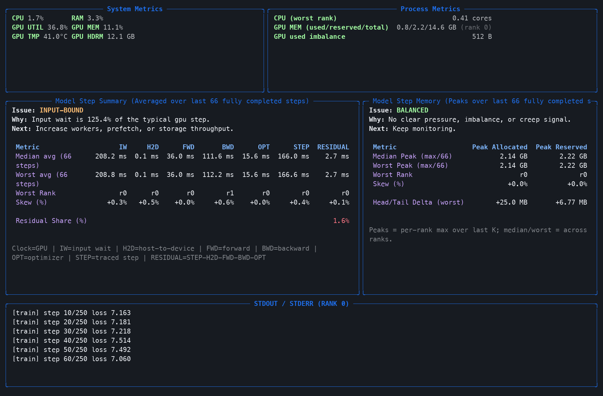
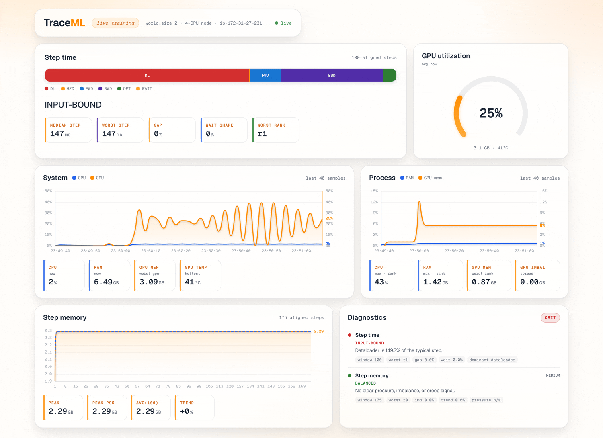

<div align="center">

# TraceML

**Find out why your PyTorch training is slow—before it wastes GPU hours.**

[](https://pypi.org/project/traceml-ai/)
[](https://github.com/traceopt-ai/traceml/actions/workflows/ci.yml)
[](https://www.python.org/)
[](./LICENSE)
[](https://github.com/traceopt-ai/traceml/stargazers)

[**Quickstart**](#quickstart) •
[**Documentation**](docs/user_guide/quickstart.md) •
[**Integrations**](docs/user_guide/integrations.md) •
[**Distributed Training**](docs/user_guide/distributed-training.md) •
[**Discord**](https://discord.gg/rY3EQguZAN)

</div>

TraceML is an open-source tool that diagnoses performance bottlenecks in
PyTorch training. It shows what is slow, the evidence behind the diagnosis,
and what to investigate next.

Use TraceML as a first pass before opening an operator- or kernel-level
profiler. It complements experiment trackers such as W&B and MLflow.

```text
+----------------------------------------------------------------------------+
|  TraceML Run Summary | duration 40.1s                                      |
+----------------------------------------------------------------------------+
|                                                                            |
|  TraceML Verdict: INPUT STRAGGLER / CRITICAL                               |
|  Why: Rank r0 input wait was 254.5ms vs median rank r1 at 3.8ms.           |
|  Next: Inspect dataloader, collate_fn, preprocessing, and storage on the   |
|  slow rank.                                                                |
|                                                                            |
|  Section Status                                                            |
|  Section       Status                  Severity                            |
|  ------------------------------------------------                          |
|  Step Time     INPUT STRAGGLER         CRITICAL                            |
|  System        LOW GPU UTIL            INFO                                |
|  Process       NORMAL                  INFO                                |
|  Step Memory   BALANCED                INFO                                |
|                                                                            |
|  System Evidence                                                           |
|  Metric          Median        Worst         Skew        Scope             |
|  --------------------------------------------------------------------------|
|  CPU Util        18.4%         71.2%         52.8pp      node=n1           |
|  GPU Util        14.0%         0.0%          14.0pp      node=n0           |
|  GPU Memory      6.20GB        8.90GB        43.5%       node=n1           |
|  GPU Temp        42C           58C           16C         node=n1           |
|                                                                            |
|  Step Time Evidence                                                        |
|  Phase           Median        Worst         Skew        Scope             |
|  --------------------------------------------------------------------------|
|  Total           303.7ms       304.1ms       0.1%        rank=r0 node=n0   |
|  Input Wait      3.8ms         254.5ms       6597.4%     rank=r0 node=n0   |
|  Compute         259.5ms       261.0ms       0.6%        rank=r2 node=n1   |
+----------------------------------------------------------------------------+
```

TraceML turns full-run telemetry into a diagnosis, supporting evidence, and
the next action to take.

## Quickstart

### 1. Install

```bash
pip install traceml-ai
```

Or, in a project managed by [uv](https://docs.astral.sh/uv/):

```bash
uv add traceml-ai
```

### 2. Instrument the training step

```diff
+   import traceml_ai as traceml

+   traceml.init(mode="auto")

    for batch in dataloader:
+       with traceml.trace_step(model):
            optimizer.zero_grad(set_to_none=True)
            outputs = model(batch["x"])
            loss = criterion(outputs, batch["y"])
            loss.backward()
            optimizer.step()
```

### 3. Run

```bash
traceml run train.py
```

Summary mode is the default. TraceML prints the final diagnosis and writes:

```text
logs/<run_name>/final_summary.json
logs/<run_name>/final_summary.txt
```

See the
[full quickstart](docs/user_guide/quickstart.md) for Colab, Docker, direct
`python`/`torchrun` launches, HTML reports, and advanced options.

## What TraceML Diagnoses

| Diagnosis | Where to investigate |
|---|---|
| Input-bound | DataLoader workers, transforms, tokenization, collation, or storage |
| Compute-bound | Model compute, mixed precision, batch size, or deeper profiling |
| Residual-heavy | Work outside traced phases, CPU stalls, logging, checkpointing, validation, or unobserved transfers |
| Rank straggler | Rank-local input, data imbalance, node variance, or networking |
| Memory creep | Retained tensors, logging references, or cached activations |
| Run regression | Code, data, environment, hardware, or infrastructure changes |

Read [How to Read TraceML Output](docs/user_guide/reading-output.md) for the
diagnosis rules, evidence fields, and recommended next actions.

## Use the Result

Send the compact diagnosis to an existing W&B run:

```python
import traceml_ai as traceml
import wandb

...

summary = traceml.summary(print_text=True)
if summary is not None:
    wandb.log(summary)
```

The same result can be stored in MLflow. See
[W&B and MLflow](docs/user_guide/integrations/wandb-mlflow.md) for complete
examples.

Compare a run with a known-good baseline:

```bash
traceml compare old_run/final_summary.json new_run/final_summary.json
```

See [Compare Runs](docs/user_guide/compare.md) for the report format.

<details>
<summary><strong>Want live diagnostics during training?</strong></summary>

Use the live terminal view locally or over SSH:

```bash
traceml run train.py --mode=cli
```



Use the browser dashboard on a single node:

```bash
traceml run train.py --mode=dashboard
```



For remote browser access and SSH tunneling, see the
[full quickstart](docs/user_guide/quickstart.md).

</details>

## Distributed Training and Integrations

- **Distributed:** [DDP, FSDP, and multi-node](docs/user_guide/distributed-training.md)
  or [Slurm](docs/user_guide/slurm.md)
- **Frameworks:** [Hugging Face](docs/user_guide/integrations/huggingface.md),
  [PyTorch Lightning](docs/user_guide/integrations/lightning.md),
  [Ray Train](docs/user_guide/integrations/ray.md), and
  [DeepSpeed](docs/user_guide/integrations/deepspeed.md)
- **Trackers:** [W&B and MLflow](docs/user_guide/integrations/wandb-mlflow.md)

Summary mode supports single-node and multi-node runs. Live terminal and
dashboard modes are explicit single-node options. See the
[FAQ](docs/user_guide/faq.md) for current support and limitations.

## Learn More

- [Complete quickstart](docs/user_guide/quickstart.md)
- [Examples](examples/README.md)
- [Troubleshoot slow training](docs/guides/slow-pytorch-training.md)
- [Public API](docs/user_guide/public-api.md)
- [FAQ](docs/user_guide/faq.md)

## Community

If TraceML helps you find a bottleneck, consider
[starring the repository](https://github.com/traceopt-ai/traceml).
Contributions and real-world slowdown reports are welcome:

- [Contributing guide](CONTRIBUTING.md)
- [Open an issue](https://github.com/traceopt-ai/traceml/issues)
- [Security policy](SECURITY.md)
- [Discord](https://discord.gg/rY3EQguZAN)

## License

Apache 2.0. See [LICENSE](LICENSE).
