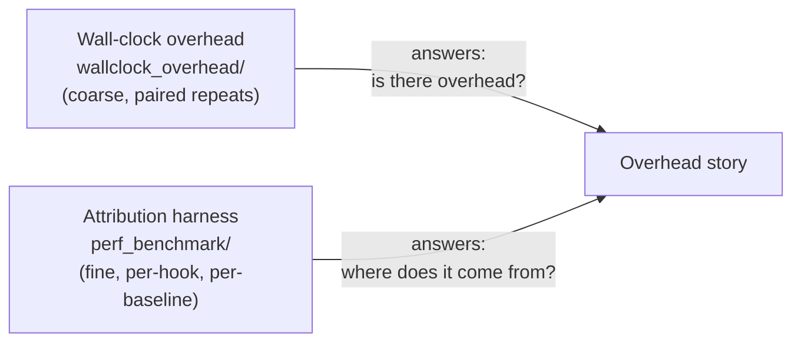

# TraceML overhead benchmarking

Two independent tracks measure TraceML's runtime cost. The wall-clock
track answers "how much slower is training end to end?"; the attribution
track answers "which instrumentation hook costs what, per step?".

**Headline (as of 2026-07-22):** TraceML adds **less than 1 ms per rank
per training step**, and end-to-end throughput overhead has measured at
**roughly 1% or below** on every configuration tested.

## Layout

| Folder | What it holds |
|---|---|
| [`wallclock_overhead/`](wallclock_overhead/) | Wall-clock track: training script + paired `time` methodology and reproduction commands |
| [`perf_benchmark/`](perf_benchmark/) | Attribution track: config-driven runner, baselines, aggregation |
| [`reports/`](reports/) | Dated campaign reports from both tracks (report + distilled CSVs) |

## Wall-clock overhead — [`wallclock_overhead/`](wallclock_overhead/README.md)

Paired repeats of the same training script — `time torchrun ...` (native)
vs `time traceml run ...` (TraceML) — alternated in order to cancel
thermal/environment drift, identical args each time. Reproducible with
nothing but the two `time` commands.

| Campaign | TraceML | Hardware / topology | Workload & config | Repeats | Throughput overhead |
|---|---|---|---|---|---|
| [2026-06-11](reports/2026-06-11_pr153_ddp_mlp_g4dn/report.md) | v0.3.1 | 2× g4dn.xlarge (1× T4 each): single GPU and 2-node DDP | DDP MLP, batch 256, hidden dim 4096, 600 s/trial | 5 paired per topology, 20/20 trials clean | **+1.02%** single GPU · **≈0%** 2-node DDP (network-bound) |
| [2026-07-19](reports/2026-07-19_v035_ddp_mlp_g4dn/report.md) | v0.3.5 | 1× g4dn.12xlarge (4× T4): single GPU and 4-GPU DDP | same script, identical native/TraceML args, 300 s/trial | 5 paired per topology | **+0.95% ± 0.09** single GPU · **+0.41% ± 0.07** 4-GPU DDP |

## Attribution — [`perf_benchmark/`](perf_benchmark/README.md)

Config-driven runner comparing three cells per condition —
`never_init` (TraceML never initialized), `trace_manual`, `trace_auto` —
with CUDA-synced step timing. Statistics use the median of independent
process-repeat medians, and any delta inside the baseline's noise floor
is reported as a bound, never as zero.

| Campaign | Code | Hardware / topology | Workload & config | Repeats | Per-step overhead vs `never_init` |
|---|---|---|---|---|---|
| [2026-07-22](reports/2026-07-22_clean_1_2_4node_g4dn/report.md) | `benchmarking` @ `58a177c` | 1 / 2 / 4 nodes, each g4dn.xlarge (1× T4), on-demand | `tiny_mlp`, synthetic data, batch 256 / 512 / 1024, 1000 timed steps + 100 warmup discarded, step timing, GIL probe off | 10 fresh processes per cell | `trace_auto` **+0.17–0.58 ms per rank** · `trace_manual` **+0.05–0.28 ms per rank** |

Percentages are deliberately not the headline here: the same ~0.4 ms cost
is 42% of a 1.4 ms single-node step but 4% of a 9.3 ms 4-node step — the
baseline grows with node count, the cost does not. An earlier 2026-07-21
campaign is retained as GIL-stress diagnostic data only (its configs
unknowingly ran the GIL stress probe in every cell); see
[`reports/README.md`](reports/README.md).

## If you only need one number

TraceML costs **under 1 ms per rank per training step** (attribution
track), which shows up as **roughly 1% or less** end-to-end on the
configurations tested (wall-clock track). The main repository README's
measured-overhead line links to this page.
