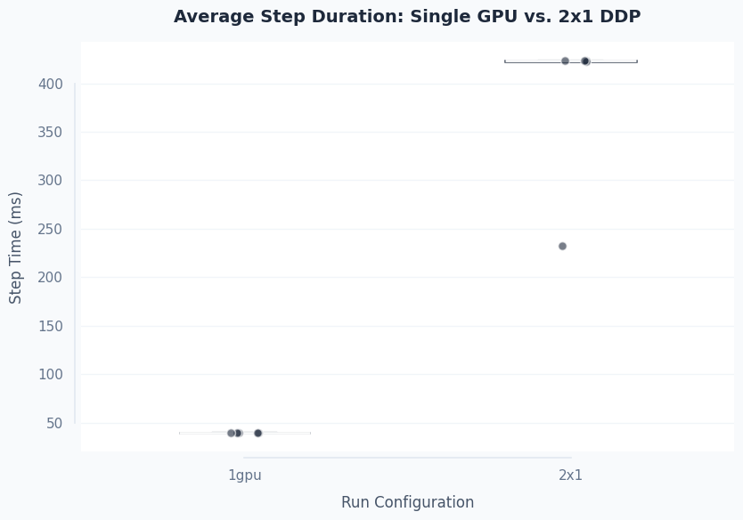
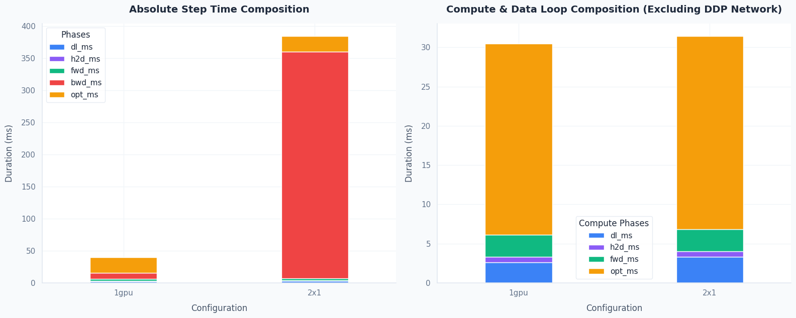
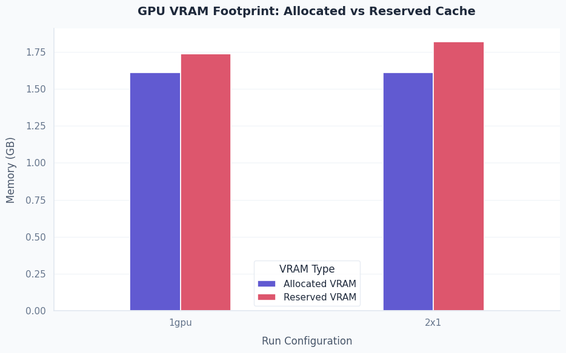
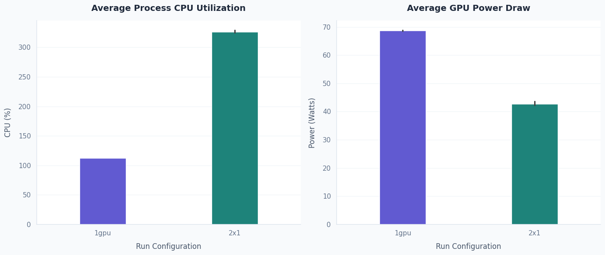
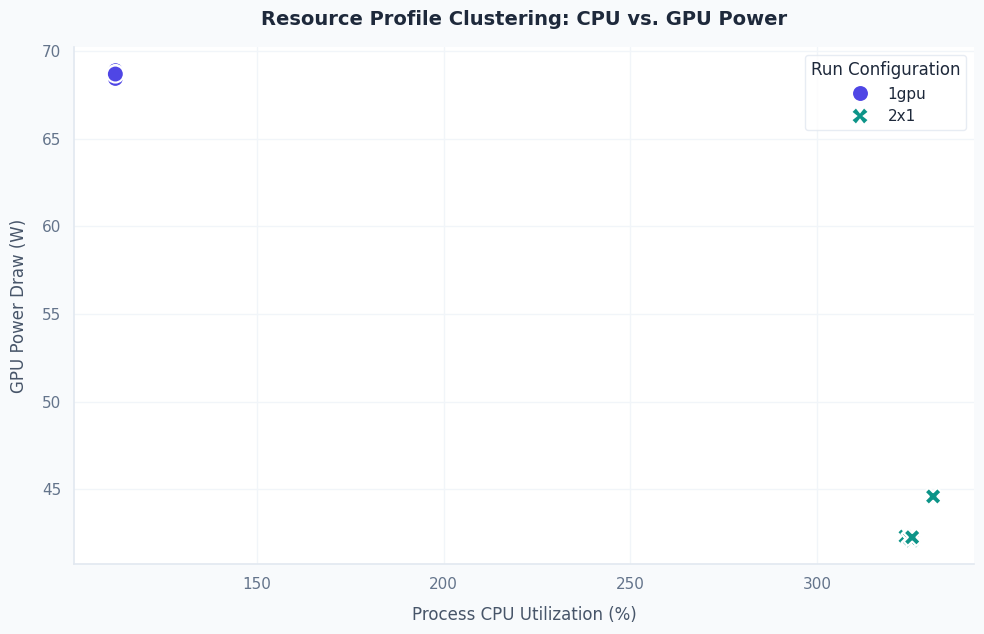
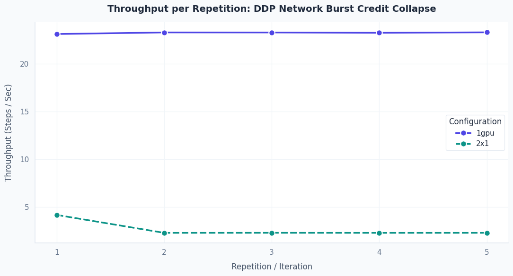

# PR #153 Overhead Study: TraceML Multi-Node Aggregator (`ddp_mlp_e2e`)

- **Date:** 2026-06-12 · **Version:** TraceML v0.3.1 (`multnode_display` branch)
- **Scope:** Performance and resource overhead of the base multi-node / DDP
  aggregator + display telemetry layer introduced by PR #153.
- **Workload:** [`benchmarking/workloads/ddp_mlp_e2e.py`](../../workloads/ddp_mlp_e2e.py)
- **Hardware:** 2× AWS `g4dn.xlarge` (1× Tesla T4, 16 GB RAM each),
  `eu-central-1`; driver 595.71.05, CUDA 13.0, torch 2.11.0+cu130,
  NCCL 2.28.9, Python 3.13. Multi-node = 2 nodes × 1 GPU, static
  rendezvous over private IP, TCP transport (no EFA on g4dn).

> **Verification.** Every number below was independently re-derived from
> the 10 raw per-run `telemetry_summary_card.json` files and from
> `results.jsonl`, not just copied from the notebook. The source notebook
> is kept internally; this report is the reviewable artifact.

## Executive summary

| Topology | Throughput overhead | Wall-clock overhead | Verdict |
|---|---|---|---|
| **Single GPU (T4)** | **+1.02%** | **+0.90%** | well under the < 2% budget |
| **2-node DDP (T4, TCP)** | **≈0%** (stable-network floor) | **+0.64%** | negligible; step is network-bound |

The base multi-node telemetry/aggregation layer in PR #153 stays within
the < 2% overhead budget on both single-GPU and DDP. **Recommendation:
safe to merge.** Under DDP the training step is dominated by inter-node
NCCL all-reduce, so TraceML's local telemetry cost is not measurable
against it.

## Contents
1. [Motivation & scope boundary](#1-motivation--scope-boundary)
2. [Methodology & data-quality control](#2-methodology--data-quality-control)
3. [Step time & phase bottlenecks](#3-step-time--phase-bottlenecks)
4. [Memory & hardware efficiency](#4-memory--hardware-efficiency)
5. [Throughput & environment drift](#5-throughput--environment-drift)
6. [Conclusions & verdict](#6-conclusions--verdict)
7. [Methodology caveats (for the next campaign)](#7-methodology-caveats-for-the-next-campaign)

---

## 1. Motivation & scope boundary

TraceML must stay lightweight enough to run for entire training jobs, so
each release should hold a strict overhead budget (target **< 2%**). Any
telemetry layer risks slowing steps through serialization, CPU
contention, or socket blocking, this study measures whether PR #153's
base layer does.

**Scope boundary, PR #153 vs PR #149:**
- **In scope (PR #153):** the base multi-node telemetry **aggregation +
  display** layer, spawning local workers, the TCP telemetry socket,
  message multiplexing, and writing the final run card.
- **Out of scope (PR #149):** DDP **comm-hook** timing of NCCL collectives
  (`AllReduce`). That code is **not** active here and is not measured.
- **Why it matters:** confirming the base aggregator is cheap unblocks
  merging PR #153, which is the UI/aggregator foundation that PR #149's
  comm-hook timing later builds on.

## 2. Methodology & data-quality control

1. **Paired repeats:** 5 paired (native vs TraceML) runs per topology.
2. **Alternated order:** odd repeats native-first, even repeats
   TraceML-first, to cancel thermal/environmental bias.
3. **Identical args:** `--duration-sec 600 --batch-size 256 --hidden-dim 4096`
   for every trial. 20/20 trials completed, 0 failures.
4. **Two metrics, reported separately** (see §7 for why):
   - *wall overhead* = `traceml_real / native_real − 1` (captures fixed startup)
   - *throughput overhead* = `native_steps_per_s / traceml_steps_per_s − 1` (per-step cost)

**Stability (Coefficient of Variation, CV% = std/mean):**

| Topology | step-time CV% | throughput CV% |
|---|---|---|
| Single GPU | 0.27% | 0.31% |
| 2-node DDP | 22.2% | 31.2% |

Single-GPU is rock-steady. The high DDP CV% is **not** measurement noise,it is the network burst-credit drop after repeat 1 (see §5); the paired,
alternated design keeps the per-pair overhead ratio valid regardless.

## 3. Step time & phase bottlenecks

Single-GPU step ≈ 39.6 ms; DDP step ≈ 423 ms at the stable-network floor
(repeats 2-5), ~10.7× slower, entirely from inter-node communication.

Phase split (`dl` / `h2d` / `fwd` / `bwd` / `opt`). In DDP the backward
pass absorbs the NCCL all-reduce wait and **consumes ~92.6% of the step**
(391 ms of 423 ms, repeats 2-5). The right panel excludes backward to
show the compute loop itself is essentially unchanged between
topologies, i.e. the slowdown is communication, not compute or
instrumentation.

## 4. Memory & hardware efficiency

| VRAM | Single GPU | 2-node DDP |
|---|---|---|
| Peak **allocated** | 1.61 GB | 1.61 GB |
| Peak **reserved** | 1.74 GB | 1.74-1.87 GB (mean 1.82) |

Allocated VRAM is identical, **zero active-memory overhead** from
TraceML. DDP's reserved cache is marginally higher (mean +0.08 GB, up to
+0.13 GB on 3 of 5 runs), which is native PyTorch-DDP buffer behaviour,
not TraceML.

| Resource | Single GPU | 2-node DDP |
|---|---|---|
| Process CPU | 112.2% | ~326% (multi-process) |
| GPU power (stable regime) | 68.6 W | 42.2 W |

DDP GPU power drops ~38% even though `nvidia-smi` reports ~97%
utilization, the classic "busy-wait paradox": the CUDA context stays
pinned (reads as 97% util) while the GPU actually idles waiting on the
TCP all-reduce, so real power draw falls. Pairing utilization with power
(the clustering plot) is what exposes the network-idle state.

## 5. Throughput & environment drift

DDP throughput drops from **4.25 steps/s (repeat 1)** to **~2.35 steps/s
(repeats 2-5)** in *both* native and TraceML modes, AWS g4dn network
burst credits depleting after the first run, not a TraceML effect (the
native control drops identically). This is why the DDP throughput
overhead is reported as the **median (≈0%)** rather than the mean (which
the repeat-1 outlier skews to +2.4%).

## 6. Conclusions & verdict

| Metric | Target | Single GPU | 2-node DDP | Verdict |
|---|---|---|---|---|
| Throughput overhead | < 2.0% | +1.02% | ≈0% (floor) | **PASS** |
| Wall-clock overhead | < 2.0% | +0.90% | +0.64% | **PASS** (≈5.5 s fixed startup) |
| Peak VRAM allocated | 0% increase | 1.61 GB | 1.61 GB | **PASS** |
| Peak VRAM reserved | 0% increase | 1.74 GB | mean 1.82 GB | PASS (DDP buffers, not TraceML) |
| Process CPU | informational | 112.2% | ~326% | normal DDP multi-process |
| GPU power | informational | 68.6 W | 42.2 W | network-idle signature |

**Recommendation: merge PR #153.** The base aggregator/display layer is
within budget on both topologies. Once merged, PR #149's NCCL comm-hook
timing can be layered on this foundation and benchmarked the same way.

## 7. Methodology caveats (for the next campaign)

Honest limitations of *this* benchmark, to fix as the program matures:

1. **Wall-clock metric is structurally insensitive to per-step overhead.**
   Both modes train for the same fixed `--duration-sec` (600 s), so they
   finish at ~the same wall time *by construction*, native does ~14,300
   steps, TraceML ~14,180. The wall difference is therefore almost entirely
   fixed startup/teardown (~5.5 s single-GPU, ~4 s DDP: aggregator boot +
   2-rank telemetry setup + report writing), **not** per-step cost; the
   per-step cost instead shows up as *fewer steps completed* (lower
   throughput). A workload where TraceML made every step 30% slower would
   still report ~0% wall overhead (both ran 600 s) while throughput would
   show +30%. This is also what the **DDP row's split** means: its **+0.64%
   wall is the ~4 s one-time startup** spread over 600 s (it shrinks with
   run length, ~0.06% at 6000 s), while its **~0% throughput is the true
   per-step cost** (negligible because the DDP step is mostly NCCL network
   wait that hides TraceML's ~1 ms of sampling). Both numbers are correct;
   they measure one-time startup vs per-step, which is why they diverge.
   *Fix:* a fixed-`--steps N` workload makes both modes do identical work,
   so wall = startup + N × per-step-time and (for large N) the wall and
   throughput numbers converge instead of telling two stories.
2. **Rank-divergent stop can hang multi-node runs.** In DDP both ranks must
   run the same number of steps: every backward pass does an **all-reduce**
   to average gradients, and an all-reduce only completes when *every* rank
   calls it. The workload stops on `perf_counter() - start >= duration`,
   checked **independently on each rank** (own clock, own start) with nothing
   synchronizing the decision. At the 600 s boundary the ranks can land on
   different sides of the threshold *within the same step*: rank 0 reads
   600.01 s and exits + destroys its process group, while rank 1 reads
   599.99 s, runs one more step, calls all-reduce, and blocks until the NCCL
   watchdog aborts (~10 min), because its partner is gone. It's a race
   between inter-node clock skew and the ~423 ms step period, so it fired 0
   times in these 20 runs, but it is a real latent hang, and the failure is
   asymmetric: in **TraceML mode** the hang would look like *TraceML* froze
   the training when the cause is the unsynchronized stop. *Fix (either):* a
   collective stop flag (each rank computes a local flag, then
   `dist.all_reduce(stop, op=ReduceOp.MAX)` so all stop on the same step,   ~3 lines, mode-symmetric so it doesn't bias the comparison); or
   `--steps N`, which makes the stop deterministic and identical across ranks
   (no clock, no skew) and also fixes caveat 1.
3. **DDP overhead here is indirect**, inferred from the backward-phase
   timing, not measured via comm hooks (that is PR #149).
4. **Reproducibility:** this report is static (plots embedded). The data
   it is built from is in `per_run_breakdown.csv` (this folder); the raw
   per-run telemetry sessions are kept internally, not committed.
