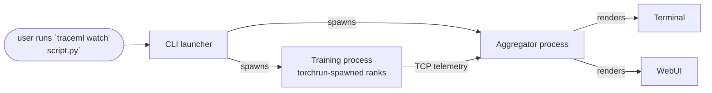

# Architecture

TraceML runs as three cooperating processes during a training job:

The CLI spawns an **aggregator** server and one or more **training** ranks via `torchrun`. Training ranks run user code in-process with TraceML hooks attached; telemetry is shipped over TCP to the aggregator, which renders the unified view.

## Telemetry data flow

Samplers maintain an incremental append counter per rank per table. The sender ships only new rows. The aggregator's `RemoteDBStore` keeps each rank's data separate, and renderers pull read-only views from it.

## Layers

| Layer | Directory | Responsibility |
|---|---|---|
| CLI | `src/traceml/cli.py` | Argument parsing, process spawning, signal handling |
| Runtime | `src/traceml/runtime/` | In-process agent per rank; user-script executor |
| Aggregator | `src/traceml/aggregator/` | TCP server, unified store, display orchestration |
| Samplers | `src/traceml/samplers/` | Periodic telemetry collection (timing, memory, system) |
| Database | `src/traceml/database/` | Bounded in-memory tables; rank-aware remote store |
| Transport | `src/traceml/transport/` | TCP bidirectional + DDP rank detection |
| Renderers | `src/traceml/renderers/` | Transform stored data into Rich/Plotly output |
| Display drivers | `src/traceml/aggregator/display_drivers/` | CLI vs NiceGUI output medium |
| Decorators | `src/traceml/decorators.py` | User-facing instrumentation entry points |
| Integrations | `src/traceml/integrations/` | Hugging Face + Lightning adapters |
| Utils | `src/traceml/utils/` | Hooks, patches, memory/timing helpers |

Each layer has its own page under [Subsystems](subsystems/cli.md).

## Design principles

- **Fail-open** — training must never crash because telemetry broke. Sampler/transport errors are logged, execution continues.
- **Bounded overhead** — every new sampler justifies its overhead. Deque-based bounded tables evict oldest records at fixed `maxlen`.
- **Process isolation** — no shared memory. TCP + env vars only.
- **Out-of-process UI** — aggregator crashes don't crash training.
