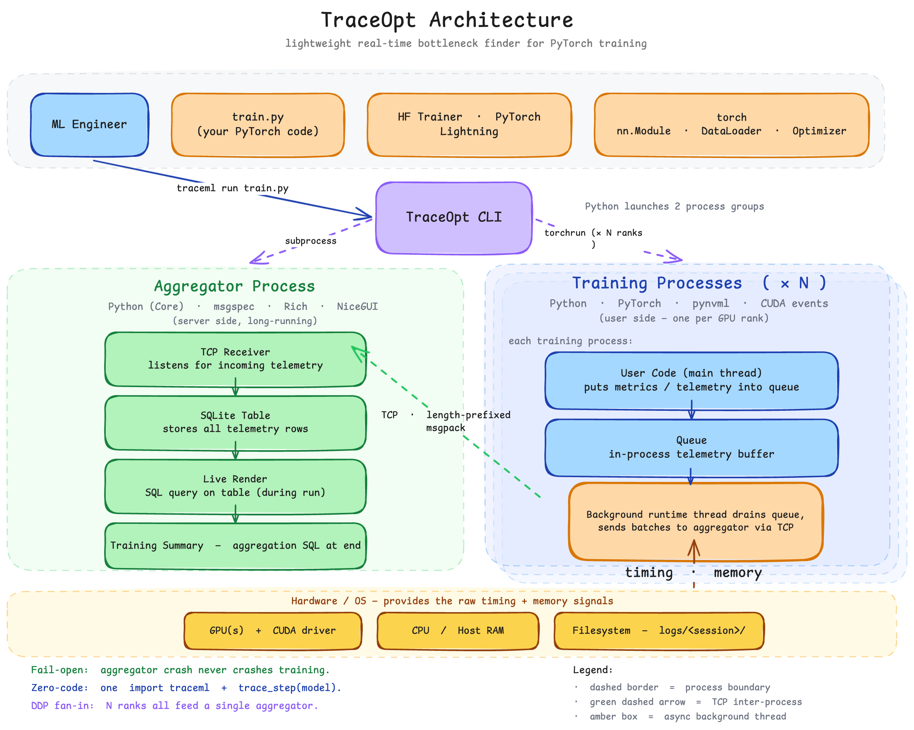
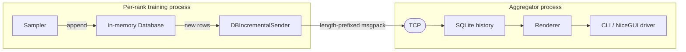

# Architecture

TraceML runs as three cooperating processes during a training job. The CLI spawns an **aggregator** server and one or more **training** ranks via `torchrun`. Training ranks run user code in-process with TraceML hooks attached; telemetry is shipped over TCP to the aggregator, which renders the unified view.

## Telemetry data flow

Samplers maintain an incremental append counter per rank per table. The sender ships only new rows. The aggregator writes canonical telemetry into SQLite-backed history, and renderers pull read-only views from that history.

## Layers

| Layer | Directory | Responsibility |
|---|---|---|
| CLI | `src/traceml_ai/launcher/` | Argument parsing, process spawning, signal handling |
| Runtime | `src/traceml_ai/runtime/` | In-process agent per rank; user-script executor |
| Aggregator | `src/traceml_ai/aggregator/` | TCP server, unified store, display orchestration |
| Samplers | `src/traceml_ai/samplers/` | Periodic telemetry collection (timing, memory, system) |
| Database | `src/traceml_ai/database/` | Bounded in-memory tables and SQLite-backed history |
| Transport | `src/traceml_ai/transport/` | TCP bidirectional + DDP rank detection |
| Renderers | `src/traceml_ai/renderers/` | Transform stored data into Rich/Plotly output |
| Display drivers | `src/traceml_ai/aggregator/display_drivers/` | CLI vs NiceGUI output medium |
| Public API | `src/traceml_ai/api.py` | Top-level instrumentation entry points |
| Integrations | `src/traceml_ai/integrations/` | Hugging Face, Lightning, and Ray adapters |
| Utils | `src/traceml_ai/utils/` | Hooks, patches, memory/timing helpers |

The `src/traceml/` package is a deprecated compatibility alias for older import
paths. New implementation work should go under `src/traceml_ai/`.

For the user-facing API surface (`trace_step`, `TraceMLTrainer`, `TraceMLCallback`, CLI usage), see the [Public API](../user_guide/public-api.md). The source tree above is the canonical reference for internals — start from the entry points and follow the imports.

## Design principles

- **Fail-open** — training must never crash because telemetry broke. Sampler/transport errors are logged, execution continues.
- **Bounded overhead** — every new sampler justifies its overhead. Deque-based bounded tables evict oldest records at fixed `maxlen`.
- **Process isolation** — no shared memory. TCP + env vars only.
- **Out-of-process UI** — aggregator crashes don't crash training.

## Architecture decisions

The load-bearing calls that shape the system, with the rationale and the main alternative that was rejected. Smaller choices live in code comments and pull requests.

| Decision | Rationale (alternative rejected) | Consequence / trade-off |
|---|---|---|
| Run the aggregator out-of-process and talk over TCP | A crash or slowdown in the UI/diagnosis layer must never take down training (rejected: in-process aggregation sharing the training interpreter) | A serialize-and-send hop per batch, plus an env-var contract and a fixed port to manage |
| Auto-instrument by patching PyTorch internals at `init()` | Deliver phase timing with zero manual logging (rejected: asking users to wrap every phase by hand) | Tight coupling to torch internals (`nn.Module.__call__`, `Tensor.backward` / `autograd.backward`, `Tensor.to`, `DataLoader.__iter__`); patches must be fail-open and are the most test-critical surface |
| Time GPU phases with pooled CUDA events resolved by non-blocking `query()`, never `synchronize()` | Synchronizing to read a timing would stall the training stream and distort the very thing being measured (rejected: `torch.cuda.synchronize()` around phases) | Events resolve opportunistically from a capped pool; an occasional unresolved event is dropped (overhead safety chosen over total completeness) |
| Length-prefixed msgpack frames, no version field, legacy flat shape still accepted | Keep the wire compact and simple while preserving existing v0.2.x senders (rejected: a versioned/handshaked protocol) | Wire evolution must stay additive and tolerant; there is no negotiated version to branch on |
| Bounded in-memory deque tables for the live view, SQLite (WAL) for history | Cap per-rank memory yet keep a queryable history; renderers read from SQLite (rejected: unbounded in-memory retention) | Oldest in-memory rows evict at `maxlen`; SQLite retention is windowed and is the source of truth for renderers |
| Rule-based diagnosis: stateless per-window thresholds, min-step damping, no hysteresis | Verdicts must be explainable, deterministic, and cheap, with no training data required (rejected: a learned/ML classifier) | Thresholds are hand-tuned and documented; verdicts are named (`INPUT_BOUND`, `COMPUTE_STRAGGLER`, `CREEP_CONFIRMED`, and so on) |
| Report residual time as a derived bucket: `residual = max(0, step - h2d - forward - backward - optimizer)` | No portable, in-process, cross-backend hook for collective/NCCL time exists today (rejected: backend-specific collective instrumentation) | Residual time can absorb legitimate non-collective gaps; explicit collective timing is on the roadmap and flagged in the user docs |
| Lazy imports and optional extras: the core import pulls no heavy dependencies | `import traceml` should work in a plain notebook without torch, nicegui, or plotly installed (rejected: eager imports of the UI/integration stack) | Heavy UI and integrations (nicegui, plotly, transformers, lightning) sit behind extras; a missing extra disables that feature, not the core |

## Quality requirements

| Quality attribute | Requirement | How it is met |
|---|---|---|
| Safety (non-intrusion) | Instrumentation must never crash training and must never swallow a user exception | Every sampler and transport path is fail-open: errors log to stderr with a `[TraceML]` prefix and execution continues; the runtime degrades to a `NoOpRuntime` if boot fails |
| Low overhead | Lightweight enough to leave on for a full production run | Non-blocking CUDA timing (no `synchronize()`), bounded deque tables, one roughly 1 Hz sampler thread per rank, one msgpack batch per tick. Relative overhead is highest on very short steps and amortizes on long ones. A formal cross-configuration overhead benchmark is in progress and not yet published. |
| Local-first | Core functionality works offline, no account required | Collection, display, diagnosis, and `final_summary` writing all run locally; cloud is additive, never required |
| Bounded resource use | Memory and disk must not grow without limit during a long run | In-memory tables are deque-bounded; SQLite history is retention-windowed per identity |
| Backward compatibility | Existing v0.2.x senders and saved outputs keep working | The wire accepts the legacy flat envelope; `compare` and `inspect` read saved summary JSON and msgpack logs without a live run |
| Explainability | A diagnosis must be traceable to the numbers behind it | Verdicts are named, threshold-based, and deterministic per window, not opaque scores |
| Portability | Run on the common training setups | Python 3.10+, Linux/macOS/Windows launcher, PyTorch 2.x, single and multi-rank via `torchrun` including multi-node |

## Risks and technical debt

Architectural risks and known structural debt. Day-to-day bugs live in the issue tracker; this is the design-level set.

- **PyTorch-internals coupling.** Auto-instrumentation patches torch internals that can change between releases, so a torch upgrade is the most likely source of a silent metric regression. Mitigation: the patches are fail-open and instrumentation is the most heavily tested surface in the codebase.
- **Residual time is a proxy, not a measurement.** `residual` is what remains after h2d, forward, backward, and optimizer are subtracted from step time, so it can include real non-collective gaps. There is no explicit collective/NCCL timing yet; adding it is the main planned step toward distributed defensibility.
- **No version field on the wire.** Backward compatibility relies on tolerating the legacy envelope shape rather than negotiating a version, so any non-additive wire change needs an explicit migration path.
- **Heterogeneous output schema versions.** `final_summary`, `compare`, and the run manifest each carry their own version number with no single shared contract. Downstream consumers (notably the viewer) couple to these shapes, so a version change must be coordinated across producer and consumer.
- **Single model per training process.** Module-level instrumentation state means one traced model per process; multiple independent models in the same process are not isolated.
- **Overhead is amortized but not yet formally benchmarked.** The design keeps overhead low by construction, but a published per-configuration overhead budget (the number behind "safe for production") is still pending.

## Glossary

| Term | Meaning |
|---|---|
| Launcher | The `traceml run` process: writes the run manifests, injects the `TRACEML_*` env vars, and spawns the aggregator and the training ranks. |
| Aggregator | The out-of-process server that ingests telemetry over TCP, persists to SQLite, drives the display, and writes the final summary. |
| Runtime | The per-rank, in-process agent that installs the patches and runs one sampler thread. |
| Rank / local_rank / global_rank / world_size | Process indices under `torchrun`. Identities differ by layer: the runtime identity uses `local_rank`, the sender uses `global_rank`, and the wire envelope prefers `global_rank`. |
| Sampler | A periodic collector (timing, memory, system, process) that appends rows to the in-memory database. |
| Renderer | Transforms stored rows into CLI (Rich) or web (NiceGUI / Plotly) output and feeds the diagnosis engine. |
| Hook / patch / decorator | The mechanisms that capture phase boundaries: monkeypatches on torch internals plus the user-facing `trace_step`. |
| H2D | Host-to-device copy (CPU to GPU), timed by patching `Tensor.to`. |
| Phase | A timed region within a step: dataloader, h2d, forward, backward, or optimizer. |
| Step / trace_step | A training iteration; `with trace_step(model)` marks the boundary that phase timing is computed against. |
| Residual (residual_proxy) | Residual step time, `max(0, step - h2d - forward - backward - optimizer)`. |
| INPUT_BOUND / COMPUTE_BOUND | The step is dominated by dataloading versus compute. |
| INPUT_STRAGGLER / COMPUTE_STRAGGLER / H2D_STRAGGLER / RESIDUAL_STRAGGLER / STRAGGLER | One rank is slower than typical after clean-step backward-delay discount; the label names the dominant excess, or `STRAGGLER` when mixed. |
| RESIDUAL_HEAVY | A large window-wide share of step time is unattributed residual time. |
| HIGH_PRESSURE / IMBALANCE | GPU memory is near capacity, or uneven across ranks. |
| CREEP_EARLY / CREEP_CONFIRMED | Direction-confirmed GPU-memory growth across the run, early or confirmed. |
| final_summary | The end-of-run `final_summary.{json,txt}`; the JSON carries `schema_version` (currently 1.6). |
| Wire envelope | The per-batch message, `{meta, body: {tables}}`, sent as a msgpack frame behind a 4-byte length prefix. |
| NoOpRuntime | The inert runtime the system falls back to if instrumentation boot fails (fail-open). |
