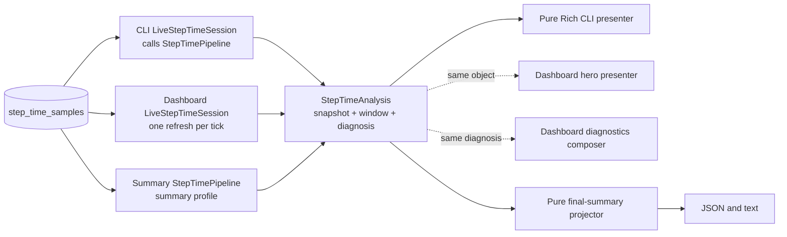

# Step Time Pipeline Contract

This page is the contributor map for Step Time. It describes the current
behavior and ownership boundaries that CLI, dashboard, and final-summary
changes must preserve.

For diagnosis thresholds and issue semantics, see
[`diagnostics/DIAGNOSIS.md`](https://github.com/traceopt-ai/traceml/blob/main/src/traceml_ai/diagnostics/DIAGNOSIS.md).
For the public final-summary shape, see
[`reporting/SCHEMA.md`](https://github.com/traceopt-ai/traceml/blob/main/src/traceml_ai/reporting/SCHEMA.md).

## Current flow



The repository has two SQL selection profiles, not three surface pipelines.
Terminal and dashboard share an index-bounded live tail. Final summary uses a
metadata-complete query. Both return one `StepTimeRepositorySnapshot` and feed
the same `StepTimeAnalyzer`.

`StepTimePipeline.run(request)` is the application facade for that shared
path. It selects one of the two data profiles, invokes the analyzer once, and
passes the resulting `StepTimeWindow` directly to diagnosis.

`LiveStepTimeSession` is the sole live orchestration boundary. It owns
last-good state, monotonic expiry, and cursor-based analysis reuse. The CLI
injects one session into a pure Rich presenter. The dashboard driver owns one
session and fans its immutable result to the hero and diagnostics composer.

`StepTimeSummarySection` runs the same pipeline once with the `summary`
profile, then passes the completed `StepTimeAnalysis` to a pure reporting
projector. The projector owns public JSON names, topology, rank identities,
and card text; it does not load SQLite, align steps, calculate domain
statistics, or diagnose.

The dashboard presenters never load or diagnose Step Time. One driver method
performs the refresh and explicit fan-out, keeping the production reading path
short: driver, live session, then the two local presenters.

## Where each decision belongs

| Concern | Source of truth | Change here when... |
|---|---|---|
| Shared data contracts | `step_time/model.py` | the canonical window, metric, series, or coverage shape changes |
| Event-to-metric names | `step_time/model.py` | a persisted event receives a canonical metric name |
| Common-step alignment and analysis | `step_time/analysis.py` | clock, sparse-signal, derivation, cohort, or statistics semantics change |
| SQLite selection and row decoding | `step_time/sqlite.py` | live-tail or summary selection, identity, progress, or clock normalization changes |
| Load/analyze/diagnose orchestration | `step_time/pipeline.py` | application flow or live/summary data-profile selection changes |
| Live caching and freshness | `step_time/pipeline.py` | cursor reuse, last-good bridging, or monotonic expiry changes |
| Diagnosis thresholds and priority | `diagnostics/step_time/` | a rule, policy, attribution, or issue order changes |
| Live CLI presentation | `renderers/step_time/renderer.py` | terminal labels or layout change |
| Dashboard Step Time presentation | `aggregator/display_drivers/nicegui_sections/` | hero or diagnostics cards change |
| Final-summary orchestration and projection | `reporting/sections/step_time/` | public JSON, topology, or summary text changes |
| Cross-surface contract scenarios | `tests/step_time/` | any item above changes intentionally |

Start with the contract scenarios before following a surface-specific path.
The shortest core reading path is:

```text
step_time/model.py
  -> step_time/sqlite.py
  -> step_time/analysis.py
  -> step_time/pipeline.py
```

Continue into only the surface being changed:

- CLI: `renderers/step_time/renderer.py`;
- dashboard: `aggregator/display_drivers/nicegui.py`, then the relevant
  `nicegui_sections` presenter;
- final summary: `reporting/sections/step_time/__init__.py`, then its pure
  projector in `builder.py`;
- diagnosis rules: `diagnostics/step_time/api.py`, `context.py`, and
  `rules.py`.

No surface path passes through `traceml_ai.utils` or a legacy rank map.

## Data-shape budget

Step Time payloads previously crossed eight boundary-level representations.
The final design has three core shapes:

```text
StepTimeRepositorySnapshot   normalized source facts
  -> StepTimeWindow          canonical analyzed facts
  -> StepTimeAnalysis        window plus one diagnosis
```

`StepTimeSourceRow` is the typed row contained by the repository snapshot;
`LiveStepTimeResult` adds freshness to an existing analysis without copying
its timing facts. Surface dictionaries and widgets are presentation output,
not another domain model. Temporary `json.loads()` objects and analyzer lookup
indexes are implementation details.

`StepTimeWindow.rank_facts` replaces the former triple nested
rank/step/metric dictionary. Dashboard, canonical diagnosis, and the CLI read
typed facts and precomputed window shares directly. Final summary projects the
same typed facts and canonical metric statistics. There is no
`per_rank_timing` projection and no production `Dict[int, Dict[str, float]]`
Step Time payload.

### Model dependency boundary

`traceml_ai.step_time.model` is the lowest Step Time layer. It owns immutable
data contracts and imports only the Python standard library. SQLite loading,
diagnosis, reporting, Rich, NiceGUI, and Plotly depend on these contracts;
the model never depends on them. New code should import from this central
module. The unused renderer-owned schema shim has been retired; only the
central model is an ownership location for Step Time types.

`traceml_ai.step_time.analysis` depends only on the central model and NumPy.
It does not import SQLite, diagnosis policies, reporting, Rich, or NiceGUI.
The package root deliberately exports model types only, so importing a source
contract does not load the analyzer or NumPy.

### Typed fact glossary

| Type or field | Meaning |
|---|---|
| `StepTimeSourceRow` | One decoded source row with CPU/GPU clock pairs; no alignment or derived meaning. |
| `StepTimeValues` | Fixed optional phase, derived, and CPU-compatibility values for one step or rank average. |
| `StepTimeStepFacts` | One aligned step id and its typed values. |
| `StepTimeRankFacts` | Typed aligned steps and the corresponding rank-window average. |
| `StepTimeMetric` | Flat per-signal series and statistics; clock and coverage live once on `StepTimeWindow`. |
| `StepTimeMetric.measured_ranks` | Exact rank population used for that metric's statistics and series. |
| `StepTimeSourceCursor` | The single stored latest-row/latest-step position used by future live-session reuse. |
| `StepTimeWindow.training_strategy` | Run strategy analyzed with the window; diagnosis does not need a parallel source of truth. |
| `representative_rank` | A real rank closest to the mathematical median; it is not the median itself. |
| `*_cpu_ms` | Historical CPU-clock compatibility values used only where the public summary requires them. |
| Other `*_ms` fields | Values from the single clock selected for the complete analysis window. |

## Canonical window invariants

| Contract | Meaning |
|---|---|
| Common window | Only the latest bounded set of completed step ids shared across the participating ranks is analyzed. |
| Expected ranks | The window retains the persisted global-rank universe even when a rank lacks a metric. |
| Selected clock | One clock, CPU or GPU, is selected for the entire window. Phase values are never mixed across clocks. |
| Required metrics | Input wait, forward, backward, and step envelope must be measured on every aligned step for a rank. Partial presence makes that metric unavailable for the rank. |
| Occurrence-driven metrics | H2D and optimizer may legitimately occur on only some steps. Once observed, absent steps contribute zero work. An entirely absent H2D means no observed transfers, not incomplete instrumentation. |
| Missing versus zero | An unavailable metric is absent from the sparse rank row and projects to `null`. A measured `0.0` remains present and projects to `0.0`. |
| Derived metrics | Compute needs forward, backward, and optimizer. Residual needs the step envelope and every compute phase; absent H2D contributes zero. Total step needs input wait and the step envelope. |
| Rank cohorts | A diagnosis uses only ranks carrying all metrics required by that rule. Consumers must not reconstruct another availability policy. |
| Metric statistics | Median, worst value, worst rank, and skew are computed from ranks that measured that metric. The worst value and rank must describe the same rank. |
| Representative rank | Choose the real rank nearest the mathematical median, then the lower value, then the lower rank id. |
| Residual meaning | `max(0, step - h2d - forward - backward - optimizer)` is unattributed time, not proof of communication or NCCL overhead. |

CPU compatibility fields in `final_summary.json` are intentionally different
from selected-clock diagnosis values. `dataloader_ms` and `total_step_ms`
remain CPU-clocked, while `input_wait_ms`, `step_time_ms`, and phase metrics use
the selected diagnosis clock.

## Surface responsibilities

| Surface | Loads | Diagnoses | Presents |
|---|---|---|---|
| Live CLI | One `LiveStepTimeSession` refresh | Diagnosis is precomputed once by the live pipeline | Pure Rich diagnosis and metric table |
| Dashboard hero | Shared result | Precomputed verdict | Ribbon and KPIs |
| Dashboard diagnostics rail | Same result | Precomputed diagnosis | Finding and evidence |
| Final summary | One repository snapshot with identity and progress | Summary policy | Stable JSON projection and text card |

Built-in live and summary policies currently use the same thresholds. Their
window sizes and presentation responsibilities differ.

## Live-session contract

One `LiveStepTimeSession` owns the state for one live consumer. Every refresh
opens a short-lived SQLite connection, runs the two-statement live repository
read in one snapshot, and closes the connection. A lock serializes concurrent
refreshes of the same session.

| Freshness | Meaning | Analysis exposed |
|---|---|---|
| `cold` | No usable window has ever been read. | Canonical empty analysis. |
| `live` | The current read produced a usable window. | Current immutable analysis. |
| `bridged` | A read was empty or failed within the last-good TTL. | Last good analysis. |
| `expired` | A previous good window exists, but its bridge TTL elapsed. | Canonical empty analysis. |

Expiry uses `time.monotonic()`, so wall-clock corrections cannot shorten or
extend the bridge. An unchanged persisted window remains `live`; freshness is
about read usability, not proof that the training process is still running.

Before decoding, the live repository compares the selected source cursor and
rank universe with the previous snapshot. If they are unchanged and the run
strategy is unchanged, the exact prior `StepTimeAnalysis` object is returned.
The persisted JSON is not parsed again, and analysis and diagnosis are not
called. A strategy or rank-universe change invalidates reuse even if timing
row ids are unchanged.

## Contract scenarios

[`tests/step_time/scenarios.py`](https://github.com/traceopt-ai/traceml/blob/main/tests/step_time/scenarios.py)
defines six explicit SQLite scenarios:

| Scenario | Contract protected |
|---|---|
| `complete_gpu` | complete multi-rank window, GPU selection, and separate CPU compatibility projection |
| `sparse_missing_forward` | one rank lacks a required signal; compute and residual remain unavailable on that rank |
| `measured_zero_forward` | an explicit zero remains measured and participates in compute, residual, and diagnosis |
| `single_rank_cpu` | single-rank statistics and diagnosis without fabricated cross-rank skew |
| `ddp_rank_straggler` | DDP visible-backward attribution and critical severity after a confident window |
| `fsdp_rank_straggler` | FSDP strategy propagation, attribution behavior, and warning severity cap |

The cross-surface goldens freeze:

- selected clock, aligned steps, rank universe, and coverage;
- sparse per-rank values and selected metric statistics;
- diagnosis kind, status, severity, affected rank, and issue ordering;
- CLI/dashboard/final-summary diagnosis parity;
- final-summary window metadata and public `null` versus `0.0` projection.

They intentionally do not snapshot timestamps, private cache state, complete
Rich/NiceGUI markup, or dictionary ordering.

## Removed internals and temporary source compatibility

The migration deliberately removed the old `utils/step_time_window.py` and
`utils/step_time_sqlite.py` pipelines and `StepTimeWindow.per_rank_timing`.
None of the built-in surfaces constructs or consumes a rank dictionary.

For patch-line source compatibility, `build_step_diagnosis()`,
`build_step_diagnosis_result()`, and `RankStepSummary` remain as deprecated
one-release shims. The diagnosis shims lazily convert the released sparse
rank input and preserve opt-in attribution; normal imports do not load that
conversion module. The reporting shim is only a historical dataclass name.
They are tested as boundaries and scheduled for removal at the next breaking
release.

New callers must construct or receive a canonical `StepTimeWindow`, call
`diagnose_step_time_window(window, policy=...)`, and read
`StepTimeAnalysis.window.rank_facts` / `StepTimeValues`. The built-in summary
projector remains responsible for public JSON field names.

New code must not put compatibility conversion on a runtime path, add another
analyzer input type, restore a per-step dictionary, or add a surface-specific
schema to the central package. It must read clock and coverage from the window
rather than copying them onto every metric.

## Changing Step Time safely

Before submitting a Step Time change:

1. Identify the ownership row above; avoid adding the same calculation to a
   presenter.
2. Add or update one explicit scenario only when a contract genuinely changes.
3. Run the cross-surface tests and inspect CLI, dashboard, and summary effects
   together.
4. If SQL changes, update the observational query baseline deliberately.
5. If public summary keys or meanings change, update `reporting/SCHEMA.md` and
   consider schema-version compatibility.
6. If diagnosis vocabulary or thresholds change, update
   `diagnostics/DIAGNOSIS.md` and user-facing interpretation guidance.

```bash
PYTHONDONTWRITEBYTECODE=1 pytest -p no:cacheprovider tests/step_time -q
```

## Glossary

| Term | Meaning |
|---|---|
| Step envelope | Instrumented time inside one traced training step. |
| Iteration | Selected input wait plus the selected step envelope. |
| Common window | Aligned completed step suffix shared by participating ranks. |
| Rank universe | Expected global ranks retained by the canonical window. |
| Measured rank | A rank carrying a particular sparse metric. |
| Eligible cohort | Ranks carrying every signal required by one calculation or rule. |
| Live session | Stateful orchestration that reads through the pipeline and owns cursor reuse, last-good bridging, and expiry. |
| Presenter | Stateless surface formatting over an analyzed result; it never reads SQLite or diagnoses. |
| Projection | A surface-specific view derived from the canonical window or diagnosis. |
