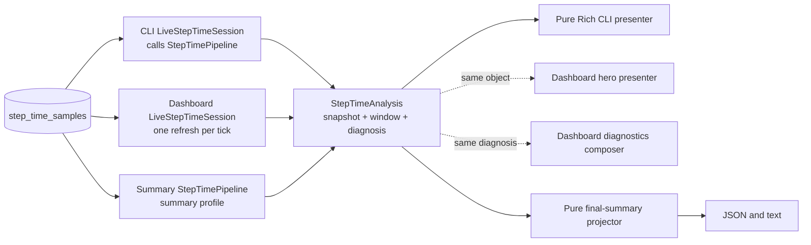

# Step Time Pipeline Contract

This page describes the Step Time pipeline, its ownership boundaries, and the
behavior shared by CLI, dashboard, and final summary.

For diagnosis thresholds and issue semantics, see
[`diagnostics/DIAGNOSIS.md`](https://github.com/traceopt-ai/traceml/blob/main/src/traceml_ai/diagnostics/DIAGNOSIS.md).
For the public final-summary shape, see
[`reporting/SCHEMA.md`](https://github.com/traceopt-ai/traceml/blob/main/src/traceml_ai/reporting/SCHEMA.md).
For user-facing timing definitions, see the
[Step Time glossary](../user_guide/reading-output.md#step-time-glossary).

## Training-to-sampler handoff

`instrumentation/step_events.py` owns `StepCapture`, the timing and memory event
contracts, and two private queues. The measurement utilities submit events to
one active capture. Input timing recorded before a framework's explicit step
callback stays in that capture and is attributed at the next step boundary.

```text
timed regions / optimizer hooks ─┐
                                ├─> active StepCapture
memory tracker ─────────────────┘          │
                                ┌─────────┴─────────┐
                         complete(step)          abort()
                                │                   │
                    ┌───────────┴───────────┐   discard
                    ▼                       ▼
             timing batch queue       memory event queue
                    ▼                       ▼
             StepTimeSampler         StepMemorySampler
```

On success, completion detaches the capture, assigns one step number, and
publishes its timing batch and final memory snapshot. An exception propagated
through `trace_step` aborts the partial capture without advancing the step
counter. Repeated completion or abort calls on the detached capture do nothing,
so an old caller cannot finalize a later step. If recording is disabled before
completion, the capture is detached and discarded instead of being published.

The producer lifecycle is sequential: close the step's timing regions, then
call `complete_step_capture()` or `abort_step_capture()`, then begin the next
step. Timing regions must not span capture boundaries. These module helpers
own finalization and replacement of the active capture; integrations should
not call the capture's private finalization methods. CUDA resolution may finish
later in the sampler because queued events already carry their step number.

Publication and reading transfer references, not copies. After publication,
the producer must not change event membership or step identity. Only the timing
sampler resolves CUDA events.

Each queue retains its existing capacity of 2,048 items and drops incoming
items when full: timing items are batches; memory items are device snapshots.
The timing sampler keeps its existing pending FIFO: an unresolved earlier
CUDA batch holds back later batches. Both readers continue after recording
stops so already-published measurements can drain. No GPU synchronization is
added.

Memory uses `publish_step_memory_event()` and `drain_step_memory_events()`.
Its peak values describe the process's PyTorch allocator on a tracked device;
the model selects that device but is not the owner of the measured memory.
Memory events and wire records therefore do not include `model_id`. The SQLite
projection already stores device and rank identity without that field.

The active capture keeps one memory snapshot per process for one active step on
one tracked device. `record()` replaces that snapshot. The memory queue retains
all completed steps until the sampler drains them. There is no model or device
key; `device` stays as snapshot metadata. Device selection and labels,
reset/read boundaries, measurement timestamps, byte units, and `None` values
for non-CUDA devices are unchanged.

Timing and memory drain independently and may reach different steps on the
same sampler tick; queue delivery is not an atomic transaction across both
queues. Existing framework boundaries still define a step, CUDA timing remains
asynchronous, and global timing is currently not persisted. Framework-specific
exception callbacks and HF input attribution remain separate integration work.

## Analysis and presentation flow



The repository has two selection profiles. Terminal and dashboard share an
index-bounded live tail; final summary uses a metadata-complete query. Both
return `StepTimeRepositorySnapshot` and feed `StepTimeAnalyzer`.

`StepTimePipeline.run(request)` is the application facade for that shared
path. It selects one of the two data profiles, invokes the analyzer once, and
passes the resulting `StepTimeWindow` directly to diagnosis.

`LiveStepTimeSession` is the sole live orchestration boundary. It owns
last-good state, monotonic expiry, and cursor-based analysis reuse. The CLI
injects one session into a pure Rich presenter. The dashboard driver owns one
session and fans its analyzed result to the hero and diagnostics composer.

`StepTimeSummarySection` runs the same pipeline once with the `summary`
profile, then passes the completed `StepTimeAnalysis` to a pure reporting
projector. The projector owns public JSON names, topology, rank identities,
and card text; it does not load SQLite, align steps, calculate domain
statistics, or diagnose.

Dashboard presenters do not load or diagnose Step Time. The driver refreshes
once, then passes the completed result to the two local presenters.

## Where each decision belongs

| Concern | Source of truth | Change here when... |
|---|---|---|
| Shared data contracts | `step_time/model.py` | the canonical window, metric, series, or coverage shape changes |
| Event-to-metric names | `step_time/model.py` | a persisted event receives a canonical metric name |
| Common-step alignment and analysis | `step_time/analysis.py` | clock, sparse-signal, derivation, cohort, or statistics semantics change |
| SQLite selection and row decoding | `step_time/sqlite.py` | live-tail or summary selection, identity, progress, or clock normalization changes |
| Load/analyze/diagnose orchestration | `step_time/pipeline.py` | application flow or live/summary data-profile selection changes |
| Live caching and freshness | `step_time/pipeline.py` | cursor reuse, last-good bridging, or monotonic expiry changes |
| Diagnosis thresholds and priority | `diagnostics/step_time/` | a rule, policy, attribution, or issue order changes |
| Live CLI presentation | `renderers/step_time/renderer.py` | terminal labels or layout change |
| Dashboard Step Time presentation | `aggregator/display_drivers/nicegui_sections/` | hero or diagnostics cards change |
| Final-summary orchestration and projection | `reporting/sections/step_time/` | public JSON, topology, or summary text changes |
| Cross-surface contract scenarios | `tests/step_time/` | any item above changes intentionally |

Start with the contract scenarios before following a surface-specific path.
The shortest core reading path is:

```text
step_time/model.py
  -> step_time/sqlite.py
  -> step_time/analysis.py
  -> step_time/pipeline.py
```

Continue into only the surface being changed:

- CLI: `renderers/step_time/renderer.py`;
- dashboard: `aggregator/display_drivers/nicegui.py`, then the relevant
  `nicegui_sections` presenter;
- final summary: `reporting/sections/step_time/__init__.py`, then its pure
  projector in `builder.py`;
- diagnosis rules: `diagnostics/step_time/api.py`, `context.py`, and
  `rules.py`.

Built-in surfaces use the central pipeline and typed facts; they do not use
utility loaders or rank-map adapters.

## Data-shape budget

Step Time has three core domain shapes:

```text
StepTimeRepositorySnapshot   normalized source facts
  -> StepTimeWindow          canonical analyzed facts
  -> StepTimeAnalysis        window plus one diagnosis
```

`StepTimeSourceRow` is the typed row contained by the repository snapshot;
`LiveStepTimeResult` adds freshness to an existing analysis without copying
its timing facts. Surface dictionaries and widgets are presentation output,
not another domain model. Temporary `json.loads()` objects and analyzer lookup
indexes are implementation details.

`StepTimeWindow.rank_facts` holds the typed per-rank facts. Dashboard,
diagnosis, and the CLI read typed facts and precomputed window shares directly.
Final summary projects the same facts and metric statistics. Built-in paths do
not pass rank dictionaries between layers.

### Model dependency boundary

`traceml_ai.step_time.model` is the lowest Step Time layer. It owns shared
data contracts and imports only the Python standard library. SQLite loading,
diagnosis, reporting, Rich, NiceGUI, and Plotly depend on these contracts;
the model never depends on them. Shared Step Time types belong in this central
module.

`traceml_ai.step_time.analysis` depends only on the central model and NumPy.
It does not import SQLite, diagnosis policies, reporting, Rich, or NiceGUI.
The package root deliberately exports model types only, so importing a source
contract does not load the analyzer or NumPy.

### Typed fact glossary

| Type or field | Meaning |
|---|---|
| `StepTimeSourceRow` | One decoded source row with CPU/GPU clock pairs; no alignment or derived meaning. |
| `StepTimeValues` | Optional phase, derived, and CPU-reporting values for one step or rank average. |
| `StepTimeStepFacts` | One aligned step id and its typed values. |
| `StepTimeRankFacts` | Typed aligned steps and the corresponding rank-window average. |
| `StepTimeMetric` | Flat per-signal series and rank statistics; clock and coverage live once on `StepTimeWindow`. |
| `StepTimeSourceCursor` | The single stored latest-row/latest-step position used by live-session reuse. |
| `StepTimeWindow.training_strategy` | Run strategy analyzed with the window; diagnosis does not need a parallel source of truth. |
| `representative_rank` | A real rank closest to the mathematical median; it is not the median itself. |
| `*_cpu_ms` / `*_gpu_ms` | Explicit clock aggregates preserved independently for public summary and compare compatibility. |
| Selected `*_ms` fields | Values from the one clock selected for the complete analysis window. |

## Canonical window invariants

| Contract | Meaning |
|---|---|
| Common window | Only the latest bounded set of completed step ids shared across the participating ranks is analyzed. |
| Expected ranks | The window retains the persisted global-rank universe even when a rank lacks a metric. |
| Selected clock | One clock, CPU or GPU, is selected for the entire window. Phase values are never mixed across clocks. |
| Required metrics | Input Wait, forward, backward, and Traced Step Time must be measured on every aligned step for a rank. Partial presence makes that metric unavailable for the rank. |
| Occurrence-driven metrics | H2D and optimizer may legitimately occur on only some steps. Once observed, absent steps contribute zero work. An entirely absent H2D means no observed transfers, not incomplete instrumentation. |
| Missing versus zero | An unavailable metric is absent from the sparse rank row and projects to `null`. A measured `0.0` remains present and projects to `0.0`. |
| Derived metrics | Compute needs forward, backward, and optimizer. Residual needs Traced Step Time and every compute phase; absent H2D contributes zero. Step Time needs Input Wait and Traced Step Time. |
| Rank cohorts | A diagnosis uses only ranks carrying all metrics required by that rule. Consumers must not reconstruct another availability policy. |
| Metric statistics | Median, worst value, worst rank, and skew are computed from ranks that measured that metric. The worst value and rank must describe the same rank. |
| Representative rank | Choose the real rank nearest the mathematical median, then the lower value, then the lower rank id. |
| Residual meaning | `max(0, Traced Step Time - h2d - forward - backward - optimizer)` is unattributed time, not proof of communication or NCCL overhead. |

In `final_summary.json`, `step_time_ms`, `traced_step_time_ms`, and phase
metrics use the selected diagnosis clock. The explicit CPU/GPU Step Time and
Traced Step Time fields preserve both clocks, while `dataloader_fetch_cpu_ms`
is supplemental CPU evidence. It is not part of Step Time and is never added
to selected-clock Input Wait.

## Naming boundary

`traceml.trace_step(...)` remains the public API name. It records the inner
instrumented duration that becomes canonical Traced Step Time only after
SQLite normalization. `_traceml_internal:step_time` is intentionally stable
raw telemetry and storage vocabulary below that normalization boundary; it is
not a public metric name or presentation label.

## Lightning steps

Under automatic optimization, one completed TraceML step corresponds to one
Lightning accumulation/update group. Each micro-batch opens and closes its own
traced region, while the owning `StepCapture` and CUDA peak-memory window stay
open until `trainer.fit_loop._should_accumulate()` becomes false. The callback
then reads memory, advances the process-local counter, and publishes the group
once. Lightning's default strategy completes a shorter final group. Strategies
that own accumulation internally publish only groups for which they perform an
update; an unfinished final group is discarded at teardown.

The resulting `StepTimeBatch` contains repeated fetch, H2D, forward, backward,
and traced-step events. `StepTimeSampler` sums repeated timing events within
that batch. `StepMemoryTracker` resets once at group start and reads once at
group end, so CUDA supplies the peak for the complete group; the memory sampler
does not calculate another maximum. Separate completed batches with the same
step number are not merged by either sampler.

Manual optimization remains batch-scoped because Lightning does not define an
automatic accumulation boundary for it. A manual batch can contain multiple
optimizer and backward events in its single TraceML step. An exception aborts
the entire capture accumulated since the prior completed update.

`tests/integrations/test_lightning_trainer.py` checks full and partial
accumulation groups against real Trainers from both the `lightning` and
`pytorch_lightning` namespaces.

## Hugging Face steps

For normally completed HF training, one TraceML step contains the microbatches
used for one optimizer update attempt. The callback opens `trace_step` at
`on_step_begin` and closes it at `on_step_end`. Accumulating microbatches emit
`on_substep_end`, which does not advance TraceML's counter.

For example, ten microbatches with `gradient_accumulation_steps=4` produce
three steps containing four, four, and two microbatches. TraceML IDs are local
to the process; their increments match HF's for recorded, completed groups,
but their absolute values can differ after checkpoint resume.

### Timing and memory

All timing events for a group are flushed together as one `StepTimeBatch`.
Before the callback opens the main `trace_step`, Accelerate moves the batches
returned by `Trainer.get_batch_samples` to the device. The HF integration arms
DataLoader and H2D timing only around each training iterator `next()` made by
that method. Each observed transfer records its H2D phase plus a matching short
traced-step segment; DataLoader fetch work is outside those transfer segments
and remains Input Wait. The later callback region still covers forward,
backward, collective, and optimizer work.

The Trainer lifecycle holds the existing DataLoader timing scope disabled by
default. A small iterator proxy temporarily enables it for those training
`next()` calls and restores the outer policy afterward. Evaluation and
prediction consume their dataloaders directly, so their fetches and transfers
remain outside the training capture without requiring sampler or diagnosis
special cases. The public `evaluate` and `predict` entry points apply the same
disabled scope when invoked outside `train`, preventing non-training fetches
from remaining in the process-wide pending capture.

`StepTimeSampler` sums the repeated transfer segments with the callback region,
and sums repeated H2D, forward, and backward events while keeping CPU and GPU
durations separate. All events receive the optimizer-group step number only
when `on_step_end` publishes the capture. The sampler does not merge separate
batches that happen to have the same step number.

Accelerate may fetch one CPU batch ahead while yielding the current prepared
batch. Any blocking wait observed there is attributed to the current step's
input-pipeline stall because it delays delivery to the training loop. Input
Wait event counts therefore describe observed iterator waits, not an exact
one-event-per-microbatch identity mapping.

Checkpoint resume has one additional boundary rule. Map-style datasets skip
completed batches in the sampler, before any fetch, so their first resumed
group is measured normally. For iterable datasets, Accelerate lazily consumes
the skipped batches and the first real batch within the same iterator call.
The integration detects that existing lazy-skip path and omits the entire first
optimizer group from step timing and memory telemetry, including all its
accumulation microbatches. The collection hook disables input timing and the
callback does not open `trace_step` for that group. At `on_step_end`, pending
events are discarded and normal recording resumes with the next collection.
No partial row is published and the omitted group does not advance TraceML's
local counter. HF still executes every forward/backward pass and optimizer
update. Fresh runs, sampler-level skips, and `ignore_data_skip=True` are
unaffected. This avoids mixing checkpoint fast-forward work into a real step
or treating deliberately missing input measurements as zero in aggregation.

Other collection-side bookkeeping in `get_batch_samples`, such as token
counting and an optional cross-rank item-count gather, is currently outside
both Input Wait and Traced Step Time. HF Step Time is therefore the sum of the
instrumented input-wait and traced regions, not a full training-loop wall-clock
measurement.

`StepMemoryTracker` resets the tracked CUDA device's PyTorch peak counters
once at the start of the group and reads peak allocated/reserved memory once
at the end. The peak covers all microbatches and optimizer work in that window.
`StepMemorySampler` stores the result without further aggregation. CPU runs
report memory as unavailable. Temporary allocation peaks before the callback
window are not captured, although inputs still resident at its start count
toward the peak.

The callback window includes gradient clipping, ordinary scheduler work, and
gradient zeroing. These contribute to Traced Step Time but are outside the
separately timed forward, backward, and optimizer calls. HF's subsequent
logging, saving, and evaluation are outside this window. Other callbacks'
work is included only when it runs inside the measured window.

### Skipped optimizer updates

HF still completes a step when AMP overflow prevents a parameter update.
TraceML follows that completion event. If the scaler skips the optimizer call,
no timing event is emitted. A fused optimizer can execute its call but skip updating
parameters internally; that call still contributes measured optimizer time.
Neither the step count nor an optimizer timing event proves parameters changed.

### Current limitations

Automatic HF Trainer timing supports `transformers>=4.46.1`; earlier versions
do not expose the required `get_batch_samples` collection seam. The resume
skip itself is older upstream behavior (Transformers delegates to Accelerate's
`skip_first_batches`); this integration does not change how checkpoints are
restored. Training input timing is
limited to the standard
`Trainer.get_batch_samples` path. A custom Trainer that overrides that method
also bypasses the collection window and produces a one-time warning; TraceML
then omits both training Input Wait and pre-step H2D rather than publishing a
partial input measurement. The existing raw input event names are
`_traceml_internal:dataloader_next` and `_traceml_internal:h2d_time`.

If training is interrupted, the Trainer lifecycle guard aborts the open
capture before the exception reaches Accelerate's automatic batch-size retry.
The failed group is not published and does not advance TraceML's step counter.
The original training exception continues unchanged.

This cleanup and duplicate-callback ownership require the guard installed by
`traceml_ai.integrations.huggingface.init()`. They do not apply when installation
fails or a custom `_inner_training_loop` bypasses the guarded parent method.
Callback ownership is cleared when the guarded attempt exits.

The boundary follows HF's
[training loop](https://github.com/huggingface/transformers/blob/6622f6f781c9c0b1f2f5541a257943bee95ad586/src/transformers/trainer.py#L1791-L1892)
and Accelerate's
[optimizer wrapper](https://github.com/huggingface/accelerate/blob/9e5d1de5d2248a5f3ee8f2d9272ce88a686dc42d/src/accelerate/optimizer.py#L152-L203).
`tests/integrations/test_hf_trainer.py` checks accumulation, partial groups, and
scaler overflow. These CPU checks do not establish CUDA timing accuracy.

## Surface responsibilities

| Surface | Loads | Diagnoses | Presents |
|---|---|---|---|
| Live CLI | One `LiveStepTimeSession` refresh | Diagnosis is precomputed once by the live pipeline | Pure Rich diagnosis and metric table |
| Dashboard hero | Shared result | Precomputed verdict | Ribbon and KPIs |
| Dashboard diagnostics rail | Same result | Precomputed diagnosis | Finding and evidence |
| Final summary | One repository snapshot with identity and progress | Summary policy | Stable JSON projection and text card |

Built-in live and summary policies currently use the same thresholds. Their
window sizes and presentation responsibilities differ.

## Live-session contract

One `LiveStepTimeSession` owns the state for one live consumer. Every refresh
opens a short-lived SQLite connection, runs the two-statement live repository
read in one snapshot, and closes the connection. A lock serializes concurrent
refreshes of the same session.

| Freshness | Meaning | Analysis exposed |
|---|---|---|
| `cold` | No usable window has ever been read. | Canonical empty analysis. |
| `live` | The current read produced a usable window. | Current analysis object. |
| `bridged` | A read was empty or failed within the last-good TTL. | Last good analysis. |
| `expired` | A previous good window exists, but its bridge TTL elapsed. | Canonical empty analysis. |

Expiry uses `time.monotonic()`, so wall-clock corrections cannot shorten or
extend the bridge. An unchanged persisted window remains `live`; freshness is
about read usability, not proof that the training process is still running.

Before decoding, the live repository compares the selected source cursor and
rank universe with the previous snapshot. If they are unchanged and the run
strategy is unchanged, the exact prior `StepTimeAnalysis` object is returned.
The persisted JSON is not parsed again, and analysis and diagnosis are not
called. A strategy or rank-universe change invalidates reuse even if timing
row ids are unchanged.

## Contract scenarios

[`tests/step_time/scenarios.py`](https://github.com/traceopt-ai/traceml/blob/main/tests/step_time/scenarios.py)
defines six explicit SQLite scenarios:

| Scenario | Contract protected |
|---|---|
| `complete_gpu` | complete multi-rank window, GPU selection, and CPU-reporting projection |
| `sparse_missing_forward` | one rank lacks a required signal; compute and residual remain unavailable on that rank |
| `measured_zero_forward` | an explicit zero remains measured and participates in compute, residual, and diagnosis |
| `single_rank_cpu` | single-rank statistics and diagnosis without fabricated cross-rank skew |
| `ddp_rank_straggler` | DDP visible-backward attribution and critical severity after a confident window |
| `fsdp_rank_straggler` | FSDP strategy propagation, attribution behavior, and warning severity cap |

The cross-surface tests cover:

- selected clock, aligned steps, rank universe, and coverage;
- sparse per-rank values and selected metric statistics;
- diagnosis kind, status, severity, affected rank, and issue ordering;
- CLI/dashboard/final-summary diagnosis parity;
- final-summary window metadata and public `null` versus `0.0` projection.

They intentionally do not snapshot timestamps, private cache state, complete
Rich/NiceGUI markup, or dictionary ordering.

## Changing Step Time safely

Before submitting a Step Time change:

1. Identify the ownership row above; avoid adding the same calculation to a
   presenter.
2. Add or update a scenario when a contract genuinely changes.
3. Run the cross-surface tests and inspect CLI, dashboard, and summary effects
   together.
4. If SQL changes, record fresh benchmark measurements.
5. If public summary keys or meanings change, update `reporting/SCHEMA.md` and
   consider schema-version compatibility.
6. If diagnosis vocabulary or thresholds change, update
   `diagnostics/DIAGNOSIS.md` and user-facing interpretation guidance.

```bash
PYTHONDONTWRITEBYTECODE=1 pytest -p no:cacheprovider tests/step_time -q
```

## Glossary

| Term | Meaning |
|---|---|
| Traced Step Time | Instrumented inner duration inside one traced training step. |
| Step Time | Selected Input Wait plus selected Traced Step Time. |
| Common window | Aligned completed step suffix shared by participating ranks. |
| Rank universe | Expected global ranks retained by the canonical window. |
| Measured rank | A rank carrying a particular sparse metric. |
| Eligible cohort | Ranks carrying every signal required by one calculation or rule. |
| Live session | Stateful orchestration that reads through the pipeline and owns cursor reuse, last-good bridging, and expiry. |
| Presenter | Stateless surface formatting over an analyzed result; it never reads SQLite or diagnoses. |
| Projection | A surface-specific view derived from the canonical window or diagnosis. |
