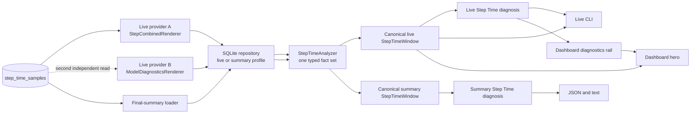

# Step Time Pipeline Contract

This page is the contributor map for Step Time. It describes the current
behavior that CLI, dashboard, and final-summary changes must preserve. It does
not prescribe presentation details or future query consolidation.

For diagnosis thresholds and issue semantics, see
[`diagnostics/DIAGNOSIS.md`](https://github.com/traceopt-ai/traceml/blob/main/src/traceml_ai/diagnostics/DIAGNOSIS.md).
For the public final-summary shape, see
[`reporting/SCHEMA.md`](https://github.com/traceopt-ai/traceml/blob/main/src/traceml_ai/reporting/SCHEMA.md).

## Current flow



The repository has two SQL selection profiles, not three surface pipelines.
Terminal and dashboard share an index-bounded live tail. Final summary uses a
metadata-complete query. Both return one `StepTimeRepositorySnapshot` and feed
the same `StepTimeAnalyzer`.

`StepTimePipeline.run(request)` is the application facade for that shared
path. It selects one of the two data profiles, invokes the analyzer once, and
passes the resulting `StepTimeWindow` directly to diagnosis. Existing surface
wrappers remain in place until PR6 through PR8, so adding the facade does not
mix presenter rewiring into this diagnosis-focused change.

The diagram shows remaining technical debt deliberately: a dashboard refresh
owns two independent Step Time computers. Each now performs one constant-size
query sequence, but the hero and diagnostics rail still load independently.
A later consumer-migration PR will fan out one analysis snapshot.

## Where each decision belongs

| Concern | Source of truth | Change here when... |
|---|---|---|
| Shared data contracts | `step_time/model.py` | the canonical window, metric, series, or coverage shape changes |
| Event-to-metric names | `step_time/model.py` | a persisted event receives a canonical metric name |
| Common-step alignment and analysis | `step_time/analysis.py` | clock, sparse-signal, derivation, cohort, or statistics semantics change |
| SQLite selection and row decoding | `step_time/sqlite.py` | live-tail or summary selection, identity, progress, or clock normalization changes |
| Load/analyze/diagnose orchestration | `step_time/pipeline.py` | application flow or live/summary data-profile selection changes |
| Analyzed-window compatibility adapter | `utils/step_time_sqlite.py` | an existing loader caller needs migration support |
| Diagnosis thresholds and priority | `diagnostics/step_time/` | a rule, policy, attribution, or issue order changes |
| Live CLI presentation | `renderers/step_time/renderer.py` | terminal labels or layout change |
| Dashboard Step Time presentation | `aggregator/display_drivers/nicegui_sections/` | hero or diagnostics cards change |
| Final-summary projection | `reporting/sections/step_time/` | public JSON or summary text changes |
| Cross-surface contract scenarios | `tests/step_time/` | any item above changes intentionally |

Start with the contract scenarios before following a surface-specific call
path. Read the short `step_time/pipeline.py` facade for orchestration, then
`step_time/sqlite.py`, `step_time/analysis.py`, and `step_time/model.py` for
the complete source-to-facts path. Diagnosis continues in
`diagnostics/step_time/api.py`, then `context.py` and `rules.py`; none of those
files rebuilds the historical rank map.

## Data-shape budget

Step Time payloads previously crossed eight boundary-level representations
between SQLite and a screen. The canonical path now permits at most five:

```text
SQLite row
  -> StepTimeSourceRow
  -> typed StepTimeWindow facts
  -> optional legacy rank-average projection
  -> surface output
```

Only representations crossing a production function or module boundary are
counted. A temporary object returned by `json.loads()` and analyzer lookup
indexes are implementation details, not new payload contracts. The storage to
canonical-facts path therefore has exactly two conversions and the analyzer
returns exactly one typed fact graph.

`StepTimeWindow.rank_facts` replaces the former triple nested
rank/step/metric dictionary. `per_rank_timing` remains a cached, read-only
projection only for presenters that migrate in PR6 through PR8 and for the
released mapping adapter. Canonical diagnosis reads `rank_facts` and
precomputed window shares directly. No per-step legacy projection exists.

### Model dependency boundary

`traceml_ai.step_time.model` is the lowest Step Time layer. It owns immutable
data contracts and imports only the Python standard library. SQLite loading,
diagnosis, reporting, Rich, NiceGUI, and Plotly depend on these contracts;
the model never depends on them. New code should import from this central
module. The unused renderer-owned schema shim has been retired; only the
window and SQLite utility adapters remain during presenter migration.

`traceml_ai.step_time.analysis` depends only on the central model and NumPy.
It does not import SQLite, diagnosis policies, reporting, Rich, or NiceGUI.
The package root deliberately exports model types only, so importing a source
contract does not load the analyzer or NumPy.

### Typed fact glossary

| Type or field | Meaning |
|---|---|
| `StepTimeSourceRow` | One decoded source row with CPU/GPU clock pairs; no alignment or derived meaning. |
| `StepTimeValues` | Fixed optional phase, derived, and CPU-compatibility values for one step or rank average. |
| `StepTimeStepFacts` | One aligned step id and its typed values. |
| `StepTimeRankFacts` | Typed aligned steps and the corresponding rank-window average. |
| `StepTimeMetric` | Flat per-signal series and statistics; clock and coverage live once on `StepTimeWindow`. |
| `StepTimeMetric.measured_ranks` | Exact rank population used for that metric's statistics and series. |
| `StepTimeSourceCursor` | The single stored latest-row/latest-step position used by future live-session reuse. |
| `StepTimeWindow.training_strategy` | Run strategy analyzed with the window; diagnosis does not need a parallel source of truth. |
| `representative_rank` | A real rank closest to the mathematical median; it is not the median itself. |
| `*_cpu_ms` | Historical CPU-clock compatibility values used only where the public summary requires them. |
| Other `*_ms` fields | Values from the single clock selected for the complete analysis window. |

## Canonical window invariants

| Contract | Meaning |
|---|---|
| Common window | Only the latest bounded set of completed step ids shared across the participating ranks is analyzed. |
| Expected ranks | The window retains the persisted global-rank universe even when a rank lacks a metric. |
| Selected clock | One clock, CPU or GPU, is selected for the entire window. Phase values are never mixed across clocks. |
| Required metrics | Input wait, forward, backward, and step envelope must be measured on every aligned step for a rank. Partial presence makes that metric unavailable for the rank. |
| Occurrence-driven metrics | H2D and optimizer may legitimately occur on only some steps. Once observed, absent steps contribute zero work. An entirely absent H2D means no observed transfers, not incomplete instrumentation. |
| Missing versus zero | An unavailable metric is absent from the sparse rank row and projects to `null`. A measured `0.0` remains present and projects to `0.0`. |
| Derived metrics | Compute needs forward, backward, and optimizer. Residual needs the step envelope and every compute phase; absent H2D contributes zero. Total step needs input wait and the step envelope. |
| Rank cohorts | A diagnosis uses only ranks carrying all metrics required by that rule. Consumers must not reconstruct another availability policy. |
| Metric statistics | Median, worst value, worst rank, and skew are computed from ranks that measured that metric. The worst value and rank must describe the same rank. |
| Representative rank | Choose the real rank nearest the mathematical median, then the lower value, then the lower rank id. |
| Residual meaning | `max(0, step - h2d - forward - backward - optimizer)` is unattributed time, not proof of communication or NCCL overhead. |

CPU compatibility fields in `final_summary.json` are intentionally different
from selected-clock diagnosis values. `dataloader_ms` and `total_step_ms`
remain CPU-clocked, while `input_wait_ms`, `step_time_ms`, and phase metrics use
the selected diagnosis clock.

## Surface responsibilities

| Surface | Loads | Diagnoses | Presents |
|---|---|---|---|
| Live CLI | One repository snapshot; recent aligned window with lookback | Live policy | Rich diagnosis and metric table |
| Dashboard hero | One repository snapshot today | Verdict comes from diagnostics payload | Phase ribbon and compact KPIs |
| Dashboard diagnostics rail | A second repository snapshot today | Live policy | Structured finding and evidence |
| Final summary | One repository snapshot with identity and progress | Summary policy | Stable JSON projection and text card |

Built-in live and summary policies currently use the same thresholds. Their
window sizes and presentation responsibilities differ.

## Contract scenarios

[`tests/step_time/scenarios.py`](https://github.com/traceopt-ai/traceml/blob/main/tests/step_time/scenarios.py)
defines six explicit SQLite scenarios:

| Scenario | Contract protected |
|---|---|
| `complete_gpu` | complete multi-rank window, GPU selection, and separate CPU compatibility projection |
| `sparse_missing_forward` | one rank lacks a required signal; compute and residual remain unavailable on that rank |
| `measured_zero_forward` | an explicit zero remains measured and participates in compute, residual, and diagnosis |
| `single_rank_cpu` | single-rank statistics and diagnosis without fabricated cross-rank skew |
| `ddp_rank_straggler` | DDP visible-backward attribution and critical severity after a confident window |
| `fsdp_rank_straggler` | FSDP strategy propagation, attribution behavior, and warning severity cap |

The cross-surface goldens freeze:

- selected clock, aligned steps, rank universe, and coverage;
- sparse per-rank values and selected metric statistics;
- diagnosis kind, status, severity, affected rank, and issue ordering;
- CLI/dashboard/final-summary diagnosis parity;
- final-summary window metadata and public `null` versus `0.0` projection.

They intentionally do not snapshot timestamps, private cache state, complete
Rich/NiceGUI markup, or dictionary ordering.

## Temporary compatibility seams

- `utils/step_time_window.py` accepts historical raw-event fixtures and
  delegates to `StepTimeAnalyzer`; PR9 removes that input adapter.
- `StepTimeWindow.per_rank_timing` lazily projects typed rank averages for
  current presenters; PR6 through PR8 remove those consumers and PR9 removes
  the projection.
- The released mapping-based diagnosis functions adapt one sparse rank map to
  a typed window. Canonical diagnosis and rules accept only `StepTimeWindow`;
  PR9 removes the mapping adapter.
- `utils/step_time_sqlite.py` preserves historical loader signatures while
  calling the repository and analyzer directly; PR9 removes it.

New code must not add another analyzer input type, per-step dictionary, or
surface-specific schema to the central package. It must also read clock and
coverage from the window rather than copying them onto every metric.

## Changing Step Time safely

Before submitting a Step Time change:

1. Identify the ownership row above; avoid adding the same calculation to a
   presenter.
2. Add or update one explicit scenario only when a contract genuinely changes.
3. Run the cross-surface tests and inspect CLI, dashboard, and summary effects
   together.
4. If SQL changes, update the observational query baseline deliberately.
5. If public summary keys or meanings change, update `reporting/SCHEMA.md` and
   consider schema-version compatibility.
6. If diagnosis vocabulary or thresholds change, update
   `diagnostics/DIAGNOSIS.md` and user-facing interpretation guidance.

```bash
PYTHONDONTWRITEBYTECODE=1 pytest -p no:cacheprovider tests/step_time -q
```

## Glossary

| Term | Meaning |
|---|---|
| Step envelope | Instrumented time inside one traced training step. |
| Iteration | Selected input wait plus the selected step envelope. |
| Common window | Aligned completed step suffix shared by participating ranks. |
| Rank universe | Expected global ranks retained by the canonical window. |
| Measured rank | A rank carrying a particular sparse metric. |
| Eligible cohort | Ranks carrying every signal required by one calculation or rule. |
| Provider | A stateful live computer that reads SQLite and owns last-good behavior. |
| Projection | A surface-specific view derived from the canonical window or diagnosis. |
