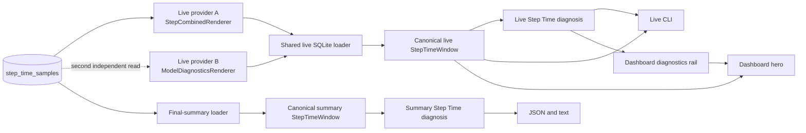

# Step Time Pipeline Contract

This page is the contributor map for Step Time. It describes the current
behavior that CLI, dashboard, and final-summary changes must preserve. It does
not prescribe presentation details or future query consolidation.

For diagnosis thresholds and issue semantics, see
[`diagnostics/DIAGNOSIS.md`](https://github.com/traceopt-ai/traceml/blob/main/src/traceml_ai/diagnostics/DIAGNOSIS.md).
For the public final-summary shape, see
[`reporting/SCHEMA.md`](https://github.com/traceopt-ai/traceml/blob/main/src/traceml_ai/reporting/SCHEMA.md).

## Current flow



The diagram shows current technical debt deliberately: a dashboard refresh
owns two independent Step Time computers. The hero receives timing data from
one, while the diagnostics rail and hero verdict receive diagnosis from the
other. PR1 measures this duplication; it does not change it.

## Where each decision belongs

| Concern | Source of truth | Change here when... |
|---|---|---|
| Shared data contracts | `step_time/model.py` | the canonical window, metric, series, or coverage shape changes |
| Event-to-metric names | `utils/step_time_window.py` | persisted event names or clock extraction change |
| Common-step alignment and availability | `utils/step_time_window.py` | window, sparse-signal, or derived-metric semantics change |
| SQLite rank loading and strategy context | `utils/step_time_sqlite.py` | persisted Step Time reads change |
| Diagnosis thresholds and priority | `diagnostics/step_time/` | a rule, policy, attribution, or issue order changes |
| Live CLI presentation | `renderers/step_time/renderer.py` | terminal labels or layout change |
| Dashboard Step Time presentation | `aggregator/display_drivers/nicegui_sections/` | hero or diagnostics cards change |
| Final-summary projection | `reporting/sections/step_time/` | public JSON or summary text changes |
| Cross-surface contract scenarios | `tests/step_time/` | any item above changes intentionally |

Start with the contract scenarios before following a surface-specific call
path. They present the entire persisted-input-to-output behavior in one place.

### Model dependency boundary

`traceml_ai.step_time.model` is the lowest Step Time layer. It owns immutable
data contracts and imports only the Python standard library. SQLite loading,
diagnosis, reporting, Rich, NiceGUI, and Plotly depend on these contracts;
the model never depends on them. New code should import from this central
module. Historical renderer-schema and window-utility imports remain thin
re-exports while external integrations migrate.

## Canonical window invariants

| Contract | Meaning |
|---|---|
| Common window | Only the latest bounded set of completed step ids shared across the participating ranks is analyzed. |
| Expected ranks | The window retains the persisted global-rank universe even when a rank lacks a metric. |
| Selected clock | One clock, CPU or GPU, is selected for the entire window. Phase values are never mixed across clocks. |
| Required metrics | Input wait, forward, backward, and step envelope must be measured on every aligned step for a rank. Partial presence makes that metric unavailable for the rank. |
| Occurrence-driven metrics | H2D and optimizer may legitimately occur on only some steps. Once observed, absent steps contribute zero work. An entirely absent H2D means no observed transfers, not incomplete instrumentation. |
| Missing versus zero | An unavailable metric is absent from the sparse rank row and projects to `null`. A measured `0.0` remains present and projects to `0.0`. |
| Derived metrics | Compute needs forward, backward, and optimizer. Residual needs the step envelope and every compute phase; absent H2D contributes zero. Total step needs input wait and the step envelope. |
| Rank cohorts | A diagnosis uses only ranks carrying all metrics required by that rule. Consumers must not reconstruct another availability policy. |
| Metric statistics | Median, worst value, worst rank, and skew are computed from ranks that measured that metric. The worst value and rank must describe the same rank. |
| Residual meaning | `max(0, step - h2d - forward - backward - optimizer)` is unattributed time, not proof of communication or NCCL overhead. |

CPU compatibility fields in `final_summary.json` are intentionally different
from selected-clock diagnosis values. `dataloader_ms` and `total_step_ms`
remain CPU-clocked, while `input_wait_ms`, `step_time_ms`, and phase metrics use
the selected diagnosis clock.

## Surface responsibilities

| Surface | Loads | Diagnoses | Presents |
|---|---|---|---|
| Live CLI | Recent aligned window with lookback | Live policy | Rich diagnosis and metric table |
| Dashboard hero | Recent aligned window with lookback | Verdict comes from diagnostics payload | Phase ribbon and compact KPIs |
| Dashboard diagnostics rail | A second recent aligned window today | Live policy | Structured finding and evidence |
| Final summary | Larger bounded final window plus rank identity | Summary policy | Stable JSON projection and text card |

Built-in live and summary policies currently use the same thresholds. Their
window sizes and presentation responsibilities differ.

## Contract scenarios

[`tests/step_time/scenarios.py`](https://github.com/traceopt-ai/traceml/blob/main/tests/step_time/scenarios.py)
defines six explicit SQLite scenarios:

| Scenario | Contract protected |
|---|---|
| `complete_gpu` | complete multi-rank window, GPU selection, and separate CPU compatibility projection |
| `sparse_missing_forward` | one rank lacks a required signal; compute and residual remain unavailable on that rank |
| `measured_zero_forward` | an explicit zero remains measured and participates in compute, residual, and diagnosis |
| `single_rank_cpu` | single-rank statistics and diagnosis without fabricated cross-rank skew |
| `ddp_rank_straggler` | DDP visible-backward attribution and critical severity after a confident window |
| `fsdp_rank_straggler` | FSDP strategy propagation, attribution behavior, and warning severity cap |

The cross-surface goldens freeze:

- selected clock, aligned steps, rank universe, and coverage;
- sparse per-rank values and selected metric statistics;
- diagnosis kind, status, severity, affected rank, and issue ordering;
- CLI/dashboard/final-summary diagnosis parity;
- final-summary window metadata and public `null` versus `0.0` projection.

They intentionally do not snapshot timestamps, private cache state, complete
Rich/NiceGUI markup, or dictionary ordering.

## Changing Step Time safely

Before submitting a Step Time change:

1. Identify the ownership row above; avoid adding the same calculation to a
   presenter.
2. Add or update one explicit scenario only when a contract genuinely changes.
3. Run the cross-surface tests and inspect CLI, dashboard, and summary effects
   together.
4. If SQL changes, update the observational query baseline deliberately.
5. If public summary keys or meanings change, update `reporting/SCHEMA.md` and
   consider schema-version compatibility.
6. If diagnosis vocabulary or thresholds change, update
   `diagnostics/DIAGNOSIS.md` and user-facing interpretation guidance.

```bash
PYTHONDONTWRITEBYTECODE=1 pytest -p no:cacheprovider tests/step_time -q
```

## Glossary

| Term | Meaning |
|---|---|
| Step envelope | Instrumented time inside one traced training step. |
| Iteration | Selected input wait plus the selected step envelope. |
| Common window | Aligned completed step suffix shared by participating ranks. |
| Rank universe | Expected global ranks retained by the canonical window. |
| Measured rank | A rank carrying a particular sparse metric. |
| Eligible cohort | Ranks carrying every signal required by one calculation or rule. |
| Provider | A stateful live computer that reads SQLite and owns last-good behavior. |
| Projection | A surface-specific view derived from the canonical window or diagnosis. |
