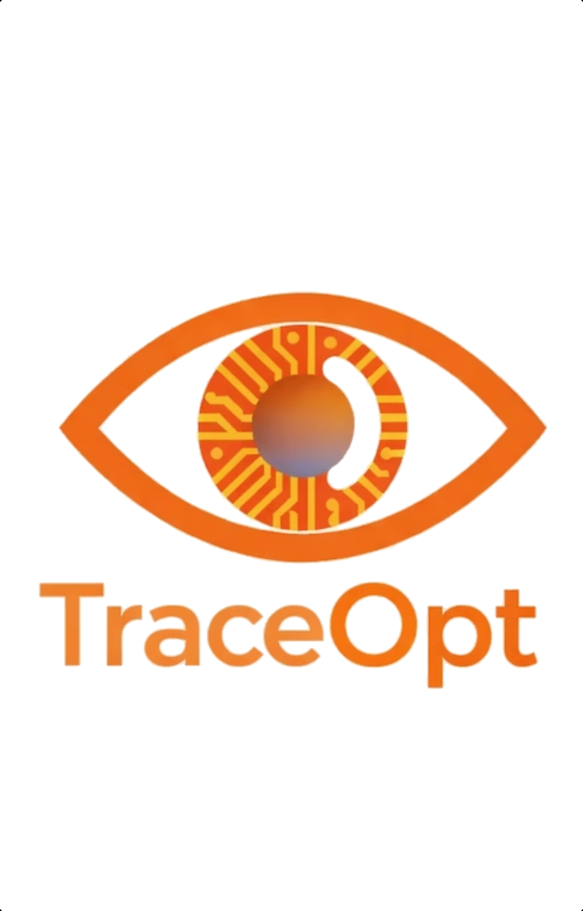

---
hide:
  - navigation
  - toc
---

<p align="center" markdown>
  
</p>

<h1 align="center" style="margin-top: 0.5rem;">TraceML</h1>

<p align="center" style="font-size: 1.15rem; color: var(--md-default-fg-color--light);">
  Training efficiency for AI teams — starting with open-source live bottleneck detection for PyTorch.
</p>

<p align="center">
  <a href="user_guide/quickstart/" class="md-button md-button--primary">Quickstart</a>
  <a href="https://github.com/traceopt-ai/traceml" class="md-button">GitHub</a>
</p>

```bash
pip install traceml-ai
```

---

## Why TraceML

<div class="grid cards" markdown>

-   :material-currency-usd:{ .lg .middle } __Expensive runs__

    ---

    Training jobs run for hours or days on costly GPUs. A bad run is real money.

-   :material-clock-alert-outline:{ .lg .middle } __Problems surface too late__

    ---

    Slowdowns and instability are usually discovered *after* compute is already spent.

-   :material-account-group-outline:{ .lg .middle } __One issue wastes the whole run__

    ---

    In distributed training, one slow rank can delay every other node. A single regression compounds across the cluster.

</div>

## What you get

<div class="grid cards" markdown>

-   :material-gauge:{ .lg .middle } __Live visibility__

    ---

    See where compute time and memory are actually going — forward, backward, optimizer, dataloader — while the run is live.

-   :material-fast-forward:{ .lg .middle } __Faster iteration__

    ---

    Shorten the time from "something is off" to knowing which phase, which rank, which layer.

-   :material-reload-alert:{ .lg .middle } __Avoid costly reruns__

    ---

    Catch regressions and instability early so you don't discover them at the end of a multi-hour job.

-   :material-chart-line:{ .lg .middle } __Operate training more reliably__

    ---

    Build visibility into performance over time instead of debugging each run from scratch.

</div>

## Where TraceML fits

Experiment trackers log what you ran. Profilers capture deep one-off traces. Infra monitors show GPU health. **TraceML is the live layer in between** — zero-code instrumentation that runs safely for the whole job and tells you where training time is being lost, right now.

## Two audiences, two guides

<div class="grid cards" markdown>

-   :material-rocket-launch-outline:{ .lg .middle } __Using TraceML__

    ---

    Start with the [Quickstart](user_guide/quickstart.md), then browse [integrations](user_guide/integrations/huggingface.md), the [FAQ](user_guide/faq.md), and the [Public API](user_guide/public-api.md).

-   :material-code-braces:{ .lg .middle } __Contributing to TraceML__

    ---

    Start with the [Architecture overview](developer_guide/architecture.md) and the [Contributing guide](developer_guide/contributing.md).

</div>

---

<p align="center" style="color: var(--md-default-fg-color--lighter); font-size: 0.85rem;">
  Built by <a href="https://traceopt.ai">traceopt.ai</a>.
</p>
