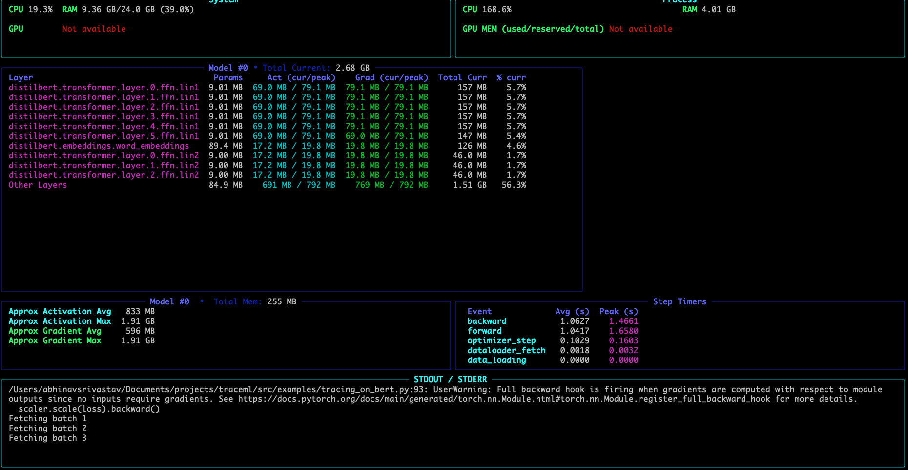
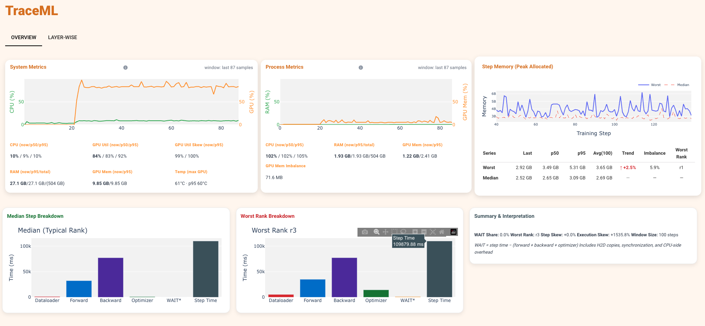

# TraceML Quickstart

Get TraceML running in under 5 minutes. This guide covers everything from installation to runs, and shows you exactly what to expect on screen at each step and end of summary card.

> **New to TraceML?**
> The [README](../README.md) gives you the one-minute overview. This page is the full getting-started guide.

---

## Table of Contents

1. [Prerequisites](#1-prerequisites)
2. [Install](#2-install)
3. [Adapt your training script](#3-adapt-your-training-script)
4. [Run: Terminal dashboard](#4-run-terminal-dashboard)
5. [Run: Web dashboard](#5-run-web-dashboard)
6. [Run: Single-node DDP](#6-run-single-node-ddp)
7. [Key CLI flags](#7-key-cli-flags)
8. [What TraceML shows you](#8-what-traceml-shows-you)
9. [Deep-Dive mode](#9-deep-dive-mode)
10. [Hugging Face Trainer](#10-hugging-face-trainer)
11. [PyTorch Lightning](#11-pytorch-lightning)
12. [Troubleshooting](#12-troubleshooting)

---

## 1. Prerequisites

| Requirement | Version |
|-------------|---------|
| Python | 3.10 or later |
| PyTorch | 2.5.0 or later |

---

## 2. Install

```bash
pip install traceml-ai
```

Verify the install worked:

```bash
traceml --help
```

You should see the `run` and `inspect` subcommands listed.

**Optional extras**

If you plan to use the [Hugging Face Trainer integration](#10-hugging-face-trainer), install the `[hf]` extra which includes `transformers` and `accelerate`:

```bash
pip install "traceml-ai[hf]"
```

If you want PyTorch and torchvision pinned to the versions TraceML is tested against:

```bash
pip install "traceml-ai[torch]"
```

---

## 3. Adapt your training script

TraceML requires two things from your script:

1. **`trace_step(model)`** wraps your training step. This is the only mandatory change.
2. **`trace_model_instance(model)`** is optional. It enables per-layer timing and memory signals (Deep-Dive mode).

### Minimal example (`train.py`)

Copy this and save it as `train.py`. It runs on CUDA if available, and falls back to CPU automatically.

```python
import torch
import torch.nn as nn
import torch.optim as optim

from traceml.decorators import trace_step

# --- A small model (replace this with yours) ---
class MyModel(nn.Module):
    def __init__(self):
        super().__init__()
        self.net = nn.Sequential(
            nn.Linear(128, 256),
            nn.ReLU(),
            nn.Linear(256, 10),
        )

    def forward(self, x):
        return self.net(x)


def main():
    device = torch.device("cuda" if torch.cuda.is_available() else "cpu")
    print(f"Running on: {device}")

    model = MyModel().to(device)
    optimizer = optim.Adam(model.parameters(), lr=1e-3)
    criterion = nn.CrossEntropyLoss()

    num_steps = 200

    model.train()
    for step in range(num_steps):

        # --- TraceML: wrap your entire training step ---
        with trace_step(model):
            inputs = torch.randn(64, 128, device=device)
            labels = torch.randint(0, 10, (64,), device=device)

            optimizer.zero_grad(set_to_none=True)
            outputs = model(inputs)
            loss = criterion(outputs, labels)
            loss.backward()
            optimizer.step()

        if step % 50 == 0:
            print(f"Step {step} | loss: {loss.item():.4f}")


if __name__ == "__main__":
    main()
```

**What changed from your normal script:**

- Added `from traceml.decorators import trace_step`
- Wrapped the training step body in `with trace_step(model):`
- Everything else (model, optimizer, loss) stays the same.

> **Tip:** `trace_step` is a context manager, not a decorator. Wrap the entire step body, everything from `zero_grad` through `optimizer.step()`.

---

## 4. Run: Terminal dashboard

```bash
traceml run train.py
```

TraceML starts two processes under the hood:

1. The **aggregator** (renders the terminal dashboard using Rich).
2. Your **training script** (via `torchrun`).

**What you will see:**

```
[TraceML] Starting aggregator on 127.0.0.1:29765 (mode=cli)
[TraceML] Aggregator PID: 12345
[TraceML] Aggregator ready.
[TraceML] Launching TraceML executor: torchrun ...
```

Then the terminal dashboard appears alongside your training logs:



**To stop:** press `Ctrl+C`. TraceML will terminate both the aggregator and training processes cleanly.

> **Fail-open design:** If the aggregator crashes mid-run, training continues without interruption. You will see a warning message, but your model keeps training.


---

## 5. Run: Web dashboard

```bash
traceml run train.py --mode=dashboard
```

This starts the same training run but renders metrics in a browser-based UI instead of the terminal.

**What happens:**

- The web UI starts at `http://localhost:8765`
- Your default browser opens automatically
- Metrics update in real time as steps complete



**When to use the web dashboard:**

- You want to share the live view with teammates (navigate to the URL on the same machine)
- You prefer a visual, interactive layout over the terminal table
- You are running on a machine with a display (headless servers need port-forwarding)

---
### End-of-run summary card

At the end of a run, TraceML prints a compact text summary for quick review and sharing.
It highlights the straggler rank, average total step time, dataloader share, and compute split.

---

## 6. Run: Single-node DDP

TraceML works with single-node multi-GPU training. Your script needs to initialise the process group and wrap the model with `DistributedDataParallel` (standard DDP boilerplate), and `trace_step` / `trace_model_instance` work exactly the same way inside it.

> **Scope:** Single-node DDP only. Multi-node DDP is not yet supported.

### Adapt your script for DDP

For DDP, you need to initialize the process group and wrap your model. Here is the minimal DDP version of the script from Section 3:

```python
import os

import torch
import torch.distributed as dist
import torch.nn as nn
import torch.optim as optim

from traceml.decorators import trace_model_instance, trace_step


class MyModel(nn.Module):
    def __init__(self):
        super().__init__()
        self.net = nn.Sequential(
            nn.Linear(128, 256),
            nn.ReLU(),
            nn.Linear(256, 10),
        )

    def forward(self, x):
        return self.net(x)


def main():
    # torchrun sets these automatically
    rank = int(os.environ.get("RANK", 0))
    local_rank = int(os.environ.get("LOCAL_RANK", 0))
    world_size = int(os.environ.get("WORLD_SIZE", 1))

    use_cuda = torch.cuda.is_available()
    backend = "nccl" if use_cuda else "gloo"
    dist.init_process_group(backend=backend, rank=rank, world_size=world_size)

    if use_cuda:
        torch.cuda.set_device(local_rank)
        device = torch.device("cuda", local_rank)
    else:
        device = torch.device("cpu")

    model = MyModel().to(device)

    # IMPORTANT: call trace_model_instance BEFORE wrapping with DDP
    trace_model_instance(model)

    model = torch.nn.parallel.DistributedDataParallel(
        model,
        device_ids=[local_rank] if use_cuda else None,
    )

    optimizer = optim.Adam(model.parameters(), lr=1e-3)
    criterion = nn.CrossEntropyLoss()

    model.train()
    for step in range(200):

        # Use model.module (the unwrapped model) as the argument to trace_step
        with trace_step(model.module):
            inputs = torch.randn(64, 128, device=device)
            labels = torch.randint(0, 10, (64,), device=device)

            optimizer.zero_grad(set_to_none=True)
            outputs = model(inputs)
            loss = criterion(outputs, labels)
            loss.backward()
            optimizer.step()

    dist.destroy_process_group()


if __name__ == "__main__":
    main()
```

### Launch command

```bash
traceml run train_ddp.py --nproc-per-node=4
```

Replace `4` with the number of GPUs you want to use (or the number of CPU workers for a CPU run).

**What you will see in the terminal dashboard (or web dashboard):**

- Per-step metrics for **all ranks**
- **Median** step time (typical behavior across ranks)
- **Worst rank** (slowest or highest memory usage)
- **Skew %** (how much outlier ranks deviate from the median)

This makes straggler detection and rank imbalance immediately visible without any additional code.

> **Tip:** Add `--mode=dashboard` to get the web UI instead of the terminal table, just like in Section 5.

---

## 7. Key CLI flags

All flags are passed to `traceml run`. They are optional; the defaults work for most cases.

| Flag | Default | Description |
|------|---------|-------------|
| `--mode` | `cli` | Display mode. `cli` for terminal dashboard, `dashboard` for web UI at `localhost:8765`. |
| `--nproc-per-node` | `1` | Number of processes (GPUs) to launch per node. Set this for DDP runs. |
| `--interval` | `2.0` | How often (in seconds) the dashboard refreshes. Lower = more real-time, slightly more overhead. |
| `--enable-logging` | off | Save raw metrics to disk as `.msgpack` files for offline inspection. |
| `--logs-dir` | `./logs` | Directory to write log files if `--enable-logging` is on. |
| `--num-display-layers` | `5` | How many model layers to show in the per-layer breakdown (Deep-Dive mode). |
| `--no-history` | off | Disable run history. Live view only; summaries and cross-run comparisons will not be available. |

**Full flag reference:**

```
traceml run --help
```

---

## 8. What TraceML shows you

Every training step, TraceML records and displays the following signals.

### Step-level signals (always on)

| Signal | What it tells you |
|--------|------------------|
| Step time | Wall time for the full training step (forward + backward + optimizer) |
| Dataloader fetch time | Time spent waiting for the next batch from the dataloader |
| GPU memory allocated | Memory currently allocated by PyTorch on the GPU |
| GPU memory peak | Peak allocation seen during this step |

### Rank-level signals (DDP only)

| Signal | What it tells you |
|--------|------------------|
| Median | The typical value across all ranks for a given step |
| Worst rank | The rank with the slowest step time or highest memory use |
| Skew % | How far the worst rank deviates from the median (higher = more imbalance) |

**How to read skew:**
A skew of 0% means all ranks are in sync. A consistently high skew (e.g., 30%+) usually signals a data loading bottleneck, an uneven dataset split, or a hardware issue on one GPU.

---

## 9. Deep-Dive mode

Deep-Dive mode attaches hooks to individual model layers for finer-grained diagnostics. It is optional and additive, the essential step-level signals are not affected whether you enable it or not.

### How to enable it

Call `trace_model_instance(model)` **before** your training loop:

```python
from traceml.decorators import trace_model_instance, trace_step

model = MyModel().to(device)

# Enable Deep-Dive hooks
trace_model_instance(model)

# Then train as normal
for step in range(num_steps):
    with trace_step(model):
        ...
```

### What it adds

| Signal | Description |
|--------|-------------|
| Per-layer parameter memory | Static memory footprint of each layer's parameters (weights + biases) |
| Per-layer forward time | How long each layer took during the forward pass |
| Per-layer backward time | How long each layer took during the backward pass |
| Per-layer forward memory | Activation memory used per layer (forward) |
| Per-layer backward memory | Gradient memory per layer (backward) |

### When to use it

- You suspect a specific layer is a bottleneck but step-level signals are not enough.
- You are diagnosing memory growth and want to pinpoint which layer is responsible.
- Short diagnostic runs, not continuous production training (hooks add light overhead).

> **DDP note:** Call `trace_model_instance` on the **unwrapped** model, before passing it to `DistributedDataParallel`. See the DDP example in [Section 6](#6-run-single-node-ddp).

---

## 10. Hugging Face Trainer

If you use `transformers.Trainer`, use `TraceMLTrainer` as a drop-in replacement. No changes to your training loop are needed.

```python
from traceml.integrations.huggingface import TraceMLTrainer
from transformers import TrainingArguments

training_args = TrainingArguments(output_dir="./output", num_train_epochs=3)

trainer = TraceMLTrainer(
    model=model,
    args=training_args,
    train_dataset=train_dataset,
    eval_dataset=eval_dataset,
    traceml_enabled=True,       # Set to False to disable tracing without removing the class
)

trainer.train()
```

To also enable Deep-Dive per-layer signals, pass `traceml_kwargs`:

```python
trainer = TraceMLTrainer(
    model=model,
    args=training_args,
    train_dataset=train_dataset,
    traceml_enabled=True,
    traceml_kwargs={"trace_layer_forward_time": True, "trace_layer_backward_time": True},
)
```

Launch it the same way as any other script:

```bash
traceml run fine_tune.py
```

> **More details:** See the full [Hugging Face integration guide](huggingface.md) for NLP, vision, DDP, and a complete `TraceMLTrainer` parameter reference.

---

## 11. PyTorch Lightning

If you use PyTorch Lightning, TraceML provides an official callback.

```python
import lightning as L
from traceml.integrations.lightning import TraceMLCallback

trainer = L.Trainer(
    max_steps=500,
    enable_progress_bar=False,  # Let TraceML own the terminal
    callbacks=[TraceMLCallback()],
)
trainer.fit(model)
```

Launch the training script the same way as with plain PyTorch:

```bash
traceml run train.py
```

> **More details:** See the full [PyTorch Lightning integration guide](lightning.md) for a complete CNN example, deep-dive usage, and details on how it seamlessly supports gradient accumulation.

---

## 12. Troubleshooting

### "Aggregator failed to start"

```
[TraceML] Aggregator failed to start (exit=1). See aggregator output above for details.
```

**Causes and fixes:**

- Port `29765` is already in use. Check with `lsof -i :29765` (Linux/macOS) and kill the conflicting process, or pass a different port: `--tcp-port=29766`.
- Missing dependency (e.g., `nicegui` not installed). Run `pip install traceml-ai` again in a clean environment.

---

### "torchrun: command not found"

TraceML uses `torchrun` to launch your script. It is included with PyTorch but may not be on your PATH.

**Fix:**

```bash
# Confirm torchrun is available
python -m torch.distributed.run --help

# If the above works but torchrun does not, add it to PATH or use the module form directly
```

> Note: TraceML calls `torchrun` as a subprocess. If you need to use `python -m torch.distributed.run`, raise a GitHub issue.

---

### No CUDA detected

TraceML works on CPU. GPU memory signals will show `N/A`. Step timing and dataloader signals still work.

If you have a GPU but TraceML reports no CUDA:

```bash
python -c "import torch; print(torch.cuda.is_available())"
```

If that prints `False`, check your PyTorch + CUDA version compatibility: https://pytorch.org/get-started/locally/

---

### Dashboard does not open in browser (`--mode=dashboard`)

NiceGUI tries to open the system browser automatically. On headless servers or remote machines:

1. Note the port: `http://localhost:8765`
2. Forward the port via SSH: `ssh -L 8765:localhost:8765 user@remote`
3. Open `http://localhost:8765` in your local browser.

---

### Aggregator crashes mid-run: training keeps going

This is by design. TraceML is **fail-open**: if the aggregator (the dashboard process) crashes unexpectedly, your training run is never interrupted. You will see:

```
[TraceML] WARNING: aggregator exited early (code=1). Training will continue without TraceML telemetry.
```

Please [open an issue](https://github.com/traceopt-ai/traceml/issues) with the aggregator output so the team can investigate.

---

## Next steps

- Browse the full example scripts in [`src/examples/`](../src/examples/)
- Read the [Hugging Face integration guide](huggingface.md) for `TraceMLTrainer`, NLP and vision examples
- Read the [PyTorch Lightning integration guide](lightning.md) for `TraceMLCallback`
- Check the [architecture diagram](traceml_architecture_diagram.png) if you are curious about internals
- Join the discussion: [GitHub Discussions](https://github.com/traceopt-ai/traceml/discussions)
