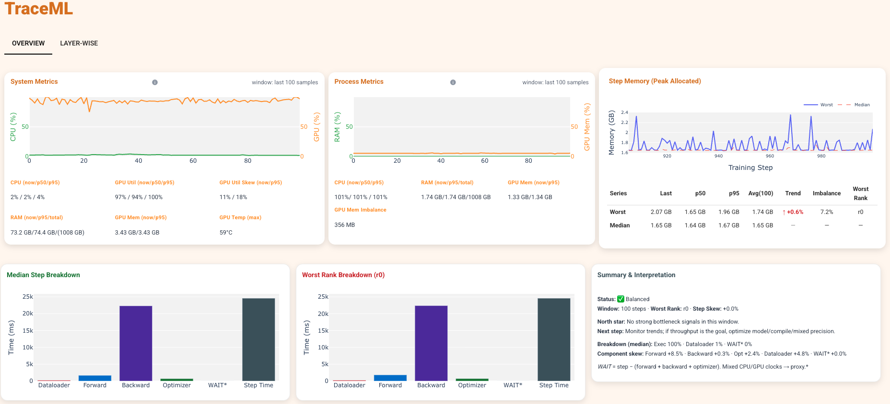

# TraceML Quickstart

Get from install to your first useful TraceML run in under 5 minutes.

If you just want the fastest path:

1. Install TraceML
2. Wrap your training step with `trace_step(model)`
3. Run `traceml run train.py`

If you are new to TraceML, start here.
If you want the high-level overview first, see the [README](../README.md).

---

## Prerequisites

| Requirement | Version |
|---|---|
| Python | 3.10+ |
| PyTorch | 2.5+ |

---

## 1) Install

```bash
pip install traceml-ai
```

Check that the CLI is available:

```bash
traceml --help
```

You should see the `run` command.

### Optional extras

For Hugging Face Trainer support:

```bash
pip install "traceml-ai[hf]"
```

If you want PyTorch pinned to the versions TraceML is tested against:

```bash
pip install "traceml-ai[torch]"
```

---

## 2) Minimal training script

Save this as `train.py`.

```python
import torch
import torch.nn as nn
import torch.optim as optim

from traceml.decorators import trace_step


class MyModel(nn.Module):
    def __init__(self):
        super().__init__()
        self.net = nn.Sequential(
            nn.Linear(128, 256),
            nn.ReLU(),
            nn.Linear(256, 10),
        )

    def forward(self, x):
        return self.net(x)


def main():
    device = torch.device("cuda" if torch.cuda.is_available() else "cpu")
    print(f"Running on: {device}")

    model = MyModel().to(device)
    optimizer = optim.Adam(model.parameters(), lr=1e-3)
    criterion = nn.CrossEntropyLoss()

    model.train()
    for step in range(200):
        with trace_step(model):
            inputs = torch.randn(64, 128, device=device)
            labels = torch.randint(0, 10, (64,), device=device)

            optimizer.zero_grad(set_to_none=True)
            outputs = model(inputs)
            loss = criterion(outputs, labels)
            loss.backward()
            optimizer.step()

        if step % 50 == 0:
            print(f"Step {step} | loss: {loss.item():.4f}")


if __name__ == "__main__":
    main()
```

### The only required change

TraceML only needs one change in a normal PyTorch loop:

```python
with trace_step(model):
    ...
```

Wrap the full training step body, from `zero_grad(...)` through `optimizer.step()`.

---

## 3) Run TraceML

```bash
traceml run train.py
```

During training, TraceML opens a live terminal view alongside your logs.


At the end of the run, it prints a compact summary you can review or share.

```text
Suspected bottleneck: input stall
Median step time: 412 ms
Step-time drift: +9.8%
Worst-rank skew: 14%
Memory trend: +1.2 GB over run
```

### What TraceML helps you spot

- input / dataloader stalls
- unstable step times
- DDP rank imbalance
- memory drift over time
- how step time splits across forward, backward, optimizer, and overhead

---

## 4) Optional: local UI

If you want a richer view, TraceML also includes a local UI for reviewing runs and comparing them locally.

```bash
traceml run train.py --mode=dashboard
```

The UI runs locally at `http://localhost:8765`.



Use the local UI when you want:

- a richer run review experience
- an easier view for comparing runs
- a browser-based layout instead of the terminal

If you just want the fastest path, stay with the default terminal mode.

---

## 5) What TraceML records

### Always on

- step time
- dataloader / input wait time
- forward / backward / optimizer / overhead timing
- GPU memory allocated
- GPU memory peak
- CPU / RAM / GPU signals

### In single-node DDP

- median rank
- worst rank
- skew (%)

This makes stragglers and rank imbalance easier to spot without extra instrumentation.

---

## 6) Single-node DDP

TraceML supports single-node multi-GPU training.

Use standard PyTorch DDP, and keep `trace_step(...)` inside the training loop.
If you also enable model hooks, call `trace_model_instance(model)` **before** wrapping the model in `DistributedDataParallel`.

> **Scope:** Multi-node DDP is not yet supported.

### Minimal DDP example

```python
import os

import torch
import torch.distributed as dist
import torch.nn as nn
import torch.optim as optim

from traceml.decorators import trace_model_instance, trace_step


class MyModel(nn.Module):
    def __init__(self):
        super().__init__()
        self.net = nn.Sequential(
            nn.Linear(128, 256),
            nn.ReLU(),
            nn.Linear(256, 10),
        )

    def forward(self, x):
        return self.net(x)


def main():
    rank = int(os.environ.get("RANK", 0))
    local_rank = int(os.environ.get("LOCAL_RANK", 0))
    world_size = int(os.environ.get("WORLD_SIZE", 1))

    use_cuda = torch.cuda.is_available()
    backend = "nccl" if use_cuda else "gloo"
    dist.init_process_group(backend=backend, rank=rank, world_size=world_size)

    if use_cuda:
        torch.cuda.set_device(local_rank)
        device = torch.device("cuda", local_rank)
    else:
        device = torch.device("cpu")

    model = MyModel().to(device)
    trace_model_instance(model)  # optional

    model = torch.nn.parallel.DistributedDataParallel(
        model,
        device_ids=[local_rank] if use_cuda else None,
    )

    optimizer = optim.Adam(model.parameters(), lr=1e-3)
    criterion = nn.CrossEntropyLoss()

    model.train()
    for step in range(200):
        with trace_step(model.module):
            inputs = torch.randn(64, 128, device=device)
            labels = torch.randint(0, 10, (64,), device=device)

            optimizer.zero_grad(set_to_none=True)
            outputs = model(inputs)
            loss = criterion(outputs, labels)
            loss.backward()
            optimizer.step()

    dist.destroy_process_group()


if __name__ == "__main__":
    main()
```

Launch it with:

```bash
traceml run train_ddp.py --nproc-per-node=4
```

You will see:

- per-rank metrics
- median step time
- worst rank
- skew (%)

---

## 7) Hugging Face Trainer

If you use `transformers.Trainer`, replace it with `TraceMLTrainer`.

```python
from traceml.hf_decorators import TraceMLTrainer
from transformers import TrainingArguments

training_args = TrainingArguments(output_dir="./output", num_train_epochs=3)

trainer = TraceMLTrainer(
    model=model,
    args=training_args,
    train_dataset=train_dataset,
    eval_dataset=eval_dataset,
    traceml_enabled=True,
)

trainer.train()
```

Run it the same way:

```bash
traceml run fine_tune.py
```

For full details, see [huggingface.md](huggingface.md).

---

## 8) Optional: model-level hooks

If you want additional model-level timing and memory context, enable lightweight hooks:

```python
from traceml.decorators import trace_model_instance

trace_model_instance(model)
```

Use this together with `trace_step(model)`.
The core step-level view works without it.

Use model-level hooks when:

- step-level signals are not enough
- you suspect a specific layer is slow
- you want extra memory detail for a short diagnostic run

---

## 9) Useful CLI flags

| Flag | Default | Description |
|---|---|---|
| `--mode` | `cli` | `cli` for terminal view, `dashboard` for local UI |
| `--nproc-per-node` | `1` | Number of processes to launch for DDP |
| `--interval` | `2.0` | Refresh interval in seconds |
| `--enable-logging` | off | Save raw metrics to disk |
| `--logs-dir` | `./logs` | Directory for saved logs |
| `--num-display-layers` | `5` | Number of layers to show with model hooks |
| `--no-history` | off | Disable run history |

Full reference:

```bash
traceml run --help
```

---

## 10) Troubleshooting

### `torchrun: command not found`

TraceML uses `torchrun` to launch your script.

Check whether it is available:

```bash
python -m torch.distributed.run --help
```

If that works but `torchrun` does not, fix your PATH or raise an issue.

### No CUDA detected

TraceML also works on CPU.
GPU memory signals will show `N/A`, but step timing still works.

Check CUDA availability:

```bash
python -c "import torch; print(torch.cuda.is_available())"
```

### Local UI does not open

On a headless or remote machine:

1. note the port: `http://localhost:8765`
2. forward it: `ssh -L 8765:localhost:8765 user@remote`
3. open it locally in your browser

### Aggregator fails or exits early

TraceML is fail-open.
If the UI/aggregator exits unexpectedly, training continues.

Please open an issue and include the output you saw.

---

## Next steps

- check the examples in [`src/examples/`](../src/examples/)
- read [huggingface.md](huggingface.md) for the Trainer integration
- open an issue if TraceML caught a real slowdown for you
- join [GitHub Discussions](https://github.com/traceopt-ai/traceml/discussions)
