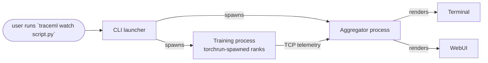
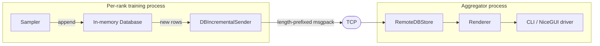

# Dev Docs Site Implementation Plan

> **For agentic workers:** REQUIRED SUB-SKILL: Use superpowers:subagent-driven-development (recommended) or superpowers:executing-plans to implement this plan task-by-task. Steps use checkbox (`- [ ]`) syntax for tracking.

**Goal:** Stand up a public MkDocs Material docs site for TraceML that unifies existing user-facing markdown with auto-generated developer API reference, deploys to GitHub Pages, and is gated by CI + pre-push hooks.

**Architecture:** Single `mkdocs.yml` at repo root. Content split into `docs/user_guide/` (relocated existing markdown + public API page) and `docs/developer_guide/` (architecture overview + 11 thin subsystem pages driven by mkdocstrings + contributing). GitHub Actions builds with `--strict` on every PR and deploys to GitHub Pages on push to `main`.

**Tech Stack:** MkDocs 1.6+, mkdocs-material 9.5+, mkdocstrings[python] 0.26+, mkdocs-autorefs 1.2+, pymdown-extensions 10+, GitHub Pages, GitHub Actions, pre-commit.

**Source spec:** `specs/2026-04-19-dev-docs-site-design.md`

**Branch:** `docs/dev-docs-site` (already created, tracking `upstream/main`).

**Execution environment:** all commands run from repo root `/teamspace/studios/this_studio/traceml/` unless stated otherwise.

---

## File structure

**Create:**
- `mkdocs.yml`
- `docs/index.md`
- `docs/user_guide/public-api.md`
- `docs/developer_guide/architecture.md`
- `docs/developer_guide/subsystems/{cli,runtime,aggregator,samplers,database,transport,renderers,display-drivers,decorators,integrations,utils}.md`
- `docs/developer_guide/contributing.md`
- `.github/ISSUE_TEMPLATE/{bug_report,feature_request,design_doc}.md`
- `.github/ISSUE_TEMPLATE/config.yml`
- `.github/pull_request_template.md`
- `.github/CODEOWNERS`
- `.github/workflows/docs.yml`

**Move (git mv):**
- `docs/quickstart.md` → `docs/user_guide/quickstart.md`
- `docs/faq.md` → `docs/user_guide/faq.md`
- `docs/how-to-read-output.md` → `docs/user_guide/reading-output.md`
- `docs/huggingface.md` → `docs/user_guide/integrations/huggingface.md`
- `docs/lightning.md` → `docs/user_guide/integrations/lightning.md`
- `docs/use-with-wandb-mlflow.md` → `docs/user_guide/integrations/wandb-mlflow.md`

**Modify:**
- `pyproject.toml` — add `docs` optional-dependencies group.
- `.gitignore` — add `site/` and `.cache/`.
- `.pre-commit-config.yaml` — add `mkdocs-build` pre-push hook.
- Every moved markdown file — update internal relative links.
- `README.md` — update `docs/*.md` links to point at the new paths and add a "Full documentation" pointer once the site URL is known.
- `examples/README.md` — update `../docs/*.md` links.

---

## Task 1: Add `docs` optional-dependencies group

**Files:**
- Modify: `pyproject.toml`

- [ ] **Step 1: Read current optional-dependencies**

Run: `grep -n "optional-dependencies" pyproject.toml`
Expected: line like `[project.optional-dependencies]` exists with `torch`, `dev`, `hf`, `lightning` groups.

- [ ] **Step 2: Add `docs` group**

Append to the existing `[project.optional-dependencies]` section in `pyproject.toml` (before `[tool.isort]`):

```toml
docs = [
    "mkdocs>=1.6",
    "mkdocs-material>=9.5",
    "mkdocstrings[python]>=0.26",
    "mkdocs-autorefs>=1.2",
    "mkdocs-include-markdown-plugin>=7.0",
    "pymdown-extensions>=10.0",
]
```

- [ ] **Step 3: Install and verify**

Run: `pip install -e ".[docs,torch,lightning,hf]"`
Expected: exit 0, `mkdocs` and `mkdocstrings` installable. No dependency-resolver errors.

- [ ] **Step 4: Sanity-check CLI**

Run: `mkdocs --version && python -c "import mkdocstrings; print(mkdocstrings.__version__)"`
Expected: both print version strings, exit 0.

- [ ] **Step 5: Commit**

```bash
git add pyproject.toml
git commit -m "build: add docs extra for mkdocs + material + mkdocstrings"
```

---

## Task 2: Scaffold `mkdocs.yml` and landing page

**Files:**
- Create: `mkdocs.yml`
- Create: `docs/index.md`

- [ ] **Step 1: Write `mkdocs.yml`**

Create `mkdocs.yml` at repo root with exactly this content:

```yaml
site_name: TraceML
site_description: Real-time bottleneck finder for PyTorch training runs
site_url: https://traceopt-ai.github.io/traceml/
repo_url: https://github.com/traceopt-ai/traceml
repo_name: traceopt-ai/traceml
edit_uri: edit/main/docs/

theme:
  name: material
  # logo: assets/logo.png        # uncomment when traceopt.ai logo is available
  # favicon: assets/favicon.png
  palette:
    - scheme: default
      primary: indigo
      toggle: { icon: material/brightness-7, name: Switch to dark mode }
    - scheme: slate
      primary: indigo
      toggle: { icon: material/brightness-4, name: Switch to light mode }
  features:
    - navigation.instant
    - navigation.instant.progress
    - navigation.tracking
    - navigation.tabs
    - navigation.sections
    - navigation.top
    - search.suggest
    - search.highlight
    - content.code.copy
    - content.code.annotate
    - content.tabs.link
    - content.action.edit

plugins:
  - search
  - autorefs
  - include-markdown
  - mkdocstrings:
      handlers:
        python:
          options:
            docstring_style: numpy
            show_source: true
            show_signature_annotations: true
            separate_signature: true
            members_order: source
            merge_init_into_class: true
            show_root_heading: true
            show_symbol_type_heading: true

markdown_extensions:
  - admonition
  - pymdownx.details
  - pymdownx.superfences:
      custom_fences:
        - name: mermaid
          class: mermaid
          format: !!python/name:pymdownx.superfences.fence_code_format
  - pymdownx.tabbed: { alternate_style: true }
  - pymdownx.highlight
  - pymdownx.inlinehilite
  - toc: { permalink: true }

nav:
  - Home: index.md
```

(Full nav will be added in later tasks as pages land.)

- [ ] **Step 2: Write minimal `docs/index.md`**

Replace any pre-existing `docs/index.md` or create new with:

```markdown
# TraceML

Real-time bottleneck finder for PyTorch training runs. Auto-instruments forward, backward, optimizer, and dataloader phases — zero code changes required.

## Install

```bash
pip install traceml-ai
```

## Two audiences, two guides

- **Using TraceML?** → User Guide (quickstart, integrations, FAQ, public API).
- **Contributing to TraceML?** → Developer Guide (architecture, subsystems, contributing).
```

- [ ] **Step 3: Verify build**

Run: `mkdocs build --strict`
Expected: exit 0, creates `site/` directory. Warning about nav only containing `Home` is acceptable at this stage (strict allows this because nav is explicit).

If strict complains about missing pages, that's a plan error — fix before proceeding.

- [ ] **Step 4: Verify serve**

Run: `mkdocs serve` in a background shell, then `curl -s http://127.0.0.1:8000/ | grep -q 'TraceML'`
Expected: exit 0. Kill the background process.

- [ ] **Step 5: Commit**

```bash
git add mkdocs.yml docs/index.md
git commit -m "docs: scaffold mkdocs.yml + landing page"
```

---

## Task 3: Relocate existing user-guide markdown

**Files:**
- Move: `docs/quickstart.md` → `docs/user_guide/quickstart.md`
- Move: `docs/faq.md` → `docs/user_guide/faq.md`
- Move: `docs/how-to-read-output.md` → `docs/user_guide/reading-output.md`
- Move: `docs/huggingface.md` → `docs/user_guide/integrations/huggingface.md`
- Move: `docs/lightning.md` → `docs/user_guide/integrations/lightning.md`
- Move: `docs/use-with-wandb-mlflow.md` → `docs/user_guide/integrations/wandb-mlflow.md`

- [ ] **Step 1: Create target directories**

```bash
mkdir -p docs/user_guide/integrations
```

- [ ] **Step 2: Move files with `git mv` (preserves history)**

```bash
git mv docs/quickstart.md docs/user_guide/quickstart.md
git mv docs/faq.md docs/user_guide/faq.md
git mv docs/how-to-read-output.md docs/user_guide/reading-output.md
git mv docs/huggingface.md docs/user_guide/integrations/huggingface.md
git mv docs/lightning.md docs/user_guide/integrations/lightning.md
git mv docs/use-with-wandb-mlflow.md docs/user_guide/integrations/wandb-mlflow.md
```

- [ ] **Step 3: Verify `docs/` layout**

Run: `find docs -type f -name '*.md' | sort`
Expected output:
```
docs/index.md
docs/user_guide/faq.md
docs/user_guide/integrations/huggingface.md
docs/user_guide/integrations/lightning.md
docs/user_guide/integrations/wandb-mlflow.md
docs/user_guide/quickstart.md
docs/user_guide/reading-output.md
```

- [ ] **Step 4: Commit**

```bash
git commit -m "docs: relocate user guide markdown under docs/user_guide/"
```

(Do not run `mkdocs build` yet — the moved files have stale internal links that will fail strict. Fixed in Task 4.)

---

## Task 4: Update internal links in moved files + README references

**Files (modify):**
- `docs/user_guide/faq.md`
- `docs/user_guide/quickstart.md`
- `docs/user_guide/integrations/huggingface.md`
- `docs/user_guide/integrations/lightning.md`
- `docs/user_guide/integrations/wandb-mlflow.md`
- `README.md`
- `examples/README.md`

- [ ] **Step 1: Fix links inside `docs/user_guide/faq.md`**

Run: `grep -n "\](.*\.md" docs/user_guide/faq.md`
Expected matches at lines: 7, 8, 36, 102, 112, 247, 271, 287, 303.

Apply these replacements in `docs/user_guide/faq.md`:

| Old | New |
|---|---|
| `](quickstart.md)` | `](quickstart.md)` *(no change — same directory)* |
| `](how-to-read-output.md)` | `](reading-output.md)` |
| `](use-with-wandb-mlflow.md)` | `](integrations/wandb-mlflow.md)` |
| `](huggingface.md)` | `](integrations/huggingface.md)` |
| `](lightning.md)` | `](integrations/lightning.md)` |

Use sed for a deterministic update:
```bash
sed -i \
  -e 's|](how-to-read-output.md)|](reading-output.md)|g' \
  -e 's|](use-with-wandb-mlflow.md)|](integrations/wandb-mlflow.md)|g' \
  -e 's|](huggingface.md)|](integrations/huggingface.md)|g' \
  -e 's|](lightning.md)|](integrations/lightning.md)|g' \
  docs/user_guide/faq.md
```

- [ ] **Step 2: Fix links inside `docs/user_guide/quickstart.md`**

Apply:
```bash
sed -i \
  -e 's|`docs/huggingface.md`|`user_guide/integrations/huggingface.md`|g' \
  -e 's|`docs/lightning.md`|`user_guide/integrations/lightning.md`|g' \
  docs/user_guide/quickstart.md
```

- [ ] **Step 3: Fix links inside `docs/user_guide/integrations/huggingface.md`**

These were in `docs/` root, now sit one dir deeper. Apply:
```bash
sed -i \
  -e 's|](quickstart.md)|](../quickstart.md)|g' \
  -e 's|\[lightning.md\](lightning.md)|[PyTorch Lightning](lightning.md)|g' \
  docs/user_guide/integrations/huggingface.md
```

- [ ] **Step 4: Fix links inside `docs/user_guide/integrations/lightning.md`**

```bash
sed -i \
  -e 's|](quickstart.md)|](../quickstart.md)|g' \
  -e 's|\[huggingface.md\](huggingface.md)|[Hugging Face Trainer](huggingface.md)|g' \
  docs/user_guide/integrations/lightning.md
```

- [ ] **Step 5: Fix links inside `docs/user_guide/integrations/wandb-mlflow.md`**

```bash
sed -i \
  -e 's|](quickstart.md)|](../quickstart.md)|g' \
  -e 's|](how-to-read-output.md)|](../reading-output.md)|g' \
  -e 's|](faq.md)|](../faq.md)|g' \
  docs/user_guide/integrations/wandb-mlflow.md
```

- [ ] **Step 6: Fix `README.md` links to new docs paths**

Replacements in `README.md`:

```bash
sed -i \
  -e 's|docs/quickstart.md|docs/user_guide/quickstart.md|g' \
  -e 's|docs/how-to-read-output.md|docs/user_guide/reading-output.md|g' \
  -e 's|docs/faq.md|docs/user_guide/faq.md|g' \
  -e 's|docs/use-with-wandb-mlflow.md|docs/user_guide/integrations/wandb-mlflow.md|g' \
  -e 's|docs/huggingface.md|docs/user_guide/integrations/huggingface.md|g' \
  -e 's|docs/lightning.md|docs/user_guide/integrations/lightning.md|g' \
  README.md
```

Note: `README.md` line 12 references `docs/compare.md` which does not exist. Do **not** touch that link — it's a pre-existing dead link, out of scope for this PR.

- [ ] **Step 7: Fix `examples/README.md` links**

```bash
sed -i \
  -e 's|../docs/quickstart.md|../docs/user_guide/quickstart.md|g' \
  -e 's|../docs/how-to-read-output.md|../docs/user_guide/reading-output.md|g' \
  -e 's|../docs/faq.md|../docs/user_guide/faq.md|g' \
  -e 's|../docs/use-with-wandb-mlflow.md|../docs/user_guide/integrations/wandb-mlflow.md|g' \
  -e 's|../docs/huggingface.md|../docs/user_guide/integrations/huggingface.md|g' \
  -e 's|../docs/lightning.md|../docs/user_guide/integrations/lightning.md|g' \
  examples/README.md
```

- [ ] **Step 8: Add nav entries for relocated pages to `mkdocs.yml`**

Replace the `nav:` block at the bottom of `mkdocs.yml` with:

```yaml
nav:
  - Home: index.md
  - User Guide:
      - Quickstart: user_guide/quickstart.md
      - Reading output: user_guide/reading-output.md
      - Integrations:
          - Hugging Face: user_guide/integrations/huggingface.md
          - PyTorch Lightning: user_guide/integrations/lightning.md
          - W&B / MLflow: user_guide/integrations/wandb-mlflow.md
      - FAQ: user_guide/faq.md
```

- [ ] **Step 9: Verify build**

Run: `mkdocs build --strict 2>&1 | tee /tmp/mkdocs-build.log`
Expected: exit 0, no `WARNING` lines about unresolved links.

If warnings appear, the `grep -n` lines in steps 1-5 missed a link. Find and fix before proceeding.

- [ ] **Step 10: Commit**

```bash
git add mkdocs.yml docs/ README.md examples/README.md
git commit -m "docs: update internal links after user-guide relocation"
```

---

## Task 5: Create Public API page

**Files:**
- Create: `docs/user_guide/public-api.md`
- Modify: `mkdocs.yml` (add nav entry)

- [ ] **Step 1: Write `docs/user_guide/public-api.md`**

```markdown
# Public API

The stable surface that user code imports and calls. Everything in this page is covered by TraceML's compatibility contract across v0.x minor releases.

## Decorators

::: traceml.decorators.trace_step
    options:
      show_root_heading: true
      show_source: true

::: traceml.decorators.trace_model_instance
    options:
      show_root_heading: true
      show_source: true

## Hugging Face integration

::: traceml.integrations.huggingface.TraceMLTrainer
    options:
      show_root_heading: true
      show_source: true

## PyTorch Lightning integration

::: traceml.integrations.lightning.TraceMLCallback
    options:
      show_root_heading: true
      show_source: true

## CLI

TraceML ships with a CLI entry point installed as `traceml`.

```bash
traceml watch <script>    # run script with live terminal dashboard
traceml run <script>      # run script with minimal instrumentation
traceml deep <script>     # run with full instrumentation (step + memory + layer)
```

See the [CLI module reference](../developer_guide/subsystems/cli.md) for the implementation.
```

- [ ] **Step 2: Add nav entry**

In `mkdocs.yml`, add `      - Public API: user_guide/public-api.md` as the last item under the `User Guide` nav block (after `FAQ`).

- [ ] **Step 3: Verify render**

Run: `mkdocs build --strict`
Expected: exit 0. Open `site/user_guide/public-api/index.html` and confirm `trace_step` signature, docstring, and source link all render. If the class/function is missing from output, check it exists and has a docstring in `src/traceml/`.

- [ ] **Step 4: Commit**

```bash
git add docs/user_guide/public-api.md mkdocs.yml
git commit -m "docs: add public API reference page"
```

---

## Task 6: Create Architecture overview page

**Files:**
- Create: `docs/developer_guide/architecture.md`
- Modify: `mkdocs.yml` (add nav entry)

- [ ] **Step 1: Write `docs/developer_guide/architecture.md`**

```markdown
# Architecture

TraceML runs as three cooperating processes during a training job:



The CLI spawns an **aggregator** server and one or more **training** ranks via `torchrun`. Training ranks run user code in-process with TraceML hooks attached; telemetry is shipped over TCP to the aggregator, which renders the unified view.

## Telemetry data flow



Samplers maintain an incremental append counter per rank per table. The sender ships only new rows. The aggregator's `RemoteDBStore` keeps each rank's data separate, and renderers pull read-only views from it.

## Layers

| Layer | Directory | Responsibility |
|---|---|---|
| CLI | `src/traceml/cli.py` | Argument parsing, process spawning, signal handling |
| Runtime | `src/traceml/runtime/` | In-process agent per rank; user-script executor |
| Aggregator | `src/traceml/aggregator/` | TCP server, unified store, display orchestration |
| Samplers | `src/traceml/samplers/` | Periodic telemetry collection (timing, memory, system) |
| Database | `src/traceml/database/` | Bounded in-memory tables; rank-aware remote store |
| Transport | `src/traceml/transport/` | TCP bidirectional + DDP rank detection |
| Renderers | `src/traceml/renderers/` | Transform stored data into Rich/Plotly output |
| Display drivers | `src/traceml/aggregator/display_drivers/` | CLI vs NiceGUI output medium |
| Decorators | `src/traceml/decorators.py` | User-facing instrumentation entry points |
| Integrations | `src/traceml/integrations/` | Hugging Face + Lightning adapters |
| Utils | `src/traceml/utils/` | Hooks, patches, memory/timing helpers |

Each layer has its own page under [Subsystems](subsystems/cli.md).

## Design principles

- **Fail-open** — training must never crash because telemetry broke. Sampler/transport errors are logged, execution continues.
- **Bounded overhead** — every new sampler justifies its overhead. Deque-based bounded tables evict oldest records at fixed `maxlen`.
- **Process isolation** — no shared memory. TCP + env vars only.
- **Out-of-process UI** — aggregator crashes don't crash training.
```

- [ ] **Step 2: Add nav entry**

Append to `mkdocs.yml` after the `User Guide:` block:

```yaml
  - Developer Guide:
      - Architecture: developer_guide/architecture.md
```

- [ ] **Step 3: Verify Mermaid renders**

Run: `mkdocs build --strict && grep -q 'class="mermaid"' site/developer_guide/architecture/index.html`
Expected: exit 0. The Mermaid fences should compile to `<pre class="mermaid">` blocks.

- [ ] **Step 4: Commit**

```bash
git add docs/developer_guide/architecture.md mkdocs.yml
git commit -m "docs: add architecture overview with Mermaid diagrams"
```

---

## Task 7: Create 11 subsystem pages

**Files (create all 11 in one pass):**
- `docs/developer_guide/subsystems/cli.md`
- `docs/developer_guide/subsystems/runtime.md`
- `docs/developer_guide/subsystems/aggregator.md`
- `docs/developer_guide/subsystems/samplers.md`
- `docs/developer_guide/subsystems/database.md`
- `docs/developer_guide/subsystems/transport.md`
- `docs/developer_guide/subsystems/renderers.md`
- `docs/developer_guide/subsystems/display-drivers.md`
- `docs/developer_guide/subsystems/decorators.md`
- `docs/developer_guide/subsystems/integrations.md`
- `docs/developer_guide/subsystems/utils.md`
- Modify: `mkdocs.yml`

- [ ] **Step 1: Create subsystems directory**

```bash
mkdir -p docs/developer_guide/subsystems
```

- [ ] **Step 2: Write each subsystem page**

Each page is ~15 lines: title, 2-3 sentence intro, one mkdocstrings block.

**`docs/developer_guide/subsystems/cli.md`:**
```markdown
# CLI

The user-facing command launcher (`traceml watch|run|deep`). Parses arguments, validates the script path, sets up environment variables for rank processes, and spawns the aggregator + training processes. Handles signals (SIGINT, SIGTERM) to tear down cleanly.

::: traceml.cli
```

**`docs/developer_guide/subsystems/runtime.md`:**
```markdown
# Runtime

Per-rank in-process agent. Runs samplers on a timer loop, executes the user script via `runpy`, and ships telemetry to the aggregator over TCP. Contains the sampler orchestration and crash-handling logic.

::: traceml.runtime
```

**`docs/developer_guide/subsystems/aggregator.md`:**
```markdown
# Aggregator

Out-of-process telemetry server. Hosts a TCP server that accepts rank connections, maintains a rank-aware unified store, and drives the display driver (CLI or NiceGUI). Never shares memory with training — fully isolated so an aggregator crash leaves training intact.

::: traceml.aggregator
```

**`docs/developer_guide/subsystems/samplers.md`:**
```markdown
# Samplers

Periodic telemetry collectors: step timing, step memory, layer-level events, system metrics (CPU/GPU/RAM), process stats. Each sampler owns a bounded-deque table in the local `Database` and writes on a fixed interval (default 1s). The `DBIncrementalSender` ships only new rows to the aggregator.

::: traceml.samplers
```

**`docs/developer_guide/subsystems/database.md`:**
```markdown
# Database

Bounded append-only in-memory table store. Each table is a `collections.deque(maxlen=N)` — O(1) append with automatic eviction of oldest rows. The per-rank `Database` is written by samplers; the aggregator's `RemoteDBStore` lazily creates a `Database` per `(rank, sampler_name)` tuple as telemetry arrives.

::: traceml.database
```

**`docs/developer_guide/subsystems/transport.md`:**
```markdown
# Transport

TCP bidirectional telemetry channel plus DDP rank detection. Frames are length-prefixed msgpack blobs. The aggregator runs a threaded `TCPServer` accepting rank connections; each rank's `TCPClient` sends in a background thread and never blocks the training loop.

::: traceml.transport
```

**`docs/developer_guide/subsystems/renderers.md`:**
```markdown
# Renderers

Transforms stored telemetry into human-readable output: Rich panels for the CLI, Plotly charts for the web dashboard. Each renderer is read-only against the `RemoteDBStore` and produces either a `Rich` renderable or a NiceGUI component.

::: traceml.renderers
```

**`docs/developer_guide/subsystems/display-drivers.md`:**
```markdown
# Display drivers

Own the UI layout and output medium. `CLIDisplayDriver` drives Rich in the terminal; `NiceGUIDisplayDriver` serves a browser dashboard. Drivers orchestrate renderers and run the event loop.

::: traceml.aggregator.display_drivers
```

**`docs/developer_guide/subsystems/decorators.md`:**
```markdown
# Decorators

User-facing instrumentation entry points: `trace_step` (step boundary context manager), `trace_model_instance` (hook attachment for layer telemetry), `trace_time` (generic function timer). Fail-open by design — decorator errors log to stderr and do not break user code.

::: traceml.decorators
```

**`docs/developer_guide/subsystems/integrations.md`:**
```markdown
# Integrations

Drop-in framework adapters. `TraceMLTrainer` subclasses Hugging Face's `Trainer` and wires step-boundary + model hooks via `trace_step` / `trace_model_instance`. `TraceMLCallback` does the equivalent for PyTorch Lightning.

::: traceml.integrations
```

**`docs/developer_guide/subsystems/utils.md`:**
```markdown
# Utils

Low-level helpers: forward/backward hooks, dataloader/forward/backward patches, CUDA event pool, step memory trackers, timing regions. Most of this is invisible to users but central to how TraceML achieves zero-code instrumentation.

::: traceml.utils
```

- [ ] **Step 3: Add nav entries**

In `mkdocs.yml`, under the `Developer Guide:` block, extend with:

```yaml
      - Subsystems:
          - CLI: developer_guide/subsystems/cli.md
          - Runtime: developer_guide/subsystems/runtime.md
          - Aggregator: developer_guide/subsystems/aggregator.md
          - Samplers: developer_guide/subsystems/samplers.md
          - Database: developer_guide/subsystems/database.md
          - Transport: developer_guide/subsystems/transport.md
          - Renderers: developer_guide/subsystems/renderers.md
          - Display drivers: developer_guide/subsystems/display-drivers.md
          - Decorators: developer_guide/subsystems/decorators.md
          - Integrations: developer_guide/subsystems/integrations.md
          - Utils: developer_guide/subsystems/utils.md
```

- [ ] **Step 4: Verify build**

Run: `mkdocs build --strict 2>&1 | grep -E "WARNING|ERROR" || echo "CLEAN"`
Expected: prints `CLEAN`. If any `WARNING` about a module not found, the module path in `:::` is wrong — fix the mkdocstrings reference.

- [ ] **Step 5: Spot-check rendering**

Run: `grep -c "class=\"doc doc-class\"\|class=\"doc doc-function\"" site/developer_guide/subsystems/aggregator/index.html`
Expected: count ≥ 1 (mkdocstrings has emitted at least one documented symbol).

- [ ] **Step 6: Commit**

```bash
git add docs/developer_guide/subsystems/ mkdocs.yml
git commit -m "docs: add 11 subsystem reference pages"
```

---

## Task 8: Contributing page

**Files:**
- Create: `docs/developer_guide/contributing.md`
- Modify: `mkdocs.yml`

- [ ] **Step 1: Write `docs/developer_guide/contributing.md`**

```markdown
# Contributing

## Dev setup

```bash
git clone https://github.com/traceopt-ai/traceml.git
cd traceml
pip install -e ".[dev,torch,lightning,hf,docs]"
pre-commit install --install-hooks
pre-commit install --hook-type pre-push
```

All extras are installed because the docs build imports every TraceML module.

## Branch naming

- `feature/<short-name>` — new feature work.
- `fix/<short-name>` — bug fixes.
- `docs/<short-name>` — docs-only changes.

## Commit messages

Short single-line. Imperative mood. No `Co-Authored-By` trailers.

Examples:
- `feat: add step-time outlier detection`
- `fix: handle torchrun restart in rank detector`
- `docs: clarify W&B integration example`

## Code style

- `black` (line length 79), `ruff`, `isort` (black profile) — enforced by pre-commit.
- Python 3.10+ features allowed; nothing Python 3.12-only.

## Docstrings

NumPy style. Every public class, function, method gets one.

```python
def trace_step(model: nn.Module):
    """Mark a training step boundary.

    Responsibilities
    ----------------
    - Marks the semantic start/end of a training step.
    - Attributes step-scoped timing events.
    - Advances the global step counter.

    Parameters
    ----------
    model : torch.nn.Module
        The model being trained. Used for memory-tracker attachment.

    Yields
    ------
    None
        Context-manager protocol; no value yielded.

    Raises
    ------
    RuntimeError
        If called outside of a training loop context.
    """
```

## Tests

```bash
pytest tests/
```

New code must include tests unless the change is docs-only.

## Docs

If a code change affects user-facing behavior, update the relevant doc in the same PR.

- **Preview locally:** `mkdocs serve`, then open http://127.0.0.1:8000
- **Before pushing:** `mkdocs build --strict` must succeed. The pre-push hook enforces this.

## Cross-referencing

Use `autorefs` to link to API symbols in prose:

```markdown
See [`trace_step`][traceml.decorators.trace_step] for the context manager.
```

## PR checklist

A populated template appears when you open a PR. Fill every box.
```

- [ ] **Step 2: Add nav entry**

In `mkdocs.yml`, append to the `Developer Guide:` block (after Subsystems):

```yaml
      - Contributing: developer_guide/contributing.md
```

- [ ] **Step 3: Verify build**

Run: `mkdocs build --strict`
Expected: exit 0.

- [ ] **Step 4: Commit**

```bash
git add docs/developer_guide/contributing.md mkdocs.yml
git commit -m "docs: add contributing guide"
```

---

## Task 9: `.gitignore`, PR template, CODEOWNERS

**Files:**
- Modify: `.gitignore`
- Create: `.github/pull_request_template.md`
- Create: `.github/CODEOWNERS`

- [ ] **Step 1: Append to `.gitignore`**

Add at the end of `.gitignore`:

```
# MkDocs build output
site/
.cache/
```

- [ ] **Step 2: Write `.github/pull_request_template.md`**

```markdown
## Summary
<!-- what changed, why -->

## Checklist
- [ ] Tests added or updated (unless docs-only)
- [ ] Docs updated if user-facing behavior changed
- [ ] `mkdocs build --strict` succeeds locally
- [ ] Commit messages are short single lines, no Co-Authored-By trailers
- [ ] New public functions/classes have NumPy docstrings (Parameters / Returns / Raises)
- [ ] Internal doc links resolve (`mkdocs serve` renders clean)
```

- [ ] **Step 3: Write `.github/CODEOWNERS`**

```
# Default owner — receives a review request on any PR
*                           @abhinavsrv

# Docs owned by Abhijeet
/docs/                      @Pendu
/mkdocs.yml                 @Pendu
/.github/workflows/docs.yml @Pendu
/.github/pull_request_template.md @Pendu
/.github/ISSUE_TEMPLATE/    @Pendu
```

Replace `@abhinavsrv` with Abhinav's actual GitHub handle before merging if different.

- [ ] **Step 4: Verify the PR template is valid markdown**

Run: `cat .github/pull_request_template.md | head -5 && echo "---" && wc -l .github/pull_request_template.md`
Expected: text prints, line count ≈ 10.

- [ ] **Step 5: Commit**

```bash
git add .gitignore .github/pull_request_template.md .github/CODEOWNERS
git commit -m "chore: add gitignore entries, PR template, CODEOWNERS"
```

---

## Task 10: Issue templates

**Files:**
- Create: `.github/ISSUE_TEMPLATE/bug_report.md`
- Create: `.github/ISSUE_TEMPLATE/feature_request.md`
- Create: `.github/ISSUE_TEMPLATE/design_doc.md`
- Create: `.github/ISSUE_TEMPLATE/config.yml`

- [ ] **Step 1: Create `.github/ISSUE_TEMPLATE/bug_report.md`**

```markdown
---
name: Bug report
about: Something broke or behaved unexpectedly
title: "[bug] "
labels: bug
---

**Feature tested:**
-

**Bug description:**
-

**Steps to reproduce:**
1.
2.
3.

**Expected output:**
-

**Actual output:**
-

## System
- OS / hardware / virtualization:

## Environment
- TraceML version:
- Python version:
- PyTorch version:
- CUDA version (if GPU):
- Branch / commit hash (if dev install):
- Other library versions that diverge from the pinned set:

## Associated feature
Feature #NUMBER:
> TITLE
```

- [ ] **Step 2: Create `.github/ISSUE_TEMPLATE/feature_request.md`**

```markdown
---
name: Feature request
about: Propose a new capability or enhancement
title: "[feat] "
labels: enhancement
---

**Feature concept:**
-

**Inputs:**
-

**Outputs:**
-

**Business / functional criteria:**
-

**Non-functional criteria:**
- (performance, overhead budget, security, UX)

**Quality criteria:**
- (tests, docs, review)

**Owner & team:**
-

**Associated requirements:**
Requirements #NUMBER:
> TITLE
```

- [ ] **Step 3: Create `.github/ISSUE_TEMPLATE/design_doc.md`**

```markdown
---
name: Design document
about: Propose the design for a component before implementation
title: "[design] "
labels: design
---

## Design document for <Component>

### Objective

### Scope

### Components / architecture
1.
2.

### Test cases / implementation plan

### Tools and libraries

### Execution plan

### Conclusion
```

- [ ] **Step 4: Create `.github/ISSUE_TEMPLATE/config.yml`**

```yaml
blank_issues_enabled: false
contact_links:
  - name: Quickstart / FAQ
    url: https://traceopt-ai.github.io/traceml/user_guide/faq/
    about: Check the FAQ for common questions before filing an issue.
  - name: Discussion
    url: https://github.com/traceopt-ai/traceml/discussions
    about: For open-ended questions or RFC-style discussion, use Discussions instead.
```

- [ ] **Step 5: Validate YAML frontmatter**

Run: `python -c "import yaml; [yaml.safe_load(open(f)) for f in ['.github/ISSUE_TEMPLATE/config.yml']]"`
Expected: exit 0.

- [ ] **Step 6: Commit**

```bash
git add .github/ISSUE_TEMPLATE/
git commit -m "chore: add issue templates (bug, feature, design doc)"
```

---

## Task 11: Pre-push hook for `mkdocs build --strict`

**Files:**
- Modify: `.pre-commit-config.yaml`

- [ ] **Step 1: Read current `.pre-commit-config.yaml` bottom**

Run: `tail -10 .pre-commit-config.yaml`
Expected: see `repos:` ending with the last hook block.

- [ ] **Step 2: Append the docs hook**

Append to `.pre-commit-config.yaml`:

```yaml
  - repo: local
    hooks:
      - id: mkdocs-build
        name: mkdocs build --strict
        entry: mkdocs build --strict --quiet
        language: system
        pass_filenames: false
        files: ^(docs/|mkdocs\.yml|src/)
        stages: [pre-push]
```

- [ ] **Step 3: Install the pre-push hook**

Run: `pre-commit install --hook-type pre-push`
Expected: `pre-commit installed at .git/hooks/pre-push`.

- [ ] **Step 4: Verify the hook runs**

Run: `pre-commit run mkdocs-build --hook-stage pre-push --all-files`
Expected: exit 0, "mkdocs build --strict" runs and passes.

- [ ] **Step 5: Commit**

```bash
git add .pre-commit-config.yaml
git commit -m "chore: add pre-push hook for mkdocs strict build"
```

---

## Task 12: CI workflow

**Files:**
- Create: `.github/workflows/docs.yml`

- [ ] **Step 1: Write `.github/workflows/docs.yml`**

```yaml
name: Docs

on:
  push:
    branches: [main]
  pull_request:
    branches: [main]

permissions:
  contents: read
  pages: write
  id-token: write

concurrency:
  group: docs-${{ github.ref }}
  cancel-in-progress: ${{ github.event_name == 'pull_request' }}

jobs:
  build:
    runs-on: ubuntu-latest
    steps:
      - uses: actions/checkout@v4
        with:
          fetch-depth: 0
      - uses: actions/setup-python@v5
        with:
          python-version: "3.10"
          cache: pip
          cache-dependency-path: pyproject.toml
      - run: pip install -e ".[docs,torch,lightning,hf]"
      - run: mkdocs build --strict
      - uses: actions/upload-pages-artifact@v3
        with:
          path: site

  deploy:
    needs: build
    if: github.ref == 'refs/heads/main'
    runs-on: ubuntu-latest
    environment:
      name: github-pages
      url: ${{ steps.deployment.outputs.page_url }}
    steps:
      - id: deployment
        uses: actions/deploy-pages@v4
```

- [ ] **Step 2: Validate workflow YAML**

Run: `python -c "import yaml; yaml.safe_load(open('.github/workflows/docs.yml'))"`
Expected: exit 0.

- [ ] **Step 3: Lint with actionlint (if installed) or skip**

Run (optional): `command -v actionlint >/dev/null && actionlint .github/workflows/docs.yml || echo "actionlint not installed, skipping"`
Expected: either `actionlint` prints no errors, or `skipping`. Either is acceptable.

- [ ] **Step 4: Commit**

```bash
git add .github/workflows/docs.yml
git commit -m "ci: add docs build+deploy workflow"
```

---

## Task 13: Final verification

- [ ] **Step 1: Clean build from zero**

```bash
rm -rf site/
mkdocs build --strict
```
Expected: exit 0, `site/` exists with `index.html` and all expected pages.

- [ ] **Step 2: Link resolution**

```bash
mkdocs build --strict 2>&1 | grep -Ei "warning|error" || echo "CLEAN"
```
Expected: prints `CLEAN`.

- [ ] **Step 3: Spot-check generated URLs**

Run: `find site -name 'index.html' | sort`
Expected: contains at minimum
```
site/index.html
site/user_guide/quickstart/index.html
site/user_guide/reading-output/index.html
site/user_guide/faq/index.html
site/user_guide/public-api/index.html
site/user_guide/integrations/huggingface/index.html
site/user_guide/integrations/lightning/index.html
site/user_guide/integrations/wandb-mlflow/index.html
site/developer_guide/architecture/index.html
site/developer_guide/contributing/index.html
site/developer_guide/subsystems/cli/index.html
site/developer_guide/subsystems/runtime/index.html
site/developer_guide/subsystems/aggregator/index.html
site/developer_guide/subsystems/samplers/index.html
site/developer_guide/subsystems/database/index.html
site/developer_guide/subsystems/transport/index.html
site/developer_guide/subsystems/renderers/index.html
site/developer_guide/subsystems/display-drivers/index.html
site/developer_guide/subsystems/decorators/index.html
site/developer_guide/subsystems/integrations/index.html
site/developer_guide/subsystems/utils/index.html
```

- [ ] **Step 4: Mermaid compiled to runtime container**

Run: `grep -q 'class="mermaid"' site/developer_guide/architecture/index.html && echo "OK"`
Expected: prints `OK`.

- [ ] **Step 5: mkdocstrings output present on subsystem page**

Run: `grep -c 'class="doc doc-' site/developer_guide/subsystems/aggregator/index.html`
Expected: count ≥ 1.

- [ ] **Step 6: No committed `site/`**

Run: `git status site/ 2>&1`
Expected: prints `error: pathspec 'site/' did not match any file(s) known to git` (because `.gitignore` excludes it) OR nothing. Anything mentioning staged/tracked `site/` is a failure.

- [ ] **Step 7: Push branch to fork for CI verification**

```bash
git push -u origin docs/dev-docs-site
```
Expected: push succeeds to `origin` (user's fork). Check GitHub Actions tab on the fork: the `Docs` workflow should run on push and succeed.

- [ ] **Step 8: Note for PR time**

No commit in this step. The final PR to `upstream/main` must include in its description:
- Link to `specs/2026-04-19-dev-docs-site-design.md` backlog section.
- Reminder that GitHub Pages source must be set to "GitHub Actions" in repo settings (one-time).
- Note that the docstring-coverage roadmap item requires a separate discussion with Abhinav.

---

## Self-review checklist (run after completing all tasks)

- [ ] All 14 acceptance criteria in `specs/2026-04-19-dev-docs-site-design.md` are met.
- [ ] `git log --oneline docs/dev-docs-site ^upstream/main` shows exactly 13 clean commits (one per task 1-12 plus the earlier 2 spec commits; task 13 is verification-only, no commit).
- [ ] `mkdocs build --strict` exits 0.
- [ ] PR body lists backlog items for Abhinav's awareness.
